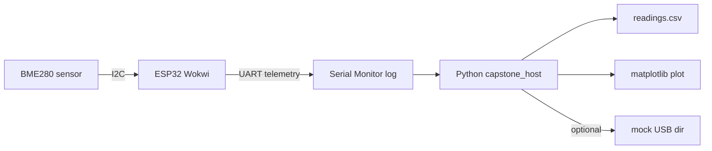

# Capstone monitoring node

Lab 5 component diagram.

```mermaid
flowchart LR
  BME[BME280 sensor] -->|I2C| ESP[ESP32 Wokwi]
  ESP -->|UART telemetry| Mon[Serial Monitor log]
  Mon --> Host[Python capstone_host]
  Host --> CSV[readings.csv]
  Host --> Plot[matplotlib plot]
  Host -->|optional| USB[mock USB dir]
```

Firmware: [wokwi/lab05-capstone/](../../wokwi/lab05-capstone/). Host: [host/capstone_host.py](../../host/capstone_host.py).
