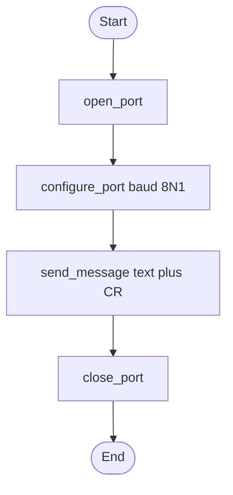
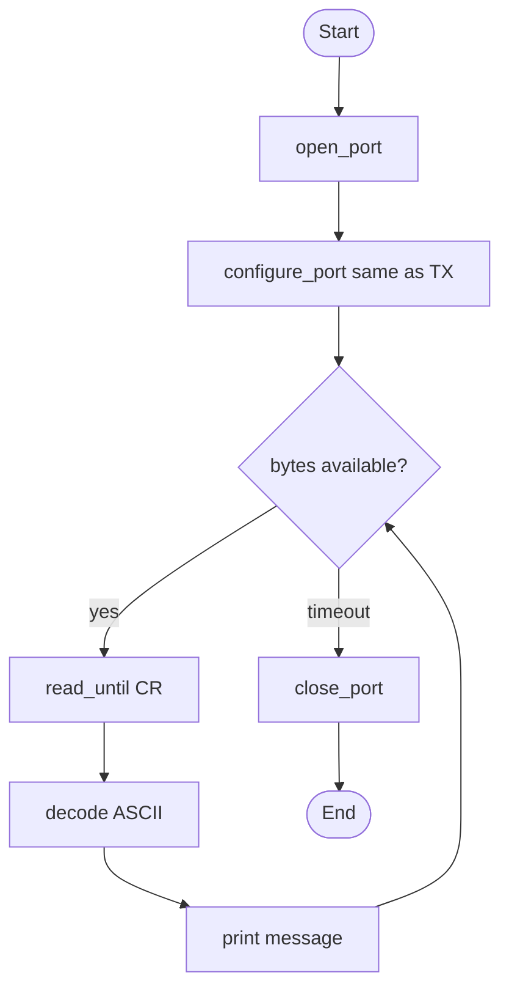

# UART transmitter and receiver algorithms (довідково)

Reference flowcharts for understanding Lab 1 — **not required in the student report**. Reports use Wokwi screenshots + host logs (`Verify: OK`), not hand-drawn diagrams.

## Transmitter

## Receiver

Code: [host/uart_host.py](../../host/uart_host.py), Wokwi: [wokwi/lab01-uart/](../../wokwi/lab01-uart/).
