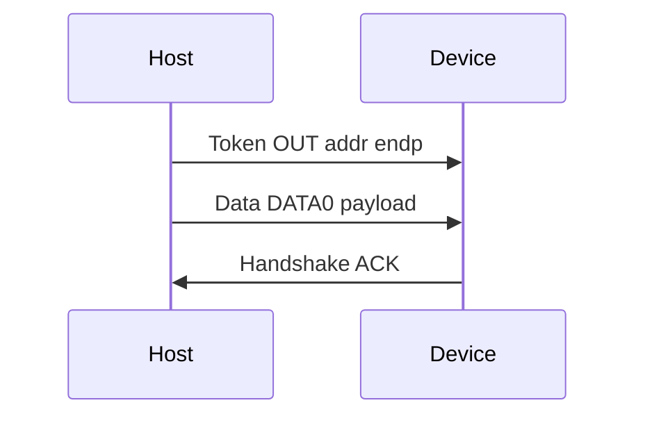

# USB OUT transaction (model)

Educational USB 2.0 Full Speed OUT transaction for Lab 3.

Implementation: [host/usb_transaction.py](../../host/usb_transaction.py).

**Note:** NRZI encoding of the same payload is covered in Lab 2 ([encoding/usb_nrzi.py](../../encoding/usb_nrzi.py)).
