# Лабораторний практикум PPID (2026)

**Навчальний заклад:** Національний університет «Львівська політехніка»  
**Кафедра:** Електроніка та комп’ютерні технології (ЕОМ)  
**Дисципліна:** Периферійні пристрої, інтерфейси та драйвери (PPID)  
**Спеціалізація:** Комп’ютерні системи та мережі (КСМ)  
**Видання:** 2026 (**5 лабораторних робіт**)

> **Про цей документ.** Методичний посібник: **Вступ → загальні положення → тематичні блоки** (теорія → лабораторні → приклад виконання → приклад програм). Усі інструкції, таблиці варіантів, зразки звітів, **повні лістинги програм** у розділах «Приклад програмних драйверів» кожного блоку, схеми Wokwi та питання для самоперевірки зібрані **в одному файлі**. Окремі markdown-файли чи посилання на репозиторій **не потрібні**. Для практичної частини потрібні: **Python 3.11+**, пакети з розділу 1.2 та браузер з доступом до **https://wokwi.com** (лабораторні 1, 4, 5).

---

# ВСТУП

**Мета practicum** — опанування студентами технологій розроблення та дослідження програмних драйверів периферійних інтерфейсів: послідовного асинхронного **RS-232C / UART**, **USB (УПШ)**, синхронної шини **I²C**, а також інтеграції вузла моніторингу (capstone). Посібник призначений для студентів спеціалізації **КСМ** у рамках дисципліни PPID.

**Умови виконання (2026).** Лабораторні працюють на **Python 3.11+**; лаб. **4–5** — симулятор **Wokwi** (ESP32 MicroPython). Лаб. **1** — host + `uart_device_emu` на віртуальній парі (без Wokwi). Фізичне залізо (USB-UART, BME280) **не обов’язкове**; за замовчуванням — `loop://` (лише TX) та mock USB-пристрої.

Практикум містить **5 лабораторних** у **трьох блоках**:

| Блок | Тема | Лабораторні |
|------|------|-------------|
| A | RS-232C / UART | № 1 (TX+RX+модель), № 2 (діаграми UART + NRZI) |
| B | USB / УПШ | № 3 (транзакція, scan, GUI) |
| C | I²C та інтеграція | № 4 (шина I²C), № 5 (capstone) |

**Як користуватися документом:**

1. **Частина I** — встановлення ПЗ, оформлення звіту, варіанти, загальна класифікація інтерфейсів.
2. **Блоки A–C** — для кожної теми: спільна теорія → робота → зразок звіту → лістинги програм.
3. **Додатки A–D** — огляд лабораторних, чеклист, стек технологій, приклад логу.

Додатковий контекст курсу: [course-overview-2026.md](course-overview-2026.md), [lectures-supplement-2026.md](lectures-supplement-2026.md).

---

# ЗМІСТ

- [Вступ](#вступ)
- [ЧАСТИНА I. Загальні положення](#частина-i-загальні-положення)
  - [1.1. Необхідне програмне забезпечення](#11-необхідне-програмне-забезпечення)
  - [1.2. Встановлення Python та пакетів](#12-встановлення-python-та-пакетів)
  - [1.3. Оформлення звіту (2026)](#13-оформлення-звіту-2026)
  - [1.4. Симулятор Wokwi](#14-симулятор-wokwi-лаб-1-4-5)
  - [1.5. Послідовний порт host](#15-послідовний-порт-host---port-лаб-1)
  - [1.6. Повідомлення (прізвище)](#16-повідомлення-прізвище-та-кодування)
  - [1.7. Рівні програмного забезпечення](#17-рівні-програмного-забезпечення)
  - [1.8. Класифікація інтерфейсів (загальний орієнтир)](#18-класифікація-периферійних-інтерфейсів-орієнтир)
  - [1.11. Таблиця варіантів](#111-таблиця-варіантів-завдань)
  - [1.12. Mock USB-пристрої](#112-mock-usb-пристрої-для-лаб-3)
- [ЧАСТИНА II. Лабораторні роботи](#частина-ii-лабораторні-роботи)
- [БЛОК A. RS-232C / UART (лаб. 1–2)](#блок-a-лабораторні-12-rs-232c--uart)
  - [Теоретичні відомості для лаб. 1–2](#теоретичні-відомості-для-виконання-лабораторних-робіт-1–2)
  - [Лабораторна робота № 1](#лабораторна-робота--1)
  - [Лабораторна робота № 2](#лабораторна-робота--2)
  - [Приклад виконання лаб. 1–2](#приклад-виконання-основних-етапів-лабораторних-робіт-1–2)
  - [Приклад програмних драйверів лаб. 1–2](#приклад-програмних-драйверів-для-лабораторних-робіт-1–2)
- [БЛОК B. USB / УПШ (лаб. 3)](#блок-b-лабораторна-3-usb--упш)
  - [Теоретичні відомості для лаб. 3](#теоретичні-відомості-для-виконання-лабораторної-роботи-3)
  - [Лабораторна робота № 3](#лабораторна-робота--3)
  - [Приклад виконання лаб. 3](#приклад-виконання-основних-етапів-лабораторної-роботи-3)
  - [Приклад програмних драйверів лаб. 3](#приклад-програмних-драйверів-для-лабораторної-роботи-3)
- [БЛОК C. I²C та інтеграція (лаб. 4–5)](#блок-c-лабораторні-45-i²c-та-інтеграція-ксм)
  - [Теоретичні відомості для лаб. 4–5](#теоретичні-відомості-для-виконання-лабораторних-робіт-4–5)
  - [Лабораторна робота № 4](#лабораторна-робота--4)
  - [Лабораторна робота № 5](#лабораторна-робота--5)
  - [Приклад виконання лаб. 4–5](#приклад-виконання-основних-етапів-лабораторних-робіт-4–5)
  - [Приклад програмних драйверів лаб. 4–5](#приклад-програмних-драйверів-для-лабораторних-робіт-4–5)
- [ЧАСТИНА III. Додатки A–D](#частина-iii-додатки)

---

# ЧАСТИНА I. Загальні положення

## 1.1. Необхідне програмне забезпечення

| Компонент | Призначення |
|-----------|-------------|
| **Python 3.11+** | Лабораторні 1–3, 5 (host) |
| **pyserial** ≥ 3.5 | Послідовний порт (лаб. 1) |
| **matplotlib** ≥ 3.11 | Діаграми UART/NRZI (лаб. 2), графік capstone (лаб. 5) |
| **pytest** ≥ 9.1 | Перевірка модулів (лаб. 2–3), опційно |
| **Wokwi** (браузер) | Симуляція ESP32 MicroPython (лаб. 4, 5) |
| **com0com** / **VSPD** (Windows) | Віртуальна пара COM (лаб. 1) |
| **socat** (Linux/macOS) | Альтернатива `uart_pty_pair` (лаб. 1) |
| **draw.io** / diagrams.net | Опційно: пояснення на захисті (не обов’язково у звіті) |

**Залежності Python (requirements.txt):**

```text
pyserial>=3.5
matplotlib>=3.11
pytest>=9.1
```

## 1.2. Встановлення Python та пакетів

1. Встановіть Python 3.11 або новіший з https://www.python.org/downloads/ (Windows: увімкніть «Add to PATH»).
2. Створіть робочу теку, наприклад `ppid-labs-work`.
3. Скопіюйте програми з розділу **«Приклад програмних драйверів»** відповідного блоку (A, B або C) у файли `host/`, `encoding/` та `wokwi/` у робочій теці (структура каталогів — як у назвах файлів у лістингах). Індекс програм — [Додаток C](#appendix-c).
4. У терміналі:

```bash
cd ppid-labs-work
python3 -m venv .venv
source .venv/bin/activate          # Windows: .venv\Scripts\activate
pip install pyserial matplotlib pytest
python3 -m pytest tests/ -v        # опційно, якщо скопійовано каталог tests/ з репозиторію
```

Лабораторні **2** і **3** працюють **повністю офлайн**. Лабораторні **1, 4, 5** потребують інтернету для Wokwi.

## 1.3. Оформлення звіту (2026)

Звіт базується на **доказах виконання** (скріни програм, програмно згенеровані діаграми, логи, лістинги коду). Ручні flowchart **не обов’язкові**.

**Обов’язково у звіті:**

1. Титульний аркуш з **номером варіанту** та **прізвищем** (латиницею A–Z).
2. Мета, короткі теоретичні відомості, хід роботи, висновки.
3. **Докази виконання:** скріни роботи програм (Wokwi, GUI), **програмно згенеровані** діаграми (PNG з matplotlib або `signal_gui`), hex-дампи та логи (`Verify: OK`, `TX hex` тощо).
4. Таблиця параметрів варіанту (baud, format, mock USB — розділ 1.11).
5. Текст програм (розділ «Приклад програмних драйверів» відповідного блоку або додаток до звіту).
6. Відповіді на питання для самоперевірки (на захисті або у звіті).
7. Демонстрація на комп’ютері / у Wokwi.

**Не обов’язково:** ручні схеми алгоритмів (draw.io, Visio). Mermaid-діаграми в методичці — **довідково** для розуміння, не для здачі.

**По лабораторних (мінімальний набір артефактів):**

| Лаб | Артефакти звіту |
|-----|-----------------|
| 1 | TX+RX через віртуальну пару: логи `uart_host` + `uart_device_emu`; TXD/RXD/GND; ASCII першої літери; опційно `loop://` |
| 2 | 2 PNG UART+NRZI; розрахунок часу; **посимвольний розбір** (start/data/parity?/stop + NRZI); місток ASCII → лаб. 3 |
| 3 | Hex транзакції; скрін `usb_gui` + `cat` у temp; USB-A/C; **для макс. оцінки** — флешка (мітка/формат/розмір + `cat`) |
| 4 | Адреса `i2c.scan()`; Serial Monitor; скрін Logic Analyzer SDA/SCL |
| 5 | Serial log, CSV, графік `out.png`; діаграма компонентів з методички |

## 1.4. Симулятор Wokwi (лаб. 4, 5)

1. Відкрийте https://wokwi.com/projects/new/micropython-esp32
2. У редакторі: **File → New file** — створіть `main.py`, вставте код з розділу **«Приклад програмних драйверів»** відповідного блоку.
3. **File → New file** — створіть `diagram.json`, вставте `diagram.json` з того ж розділу.
4. **Лаб. 4 і 5:** **`main.py`** та **`diagram.json`** — з папки лабораторії в репозиторії; **`bmp180.py`** — з [`wokwi/lib/bmp180.py`](../wokwi/lib/bmp180.py) (спільний драйвер; не Arduino Library Manager).
5. Натисніть **▶ Start Simulation**.
6. Відкрийте **Serial Monitor** (нижня панель) для обміну з ESP32.
7. Для **лаб. 4** (і 5): на схемі є **Logic Analyzer** (`diagram.json`). Під час симуляції зростає лічильник samples; після **Stop** браузер завантажить **`wokwi-logic.vcd`**. Хвилі SDA/SCL у Wokwi **не** показуються — їх переглядають у зовнішній програмі (див. нижче).

**Файли Wokwi (лаб. 4, 5):** `main.py` + `diagram.json` (з папки lab04 або lab05) + `bmp180.py` (з `wokwi/lib/`).

### Logic Analyzer: перегляд SDA/SCL (лаб. 4)

Wokwi **записує** цифрові сигнали, але **не малює** осцилограму в браузері. Офіційна інструкція: [Wokwi Logic Analyzer Guide](https://docs.wokwi.com/guides/logic-analyzer).

1. Запустіть симуляцію; переконайтесь, що на Logic Analyzer блимають LED і зростає число samples.
2. Натисніть **Stop** — завантажиться **`wokwi-logic.vcd`** (формат VCD).
3. Відкрийте файл у **[PulseView](https://sigrok.org/)** (рекомендовано) або **GTKWave**:
   - PulseView: **Open** → ▼ → **Import Value Change Dump data…** → обрати `wokwi-logic.vcd`.
   - У діалозі імпорту встановіть **Downsampling factor = 50** (див. [таблицю Wokwi](https://docs.wokwi.com/guides/logic-analyzer)).
4. Додайте декодер **I²C** (кнопка *Add protocol decoder*). Канали з `diagram.json`: **SDA = D0** (GPIO21), **SCL = D1** (GPIO22). Зробіть скрін START, адреса **0x77**, ACK, STOP — у звіт.

**Встановлення PulseView** (одноразово; безкоштовно). Деталі та оновлення: [sigrok Downloads](https://sigrok.org/wiki/Downloads). Використання VCD: [Wokwi Logic Analyzer Guide](https://docs.wokwi.com/guides/logic-analyzer).

| ОС | Як встановити |
|----|----------------|
| **Windows** | З [sigrok Downloads](https://sigrok.org/wiki/Downloads) — **PulseView (64bit)** installer (`.exe`); запустити інсталятор. |
| **Linux** | AppImage **PulseView (64bit)** з [sigrok Downloads](https://sigrok.org/wiki/Downloads): `chmod +x pulseview-*.AppImage` → `./pulseview-*.AppImage`. Альтернатива: пакет дистрибутива (`pulseview`), якщо є у репозиторії. |
| **macOS** | З [sigrok Downloads](https://sigrok.org/wiki/Downloads) — **PulseView (64bit)** DMG → встановити в Applications. Офіційний DMG — **x86_64** (на Apple Silicon зазвичай працює через Rosetta). Деталі: [sigrok — Mac OS X](https://sigrok.org/wiki/Mac_OS_X). Якщо macOS блокує запуск: `xattr -cr /Applications/PulseView.app` |

**GTKWave** — запасний переглядач без декодера I²C: Linux `sudo apt install gtkwave`; macOS `brew install gtkwave`; Windows — [gtkwave.sourceforge.net](https://gtkwave.sourceforge.net/).

**Surfer (веб, без встановлення)** — альтернатива, якщо PulseView не встановлюється (зокрема macOS): [app.surfer-project.org](https://app.surfer-project.org/) ([проєкт Surfer](https://surfer-project.org/)). Перетягніть `wokwi-logic.vcd` у вікно браузера, додайте сигнали **D0 (SDA)** та **D1 (SCL)**, зробіть скрін. **Немає декодера I²C** — лише цифрові хвилі; у звіті коротко опишіть START, адресу **0x77**, ACK, STOP (або посилайтесь на `i2c.scan()` з Serial Monitor).

**Датчик I²C у Wokwi (лаб. 4, 5):** використовується вбудований **`board-bmp180`** (адреса **0x77**). У таблиці варіантів зазначено **BME280** — той самий тип завдання (температура по I²C); на реальному залізі — BME280 (0x76/0x77).

## 1.5. Послідовний порт host, `--port` (лаб. 1)

| Сценарій | Значення `--port` | ОС |
|----------|-------------------|-----|
| Самоперевірка TX | `loop://` | усі (Windows, Linux, macOS) |
| USB-UART адаптер | `COM3`, `COM5`, … | Windows |
| USB-UART адаптер | `/dev/ttyUSB0`, `/dev/ttyACM0` | Linux |
| USB-UART адаптер | `/dev/cu.usbserial-*`, `/dev/cu.usbmodem*` | macOS |
| Віртуальна пара (**обов’язковий** обмін TX↔RX) | `COM5` / `COM6` | Windows — com0com |
| Віртуальна пара (**обов’язковий** обмін TX↔RX) | `/tmp/comA`, `/tmp/comB` | Linux/macOS — `uart_pty_pair` (або socat) |

`loop://` однаковий на всіх ОС (pyserial `serial_for_url`); додаткових драйверів не потрібно — це лише **самоперевірка TX**, не роль приймача.

**Linux/macOS** — віртуальна пара (**обов’язково** для обміну; без окремого `socat`):

```bash
python3 -m host.uart_pty_pair
# або: socat -d -d pty,raw,echo=0,link=/tmp/comA pty,raw,echo=0,link=/tmp/comB
```

**Windows:** встановіть com0com (https://com0com.sourceforge.net/) і створіть пару з’єднаних портів (наприклад COM5 ↔ COM6).

**Обов’язковий обмін Host↔Device:**

```bash
python3 -m host.uart_pty_pair                                 # термінал 0
python3 -m host.uart_device_emu --port /tmp/comB              # термінал 1 (RX)
python3 -m host.uart_host --message "IVANOV" --port /tmp/comA --wait-ack   # термінал 2 (TX)
```

Windows: `--port COM6` / `--port COM5`. Див. [SETUP § Virtual COM](SETUP.md#virtual-com-ports-lab-1).

**Лише TX:** `python3 -m host.uart_host` (за замовч. `--port loop://`).
## 1.6. Повідомлення (прізвище) та кодування

**Повідомлення** для лаб. **1–3** і запису в mock USB (лаб. 3) — **прізвище студента великими латинськими літерами A–Z** (без пробілів; транслітерація, напр. `IVANOV`):

| Ситуація | Приклад |
|----------|---------|
| Звичайне прізвище | `IVANOV`, `PETRENKO` |
| Подвійне прізвище | `SHEVCHENKO-PETRENKO` |
| Прізвище < 4 символів | додати ім’я без пробілу — узгодити з викладачем |

**Лаб. 4 (OLED):** вивести **те саме прізвище** на дисплей.

Кодування: **ASCII / UTF-8** (латиниця); `cp1251` також підходить для A–Z. Завершення пакета UART — символ `\r`. **Не використовуйте кирилицю** у повідомленні лаб. 1–3.

**Номер варіанту (1–10)** задає лише **технічні параметри** (розділ 1.11), не текст повідомлення.

## 1.7. Рівні програмного забезпечення

```text
Периферійний пристрій
    → firmware (вбудоване ПЗ пристрою)
    → драйвер ядра ОС (kernel driver)
    → API операційної системи
    → прикладні бібліотеки (pyserial, tkinter)
    → програма користувача
```

| Рівень | Приклад | Лабораторні |
|--------|---------|-------------|
| Модель протоколу | NRZI, Token/Data/Handshake | 2, 3 |
| HAL / бібліотека | pyserial; `machine.UART` / `machine.I2C` (Wokwi) | 1; 4–5 |
| API ОС | pathlib, tempfile, tkinter | 3, 5 |
| Фізична шина (симуляція) | Wokwi Logic Analyzer | 4 |

**Лаб. 1:** `Python host (pyserial) ↔ віртуальна пара COM ↔ uart_device_emu`

**Лаб. 3:** модель байтів USB → mock enumeration → GUI + tempfile (аналог Mass Storage API, **не** kernel driver).

**Лаб. 5:** `BME280 → I²C → ESP32 → UART → host → CSV + графік`

## 1.8. Класифікація периферійних інтерфейсів (орієнтир)

> Нижче — українські терміни з **англомовними відповідниками (EN)**, як у datasheet і підручниках: *simplex*, *half-duplex*, *full-duplex*, *serial*, *parallel*, *asynchronous*, *synchronous*, *bus*, *point-to-point*, *master–slave*.

### За напрямком передачі (duplex)

| Режим (UK / EN) | Приклади в курсі |
|-----------------|------------------|
| Симплекс / *simplex* | Датчик → MCU (дані в один бік) |
| Напівдуплекс / *half-duplex* | CAN, I²C, RS-485 (обидва боки, але не одночасно) |
| Повний дуплекс / *full-duplex* | RS-232 (окремі TX/RX), SPI (MOSI/MISO), USB endpoints |

### За способом передачі (serial vs parallel)

| Тип (UK / EN) | Приклади |
|---------------|----------|
| Послідовний / *serial* | RS-232, USB, CAN, SPI, I²C, MIL-1553B |
| Паралельний / *parallel* | Centronics, IEEE-488 (GPIB) |
| Магістраль / *bus* | PCI, PCIe, CAN, I²C |

### За синхронізацією

| Тип (UK / EN) | Приклади |
|---------------|----------|
| Асинхронний / *asynchronous* | UART, RS-232C (baud, start/stop bit) |
| Синхронний / *synchronous* | SPI, I²C, USB (SOF), PCIe (shared / embedded clock) |

### За топологією

| Топологія (UK / EN) | Приклади |
|---------------------|----------|
| Point-to-point / *вузол–вузол* | RS-232, USB (host–device) |
| Шина / *bus* (багато вузлів) | CAN, I²C |
| Зірка / *star* | USB hub, PCIe root complex |
| Master–slave / *ведучий–ведений* | SPI, I²C |

Детальна теорія за інтерфейсами — у **теоретичних розділах блоків A, B, C** (Частина II).

## 1.11. Таблиця варіантів завдань

Номер варіанта призначає викладач. **Прізвище** — за розділом 1.6 (однакове правило для всіх).

| № | Бод | Формат | Датчик (лаб. 4) | Інтервал, мс (лаб. 5) | Mock USB (лаб. 3) |
|---|-----|--------|-----------------|----------------------|-------------------|
| 1 | 9600 | 8N1 | BME280 | 500 | SanDisk Cruzer (Mass Storage) |
| 2 | 9600 | 8N1 | BME280 | 500 | Espressif USB JTAG/serial (CDC) |
| 3 | 19200 | 8N1 | BME280 | 1000 | Logitech USB Receiver |
| 4 | 19200 | 8N1 | I²C OLED | 500 | Intel Bluetooth (USB) |
| 5 | 9600 | 7E1 | BME280 | 200 | Linux Foundation 2.0 root hub |
| 6 | 9600 | 8N1 | I²C OLED | 1000 | SanDisk Cruzer (Mass Storage) |
| 7 | 38400 | 8N1 | BME280 | 500 | Espressif USB JTAG/serial (CDC) |
| 8 | 38400 | 8N1 | BME280 | 200 | Logitech USB Receiver |
| 9 | 9600 | 8N2 | I²C OLED | 500 | Intel Bluetooth (USB) |
| 10 | 19200 | 8N1 | BME280 | 1000 | Linux Foundation 2.0 root hub |

**Примітки:** `7E1` = 7 біт + парність Even + 1 стоп; `8N2` = 8 біт, без парності, 2 стоп-біти. Mock USB — з таблиці в розділі 1.12. **Повідомлення** — прізвище; завершення пакета — `\r`.

## 1.12. Mock USB-пристрої (для лаб. 3)

| VID:PID | Назва | Клас | Швидкість |
|---------|-------|------|-----------|
| 046d:c52b | Logitech USB Receiver | HID | 12 Mbps (Full Speed) |
| 0781:5567 | SanDisk Cruzer (Mass Storage) | Mass Storage | 480 Mbps (High Speed) |
| 303a:1001 | Espressif USB JTAG/serial (CDC) | CDC | 12 Mbps (Full Speed) |
| 1d6b:0002 | Linux Foundation 2.0 root hub | Hub | 480 Mbps (High Speed) |
| 8087:0026 | Intel Bluetooth (USB) | Wireless | 12 Mbps (Full Speed) |

У реальній ОС: `lsusb` (Linux), Диспетчер пристроїв (Windows).

---

# ЧАСТИНА II. Лабораторні роботи

# БЛОК A. Лабораторні 1–2 (RS-232C / UART)

## Теоретичні відомості для виконання лабораторних робіт № 1–2

> Загальна класифікація інтерфейсів — розділ 1.8. Нижче — теорія блоку RS-232C / UART для лаб. 1–2.

**UART / RS-232C (EN):** *asynchronous, serial, point-to-point* (зазвичай *full-duplex* за окремими лініями TX/RX).

1. **RS-232C** — інтерфейс між DTE (термінал, ПК) та DCE (модем, перетворювач). На сучасних платах (ESP32, Raspberry Pi) той самий **UART**-протокол реалізується на рівні мікроконтролера або `/dev/tty*`.
2. **Формат слова** — стартовий біт, біти даних (зазвичай 8), біт парності (опційно), один або кілька стопових бітів. Позначення **8N1**: 8 біт даних, без парності, 1 стоп-біт.
3. **Передавальний порт** — режими **налаштування** (baudrate, bytesize, parity, stopbits) та **передавання** (запис байтів у буфер TX).
4. **Приймальний порт** — налаштування → циклічне читання з буфера RX до завершення пакета (символ `\r`).
5. **Драйвер** на ПК (pyserial) інкапсулює доступ до послідовного порту; у прошивці MCU — `machine.UART` (лаб. 4–5).

Інтерфейс RS-232C широко використовують у персональних та промислових комп’ютерах для обміну з периферією у **послідовному дуплексному** режимі. У багатьох ПК інтерфейс реалізований як **COM-порт**; для підключення застосовують стандартизований **25-** або **9-контактний** з’єднувач.

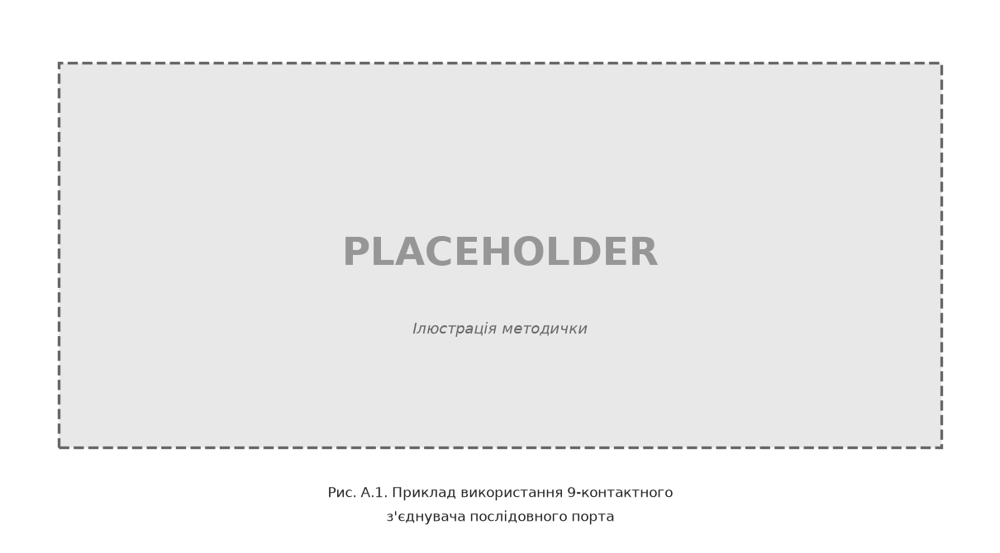

*Ілюстративний рисунок методички (не обов’язковий у звіті).*

Початок асинхронного символу відмічається **стартовим бітом** (логічний 0), далі — поле даних (5–8 біт), біт паритету (опційно), один або кілька **стопових бітів** (логічна 1). Символи ASCII передаються у 7- або 8-бітовому полі даних.

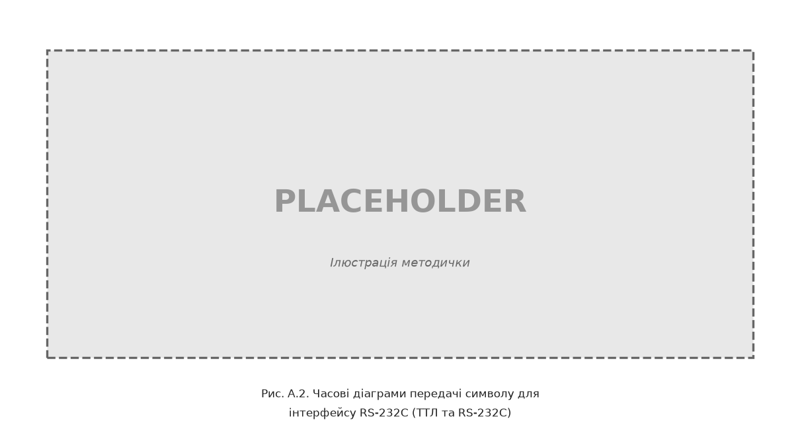

*Ілюстративний рисунок методички (а — рівні ТТЛ, б — рівні RS-232C).*

Комп’ютер має **DB25P** або **DB9P** з’єднувач. Контакти DB25P використовуються неповно, тому на практиці частіше застосовують **DB9P**.


*Ілюстративний рисунок методички.*

**Призначення основних сигналів** (шина даних і управління):

| Сигнал | DB25 | DB9 | Напрям | Опис |
|--------|------|-----|--------|------|
| RXD | 3 | 2 | IN | Дані, що приймаються |
| TXD | 2 | 3 | OUT | Дані, що передаються |
| DTR | 20 | 4 | OUT | Готовність терміналу |
| GND | 7 | 5 | — | Сигнальна земля |
| DSR | 6 | 6 | IN | Готовність даних |
| RTS | 4 | 7 | OUT | Запит на відправку |
| CTS | 5 | 8 | IN | Готовність прийому |

При **програмному** протоколі управління потоком (XON/XOFF) використовують лише лінії TXD/RXD — **три- або чотирипровідний** зв’язок.

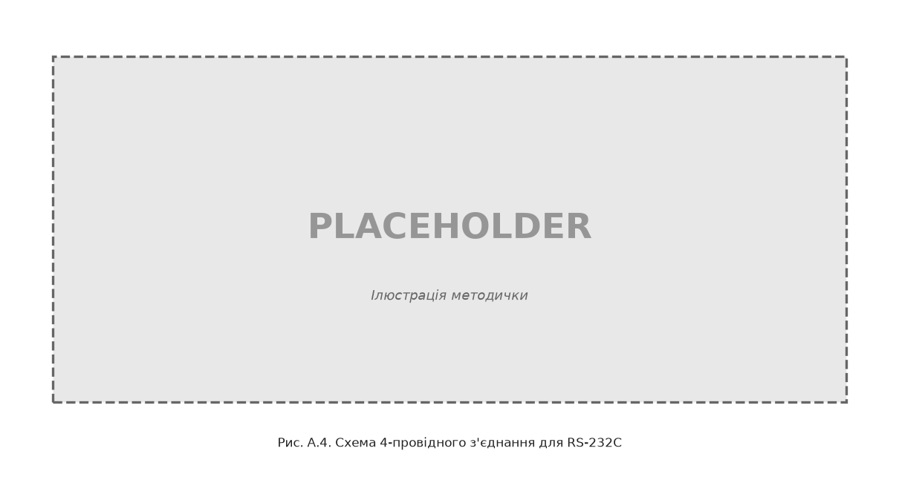

*Ілюстративний рисунок методички.*

Формат слова програмується завчасно і має бути **однаковим** для передавача та приймача; тривалість такту **T_такт = 1 / baudrate**.

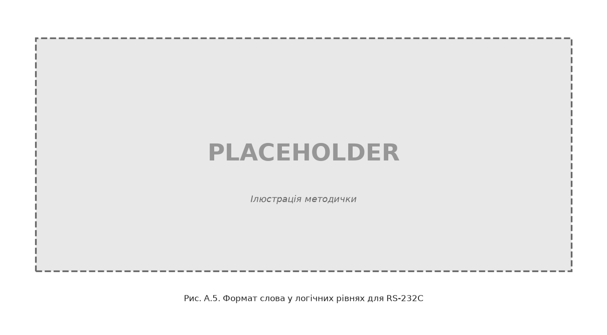

*Ілюстративний рисунок методички.*

На лінії RS-232C дані передаються в **інверсному коді** (логічній одиниці відповідає негативна напруга, логічному нулю — позитивна). Типові діапазони:

| Рівень | Передавач | Приймач |
|--------|-----------|---------|
| Логічний 0 | +5 В … +15 В | +3 В … +15 В |
| Логічна 1 | −5 В … −15 В | −3 В … −15 В |

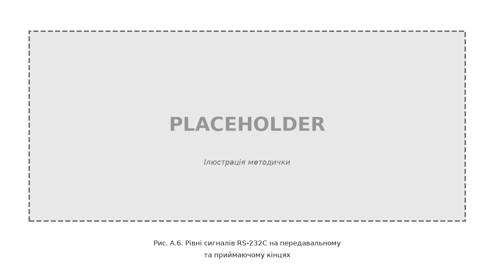

*Ілюстративний рисунок методички.*

Швидкості обміну (біт/с): 50, 75, 100, 150, 300, 600, 1200, 2400, 4800, 9600, 19200, 38400, 57600, 115200. Апаратний драйвер часто реалізують мікросхемою **UART** (i8250, 16550A тощо); рівні ТТЛ узгоджують з RS-232 перетворювачами рівнів.

**Амплітудно-часова діаграма UART** — послідовність рівнів на лінії TX протягом передачі старт-стопного кадру кожного символу. Між символами в завданні передбачена **пауза тривалістю один такт**.

**NRZI** (Non-Return to Zero Inverted) у USB 2.0: при передачі логічного **0** рівень сигналу **змінюється**; при логічній **1** — **не змінюється**. **Bit stuffing** — вставка біта 0 після шести послідовних одиниць. Для **USB 3.x SuperSpeed** — кодування **8b/10b** (детальніше — блок B).

---

## Лабораторна робота № 1

### Розроблення та дослідження програм передавача, приймача та моделі обміну даними інтерфейса RS-232C

**Мета роботи:** опанування студентом технології та процесу налаштування передавального та приймального портів, створення програм передавача і приймача пакетних даних та реалізації моделі обміну заданим повідомленням через послідовний асинхронний інтерфейс RS-232C (COM-порт / UART).

**Завдання на роботу.** Конкретний пакет даних та відповідне повідомлення студенту визначає викладач згідно з **розділом 1.11** (прізвище **латиницею A–Z**, напр. `IVANOV`). Задається швидкість обміну даними, тип контролю, кількість стопових біт.

**Короткі теоретичні відомості.** Див. [теоретичний розділ блоку A](#теоретичні-відомості-для-виконання-лабораторних-робіт-1–2).

**Технологія виконання.** Реалізуйте **дві ролі** на **одному живому шляху байтів** (віртуальна пара COM):

| Роль | Програма | Функції |
|------|----------|---------|
| **Передавач (TX), host** | `host/uart_host.py` | `open_port`, `configure_port`, `send_message`, `--wait-ack` |
| **Приймач (RX), device** | `host/uart_device_emu.py` — **обов’язково** | читання до `\r`, `--- exchange ---`, відповідь `ACK:…\n` |
| Міст | `host/uart_pty_pair.py` (або socat / com0com) | `/tmp/comA` ↔ `/tmp/comB` (Linux/macOS); `COM5`↔`COM6` (Windows) |

**Одне прізвище** у `--message` host і в прийнятому кадрі RX. На `loop://` host лише **самоперевіряє запис** (echo) — це **не** роль приймача. Wokwi у лаб. 1 **не використовується** (перший Wokwi — лаб. 4).

> **Формат кадру в лаб. 1.** У шаблоні `host/uart_host.py` формат лінії **захардкоджено як 8N1** (8 біт даних, без парності, 1 стоп-біт): `bytesize` / `parity` / `stopbits` не вибираються з GUI. У звіті достатньо зазначити **8N1** (або формат з варіанту як теоретичний параметр). **Старт-біт, парність (Even/Odd), стоп-біти та амплітудно-часова діаграма** — у **лабораторній № 2** (`uart_plot`, `signal_gui`, формати `8N1` / `7E1` / `8N2`).

**Довідкова схема обміну (mermaid, не обов’язкова у звіті):**

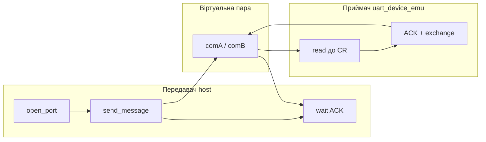


**Кроки виконання:**

1. Визначити параметри лінії згідно з варіантом (розділ 1.11); **повідомлення** — прізвище (розділ 1.6).
2. **(Опційно)** самоперевірка TX: `python3 -m host.uart_host --message "IVANOV" --baud 9600 --port loop://` → `TX hex`, `Verify: OK`.
3. **Приймач + передавач — обов’язково** (живий шлях байтів):
   ```bash
   python3 -m host.uart_pty_pair                                 # термінал 0 (тримати запущеним)
   python3 -m host.uart_device_emu --port /tmp/comB              # термінал 1 (RX)
   python3 -m host.uart_host --message "IVANOV" --port /tmp/comA --wait-ack   # термінал 2 (TX)
   ```
   Альтернатива: `socat` (див. розділ 1.5). Windows: com0com (`COM5`↔`COM6`). Див. [SETUP § Virtual COM](SETUP.md#virtual-com-ports-lab-1).
4. У звіті: лог emu (`--- exchange ---`) + host `TX hex` і `Verify: OK` на `ACK:…`.
5. Коротко: ASCII першої літери прізвища (hex); idle = 1, start = 0; повний кадр — у лаб. 2.

**Приклад коду (фрагмент, host):**

```python
import serial

PORT = "/tmp/comA"  # або COM5; loop:// — лише самоперевірка TX
BAUD = 9600

def open_port(name: str) -> serial.Serial:
    return serial.Serial(
        port=name,
        baudrate=BAUD,
        bytesize=serial.EIGHTBITS,
        parity=serial.PARITY_NONE,
        stopbits=serial.STOPBITS_ONE,
        timeout=1,
    )

def send_message(ser: serial.Serial, text: str) -> int:
    payload = (text + "\r").encode("cp1251")
    return ser.write(payload)

if __name__ == "__main__":
    message = "IVANOV"  # ваше прізвище латиницею (A–Z)
    with open_port(PORT) as ser:
        nbytes = send_message(ser, message)
        print(f"Надіслано байт: {nbytes}")
```

**Питання для самоперевірки:**

1. Привести основні характеристики інтерфейсу RS-232C.
2. Привести призначення сигналів інтерфейсу RS-232C.
3. Привести формат даних інтерфейсу RS-232C.
4. Привести формат слова передавального та приймального порту.
5. Привести особливості основних режимів функціонування передавального та приймального портів.
6. Пояснити, яким способом порт переводиться з режиму налаштування в режим основної роботи.
7. Пояснити основні принципи розроблення схем алгоритмів первинного налаштування передавача та приймача.
8. Привести основні етапи відлагодження програм передавача та приймача.
9. Пояснити роботу написаних програм.
10. Навести особливості передачі-приймання заданого повідомлення в моделі обміну.

**Додаткові питання:**

11. Чим pyserial відрізняється від `machine.UART` на ESP32 (лаб. 4–5)?
12. Як перевірити передачу без фізичного COM-порту та USB-UART адаптера?
13. Навіщо `uart_pty_pair` / com0com, якщо є `loop://`?
14. Хто в цій лабораторній є **передавачем (TX)**, хто **приймачем (RX)**? Чому baud і format мають збігатися на обох сторонах?
15. Які три контакти DB9 достатні для обміну даними? Що таке idle і start-біт?

**Зміст звіту:**

1. Мета роботи.
2. Короткі теоретичні відомості (ролі TX/RX; **TXD/RXD/GND**; idle/start; формат кадру UART).
3. Хід роботи:
   - **3.1** Параметри варіанту;
   - **3.2** Передавач (host): `TX hex`; опційно `loop://`; з `--wait-ack` — `Verify: OK`;
   - **3.3** Приймач (`uart_device_emu`, **обов’язково**): `--- exchange ---`, ACK;
   - **3.4** Порівняння: ті самі байти на TX і RX; host прийняв `ACK:…`;
   - **3.5** ASCII першої літери (підготовка до лаб. 2).
4. Висновки.
5. Текст програм ([E.1](#appendix-e1) у розділі «Приклад програмних драйверів» блоку A або додаток до звіту).
6. Демонстрація на комп’ютері (на захисті — **показати live** Host↔Device на віртуальній парі).

---

## Лабораторна робота № 2

### Дослідження графічного представлення сигналів лінії зв’язку та кодування NRZI інтерфейса УПШ (USB)

**Мета роботи:** опанування студентом особливостей передачі пакету даних через лінію зв’язку у графічному представленні сигналів для послідовного асинхронного інтерфейса RS-232C (COM-порта) та особливостей формування посимвольних даних у схемі кодування NRZI через інтерфейс УПШ (USB).

**Завдання на роботу.** **Повідомлення** — прізвище (розділ 1.6). **Baudrate і формат** — з розділу 1.11.

**Короткі теоретичні відомості.** Див. [теоретичний розділ блоку A](#теоретичні-відомості-для-виконання-лабораторних-робіт-1–2) (UART-діаграми та NRZI).

**Технологія виконання.** Побудуйте амплітудно-часові діаграми передачі **усього заданого повідомлення** (UART та NRZI). Тут же досліджуються **старт-біт, біти даних, парність (за форматом варіанту), стоп-біти** — на відміну від лаб. 1, де host захардкоджено як 8N1. **Основний спосіб** — CLI або **довідковий GUI** `host/signal_gui.py`: збереження **PNG** для звіту. Альтернатива: `encoding/uart_plot.py`, `encoding/usb_nrzi.py` (matplotlib). draw.io — лише запасний варіант; GUI надає курс — не замінює код студента у звіті.

**Розрахунок часу передачі (UART):**

```text
T_символ = (1 старт + N_даних + парність? + N_стоп) × T_такт
T_такт = 1 / baudrate
T_повідомлення ≈ (кількість_символів × біт_на_символ × T_такт) + (паузи між символами)
```

**Кроки виконання:**

1. За варіантом визначити повідомлення, baudrate і **format**.
2. Побудувати діаграму UART для всього повідомлення з паузою 1 такт між символами; підписати start/data/parity?/stop.
3. Перетворити повідомлення в бітовий рядок; застосувати bit stuffing; закодувати NRZI.
4. Побудувати діаграму NRZI для всього повідомлення.
5. Розрахувати загальний час передавання повідомлення для UART (за заданим baudrate).
6. **Посимвольно:** для однієї літери прізвища — таблиця ролей бітів UART + розбір NRZI (див. [examples/lab2/lab2.md](../examples/lab2/lab2.md) §4).
7. У висновку: ті самі ASCII-байти з’являться в лаб. 3 (Data / `message.txt`).

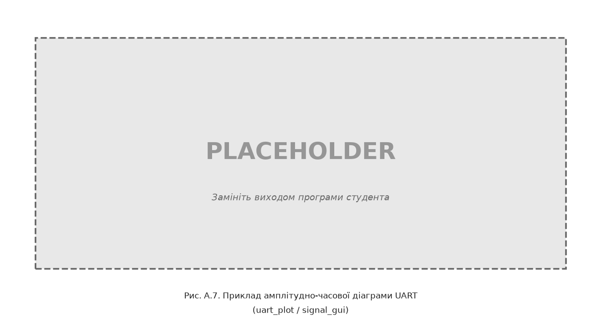

*Ілюстративний рисунок методички. У звіті студента — **програмно згенерований** PNG з `uart_plot` або `signal_gui` для всього повідомлення варіанту.*

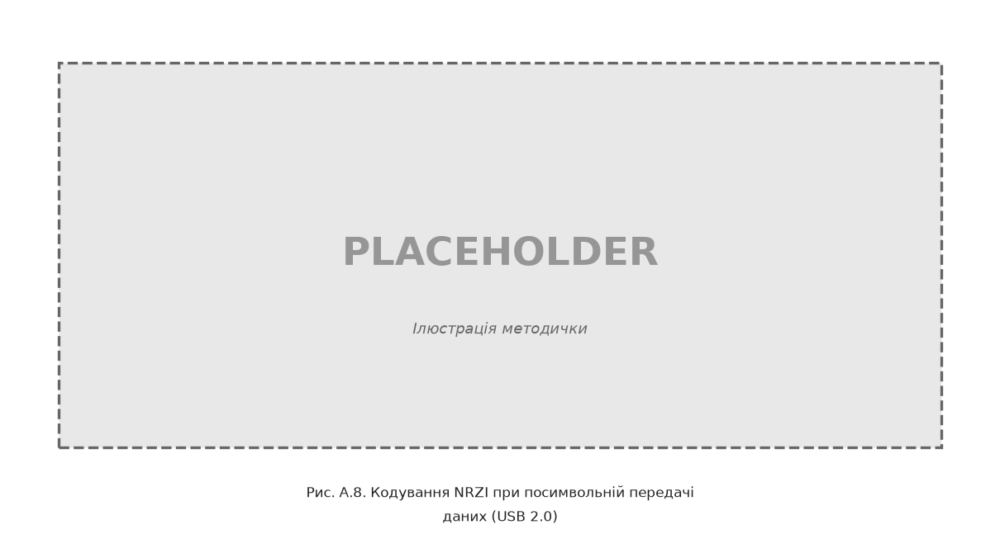

*Ілюстративний рисунок методички. У звіті — PNG з `usb_nrzi` або `signal_gui`.*

**Приклад коду (фрагмент, NRZI):**

```python
def nrzi_encode(bits: str) -> list[int]:
    levels = [1]
    for b in bits:
        if b == "0":
            levels.append(1 - levels[-1])
        else:
            levels.append(levels[-1])
    return levels

message = "IVANOV"  # ваше прізвище великими літерами
raw = "".join(format(ord(c), "08b") for c in message)
encoded = nrzi_encode(raw)
```

**Запуск шаблонів:**

```bash
cd ppid-labs-work   # робоча тека; програми — блок A, розділ «Приклад програмних драйверів»
python -m encoding.uart_plot --message "IVANOV" --baud 9600
python -m encoding.usb_nrzi --message "IVANOV"
python -m host.signal_gui
pytest tests/test_usb_nrzi.py -v
```

**Питання для самоперевірки:**

1. Привести співвідношення швидкості обміну інформацією та тривалості одного такту для інтерфейсу RS-232C.
2. Привести сигнальні рівні кодування логічної одиниці та логічного нуля для передавача та приймача.
3. Пояснити, яким способом можна розрахувати загальний час передавання заданого повідомлення.
4. Привести основні характеристики інтерфейсу USB.
5. Привести особливості системи кодування NRZI.
6. Пояснити структуру транзакцій інтерфейсу USB (зв’язок з лаб. 3).

**Додаткові питання:**

7. Чим відрізняється логічний рівень у програмі від електричного рівня на лінії RS-232?
8. Чому довга послідовність одиниць у NRZI може бути проблемою для синхронізації?
9. Для якої версії USB застосовується NRZI, а яке кодування використовує SuperSpeed (USB 3.x)?
10. Як руками зібрати кадр UART для першої літери прізвища за форматом варіанту (`8N1` / `7E1` / `8N2`)?

**Зміст звіту:**

1. Мета роботи.
2. Короткі теоретичні відомості.
3. Хід роботи: **2 PNG** — UART і NRZI для всього повідомлення; підписи start/data/parity?/stop; **посимвольний розбір** одного символу.
4. Розрахунок загального часу передавання заданого повідомлення (UART).
5. Висновки (включно з містком ASCII → лаб. 3).
6. Текст програми ([E.2](#appendix-e2) у розділі «Приклад програмних драйверів» блоку A або додаток до звіту).
7. Демонстрація на комп’ютері програми для заданого пакету даних.

---

## Приклад виконання основних етапів лабораторних робіт № 1–2

> Зразки звітів для **повної оцінки**. Замініть `PETRENKO` на своє прізвище (латиницею A–Z).

### Лабораторна робота № 1

```markdown
# Приклад звіту — лабораторна робота № 1

> Зразок для **повної оцінки**: **передавач (TX, host)** + **приймач (RX, `uart_device_emu`)** через віртуальну пару COM, `Verify: OK` на `ACK:…` — без UART-графіків (лаб. 2).

---

**Титульний аркуш**

- Дисципліна: PPID  
- Лабораторна робота № 1  
- Студент: **PETRENKO**  
- Варіант: **1** (9600 8N1)

---

## 1. Мета роботи

Опанувати налаштування передавального та приймального портів, ролі TX/RX та **живий** обмін повідомленням через UART (host ↔ device на ПК).

## 2. Короткі теоретичні відомості

**Передавач (TX)** ініціює передачу — запис байтів у лінію. **Приймач (RX)** зчитує кадр і відповідає `ACK:…`. У шаблоні host формат **захардкоджено як 8N1** (парність і діаграма кадру — у лаб. 2).

У цій лабораторній: **TX** — `host/uart_host.py`; **RX** — `host/uart_device_emu.py` на другій половині віртуальної пари (`uart_pty_pair` / com0com).

**Мінімум ліній DB9:** TXD (піна 3), RXD (піна 2), GND (піна 5). У спокої лінія — логічна **1** (idle); старт символу — біт **0**.

## 3. Хід роботи

### 3.1. Параметри варіанту

| Параметр | Значення |
|----------|----------|
| Повідомлення | `PETRENKO` |
| Baudrate | 9600 |
| Формат | 8N1 (захардкоджено в host) |
| Порти | `/tmp/comA` (TX) ↔ `/tmp/comB` (RX) |

### 3.2. Передавач (host, TX)

Спочатку самоперевірка запису на `loop://` (не роль RX):

```bash
python3 -m host.uart_host --message "PETRENKO" --baud 9600 --port loop://
```

```text
TX text: 'PETRENKO'
Надіслано байт: 9
TX hex: 50 45 54 52 45 4e 4b 4f 0d
RX text (loopback): 'PETRENKO'
Verify: OK
```

Потім обмін з приймачем (термінал 2 після запуску `uart_pty_pair` і emu):

```bash
python3 -m host.uart_host --message "PETRENKO" --port /tmp/comA --wait-ack
```

```text
TX text: 'PETRENKO'
Надіслано байт: 9
TX hex: 50 45 54 52 45 4e 4b 4f 0d
RX text: 'ACK:PETRENKO'
Verify: OK
```

### 3.3. Приймач (device, RX — `uart_device_emu`) — обов’язково

```bash
python3 -m host.uart_pty_pair          # термінал 0
python3 -m host.uart_device_emu --port /tmp/comB   # термінал 1
```

Вивід emu:

```text
--- exchange ---
RX text: PETRENKO
RX bytes (9): 50 45 54 52 45 4e 4b 4f 0d
TX ACK: ACK:PETRENKO
TX bytes (14): 41 43 4b 3a 50 45 54 52 45 4e 4b 4f 0a
Verify: OK
--------------
```

**[СКРІНШОТ: два термінали — emu exchange + host Verify: OK]**

### 3.4. Порівняння TX і RX

| Сторона | Результат |
|---------|-----------|
| Host TX | `TX hex: 50 45 54 52 45 4e 4b 4f 0d` |
| Device RX | ті самі байти; відповідь `ACK:PETRENKO`; host `Verify: OK` |

### 3.5. Перша літера (підготовка до лаб. 2)

| Символ | ASCII (dec / hex) | Нагадування |
|--------|-------------------|-------------|
| `P` | 80 / `0x50` | idle = 1; старт-біт = 0; повний кадр 8N1 — у лаб. 2 |

## 4. Висновки

Реалізовано **передавач** і **приймач** на ПК через віртуальну пару COM: байти реально проходять від TX до RX і назад як ACK. Для лінії достатньо TXD/RXD/GND. UART-графіки — у лаб. 2; Wokwi ESP32 — з лаб. 4.

## 5. Додаток — текст програм

`host/uart_host.py`, `host/uart_device_emu.py`, `host/uart_pty_pair.py` — з методички.

## 6. Демонстрація

На захисті: пояснити **хто TX, хто RX**; показати live `uart_pty_pair` + emu + `uart_host --wait-ack`; назвати контакти TXD/RXD/GND.
```

### Лабораторна робота № 2

```markdown
# Приклад звіту — лабораторна робота № 2

> Зразок для **повної оцінки**: 2 PNG (UART + NRZI), розрахунок часу, **посимвольний розбір** одного символу, підписи start/data/stop.

---

**Титульний аркуш**

- Дисципліна: PPID  
- Лабораторна робота № 2  
- Студент: **PETRENKO**  
- Варіант: **1** (9600 8N1)

---

## 1. Мета роботи

Побудувати амплітудно-часові діаграми UART і NRZI для заданого повідомлення; розрахувати загальний час передачі UART; розібрати кадр **одного** символу.

## 2. Короткі теоретичні відомості

**UART:** старт-біт, 8 біт даних, 1 стоп-біт (8N1); між символами — пауза 1 такт.  
**T_такт = 1 / baudrate.**

**NRZI (USB 2.0 Full/Low Speed):** логічний 0 — зміна рівня; логічна 1 — рівень не змінюється. Після 6 послідовних одиниць вставляється bit stuffing (біт 0). *(Довідково: USB 3 SuperSpeed — 8b/10b, supplement лекція 2.)*

## 3. Хід роботи

### 3.1. Параметри варіанту

| Параметр | Значення |
|----------|----------|
| Повідомлення | `PETRENKO` (8 символів) |
| Baudrate | 9600 |
| Формат | 8N1 |
| Пауза між символами | 1 такт |

### 3.2. Діаграма UART (CLI)

```bash
python3 -m encoding.uart_plot --message "PETRENKO" --baud 9600 --format 8N1
```

Програма вивела:

```text
Розрахований час передачі: 0.009167 с
```

**[СКРІНШОТ: matplotlib UART для всього PETRENKO — `uart_petrenko.png`; на першому символі підписано start / data / stop]**

Альтернатива — `signal_gui`, вкладка **UART**, кнопка **Save PNG**.

### 3.3. Діаграма NRZI (CLI)

```bash
python3 -m encoding.usb_nrzi --message "PETRENKO"
```

**[СКРІНШОТ: NRZI для всього PETRENKO — `nrzi_petrenko.png`]**

Альтернатива — `signal_gui`, вкладка **NRZI**, **Save PNG**.

### 3.4. Розрахунок часу UART

```text
T_такт = 1 / 9600 ≈ 0.00010417 с
Бітів на символ (8N1) = 1 + 8 + 1 = 10
Пауза між символами = 1 такт
T_символ ≈ 11 × T_такт
T_повідомлення ≈ 8 × 11 × T_такт ≈ 0.00917 с
```

Збігається з виводом програми (0.009167 с).

### 3.5. Посимвольний розбір UART — літера `P`

ASCII: `'P'` = 80₁₀ = `0x50` = `01010000₂`.  
Кадр 8N1 (як у `char_to_frame_bits`): `0` + `01010000` + `1` = **`0010100001`**.

| № у кадрі | Біт | Роль |
|-----------|-----|------|
| 1 | 0 | **start** |
| 2 | 0 | data |
| 3 | 1 | data |
| 4 | 0 | data |
| 5 | 1 | data |
| 6 | 0 | data |
| 7 | 0 | data |
| 8 | 0 | data |
| 9 | 0 | data |
| 10 | 1 | **stop** |

Парності немає (формат **N**). Ці ж ролі видно на початку UART-PNG.

### 3.6. Посимвольний розбір NRZI — літера `P`

Сирі 8 біт (без UART start/stop): `01010000`. Bit stuffing не додавався (немає 6 одиниць підряд).  
NRZI (початковий рівень 1): 0 → зміна, 1 → без зміни → рівні після кожного біта: `0 0 1 1 0 1 0 1` (див. `char_nrzi_bits('P')`).

**[СКРІНШОТ або опис: вкладка одного символу в `signal_gui` / `plot_nrzi_char`]**

### 3.7. Перевірка NRZI (pytest, опційно)

```bash
python3 -m pytest tests/test_usb_nrzi.py -v
```

```text
tests/test_usb_nrzi.py::test_nrzi_encode_basic PASSED
...
```

### 3.8. Зв’язок з лаб. 3

ASCII прізвища `50 45 54 52 45 4E 4B 4F` далі піде в payload USB Data і в `message.txt` (лаб. 3).

## 4. Висновки

Побудовано діаграми UART та NRZI для повідомлення варіанту. Час передачі UART на 9600 бод для 8 символів — близько 9.2 мс. Розібрано кадр символу `P` (start/data/stop) і NRZI того ж байта. Ті самі ASCII-байти використовуються в лаб. 3.

## 5. Додаток — текст програм

Лістинги `encoding/uart_plot.py`, `encoding/usb_nrzi.py` — з розділу «Програми для виконання» методички.

## 6. Демонстрація

На захисті: 2 PNG + таблиця ролей бітів для одного символу + bit stuffing (якщо є) у `signal_gui`.
```

---

<a id="appendix-e"></a>

## Приклад програмних драйверів для лабораторних робіт № 1–2

Повні лістинги програм для лабораторних 1–2. Скопіюйте файли у робочу теку зі структурою каталогів як у репозиторії ppid-labs.

<a id="appendix-e1"></a>

### E.1. Лабораторна робота № 1

#### host/uart_host.py

```python
"""UART host utilities for PPID lab 1."""

from __future__ import annotations

import argparse
import sys
from typing import Optional

import serial

DEFAULT_BAUD = 9600
DEFAULT_ENCODING = "cp1251"


def open_port(
    name: str,
    baud: int = DEFAULT_BAUD,
    timeout: float = 1.0,
) -> serial.Serial:
    # Lab 1 keeps line format fixed at 8N1; parity/stop variants are explored in lab 2.
    kwargs = {
        "baudrate": baud,
        "bytesize": serial.EIGHTBITS,
        "parity": serial.PARITY_NONE,
        "stopbits": serial.STOPBITS_ONE,
        "timeout": timeout,
    }
    # loop:// and other URL schemes need serial_for_url (Serial() treats them as paths)
    try:
        if "://" in name:
            return serial.serial_for_url(name, **kwargs)
        return serial.Serial(port=name, **kwargs)
    except serial.SerialException as exc:
        hint = ""
        if name.startswith("/tmp/com") or name.startswith("/dev/tty"):
            hint = (
                "\nHint (Linux/macOS): start a virtual pair first:\n"
                "  python3 -m host.uart_pty_pair\n"
                "Or install socat and create /tmp/comA ↔ /tmp/comB (see docs/SETUP.md)."
            )
        raise serial.SerialException(f"{exc}{hint}") from None


def configure_port(ser: serial.Serial, baud: int = DEFAULT_BAUD) -> None:
    ser.baudrate = baud
    ser.bytesize = serial.EIGHTBITS
    ser.parity = serial.PARITY_NONE
    ser.stopbits = serial.STOPBITS_ONE


def encode_message(text: str, encoding: str = DEFAULT_ENCODING) -> bytes:
    return (text + "\r").encode(encoding)


def decode_message(data: bytes, encoding: str = DEFAULT_ENCODING) -> str:
    return data.decode(encoding, errors="replace").strip("\r\n")


def send_message(
    ser: serial.Serial,
    text: str,
    encoding: str = DEFAULT_ENCODING,
) -> int:
    payload = encode_message(text, encoding)
    return ser.write(payload)


def receive_message(
    ser: serial.Serial,
    encoding: str = DEFAULT_ENCODING,
    until: bytes = b"\r",
) -> str:
    data = ser.read_until(expected=until)
    return decode_message(data, encoding)


def exchange_loopback(
    ser: serial.Serial,
    text: str,
    encoding: str = DEFAULT_ENCODING,
) -> str:
    """Send and read echo on loop:// port."""
    send_message(ser, text, encoding)
    return receive_message(ser, encoding)


def format_hex(data: bytes) -> str:
    return " ".join(f"{b:02x}" for b in data)


def verify_loopback_reply(sent: str, reply: str) -> bool:
    return reply == sent


def verify_ack_reply(sent: str, reply: str) -> bool:
    return reply == f"ACK:{sent}"


def main(argv: Optional[list[str]] = None) -> int:
    parser = argparse.ArgumentParser(description="UART host send/receive")
    parser.add_argument(
        "--port",
        default="loop://",
        help="loop:// (all OS), COM5 (Windows), /dev/ttyUSB0 (Linux), /tmp/comA (socat)",
    )
    parser.add_argument("--baud", type=int, default=DEFAULT_BAUD)
    parser.add_argument("--message", default="SAMPLE")
    parser.add_argument("--encoding", default=DEFAULT_ENCODING)
    parser.add_argument(
        "--wait-ack",
        action="store_true",
        help="Wait for ACK:… from peer (use with uart_device_emu on virtual COM)",
    )
    args = parser.parse_args(argv)

    with open_port(args.port, args.baud, timeout=2) as ser:
        configure_port(ser, args.baud)
        payload = encode_message(args.message, args.encoding)
        nbytes = send_message(ser, args.message, args.encoding)
        print(f"TX text: {args.message!r}")
        print(f"Надіслано байт: {nbytes}")
        print(f"TX hex: {format_hex(payload)}")
        if args.port.startswith("loop"):
            # Echo self-check of TX write — not the device RX role (use --wait-ack + emu).
            reply = receive_message(ser, args.encoding)
            print(f"RX text (loopback): {reply!r}")
            if verify_loopback_reply(args.message, reply):
                print("Verify: OK")
            else:
                print(f"Verify: FAIL (очікувалось {args.message!r})")
        elif args.wait_ack:
            reply = receive_message(ser, args.encoding, until=b"\n")
            print(f"RX text: {reply!r}")
            expected = f"ACK:{args.message}"
            if verify_ack_reply(args.message, reply):
                print("Verify: OK")
            else:
                print(f"Verify: FAIL (очікувалось {expected!r})")
    return 0


if __name__ == "__main__":
    sys.exit(main())
```

#### host/uart_device_emu.py (обов’язковий PC RX на віртуальній парі)

```python
"""Lab 1 UART device emulator (virtual COM pair) — compulsory RX role.

Listens on one end of a linked pair, reads a line ending with ``\\r``,
prints an exchange block (hex / ACK), and replies ``ACK:<message>\\n``.

Pair with ``host.uart_pty_pair`` (or socat / com0com) and
``host.uart_host --wait-ack``.

Example (Linux/macOS, no socat)::

    # terminal 0
    python3 -m host.uart_pty_pair

    # terminal 1 (device / RX)
    python3 -m host.uart_device_emu --port /tmp/comB

    # terminal 2 (host / TX)
    python3 -m host.uart_host --message "IVANOV" --port /tmp/comA --wait-ack
"""

from __future__ import annotations

import argparse
import sys
from typing import Optional

from host.uart_host import (
    DEFAULT_BAUD,
    DEFAULT_ENCODING,
    configure_port,
    decode_message,
    format_hex,
    open_port,
)


def build_ack(line: str, encoding: str = DEFAULT_ENCODING) -> bytes:
    return f"ACK:{line}\n".encode(encoding)


def handle_packet(packet: bytes, encoding: str = DEFAULT_ENCODING) -> tuple[str, bytes]:
    """Decode RX packet (…\\r) and build ACK reply. Returns (line, ack_bytes)."""
    line = decode_message(packet, encoding)
    return line, build_ack(line, encoding)


def serve_once(ser, encoding: str = DEFAULT_ENCODING) -> bool:
    """Read one frame, print exchange, send ACK. Returns False on empty/timeout."""
    packet = ser.read_until(expected=b"\r")
    if not packet:
        return False

    line, ack = handle_packet(packet, encoding)
    written = ser.write(ack)

    print("--- exchange ---")
    print(f"RX text: {line}")
    print(f"RX bytes ({len(packet)}): {format_hex(packet)}")
    print(f"TX ACK: ACK:{line}")
    print(f"TX bytes ({written}): {format_hex(ack)}")
    if written == len(ack) and line:
        print("Verify: OK")
    else:
        print("Verify: FAIL")
    print("--------------")
    return True


def main(argv: Optional[list[str]] = None) -> int:
    parser = argparse.ArgumentParser(
        description="Lab 1 UART device emulator (compulsory RX on virtual COM)."
    )
    parser.add_argument(
        "--port",
        default="/tmp/comB",
        help="Peer port: /tmp/comB (uart_pty_pair), COM6 (com0com), …",
    )
    parser.add_argument("--baud", type=int, default=DEFAULT_BAUD)
    parser.add_argument("--encoding", default=DEFAULT_ENCODING)
    parser.add_argument(
        "--once",
        action="store_true",
        help="Exit after one successful exchange (default: keep listening)",
    )
    args = parser.parse_args(argv)

    print("PPID Lab 1 — UART device emulator (RX)")
    print(f"Port: {args.port} | Baud: {args.baud}")
    print("Waiting for Host TX…")

    with open_port(args.port, args.baud, timeout=1.0) as ser:
        configure_port(ser, args.baud)
        while True:
            if serve_once(ser, args.encoding):
                if args.once:
                    return 0
            # empty read = timeout; keep looping unless --once already returned

    return 0


if __name__ == "__main__":
    sys.exit(main())
```

#### host/uart_pty_pair.py (міст /tmp/comA ↔ /tmp/comB)

```python
"""Create a linked virtual COM pair without socat (Linux/macOS).

Bridges two PTYs and optionally symlinks them to ``/tmp/comA`` and ``/tmp/comB``.
Leave this process running while you use ``uart_host`` and ``uart_device_emu``.

Example::

    # terminal 0
    python3 -m host.uart_pty_pair

    # terminal 1
    python3 -m host.uart_device_emu --port /tmp/comB

    # terminal 2
    python3 -m host.uart_host --message "IVANOV" --port /tmp/comA --wait-ack

Windows: use com0com instead (this module needs ``pty``).
"""

from __future__ import annotations

import argparse
import os
import pty
import select
import sys
from pathlib import Path


def _symlink(link: Path, target: str) -> None:
    if link.exists() or link.is_symlink():
        link.unlink()
    link.symlink_to(target)


def bridge_pair(link_a: Path, link_b: Path) -> int:
    master_a, slave_a = pty.openpty()
    master_b, slave_b = pty.openpty()
    name_a = os.ttyname(slave_a)
    name_b = os.ttyname(slave_b)
    # Keep slave FDs open so the PTYs stay alive; clients open the same tty by name.

    try:
        _symlink(link_a, name_a)
        _symlink(link_b, name_b)
    except OSError as exc:
        print(f"Could not create symlinks {link_a} / {link_b}: {exc}", file=sys.stderr)
        print(f"Use ports directly:\n  A: {name_a}\n  B: {name_b}", file=sys.stderr)
        link_a_s, link_b_s = name_a, name_b
    else:
        link_a_s, link_b_s = str(link_a), str(link_b)

    print("PPID Lab 1 — virtual COM pair (no socat)")
    print(f"  {link_a_s}  ↔  {link_b_s}")
    print(f"  ({name_a} ↔ {name_b})")
    print("Leave this running. Ctrl+C to stop.")
    print()
    print("Then:")
    print(f"  python3 -m host.uart_device_emu --port {link_b_s}")
    print(f'  python3 -m host.uart_host --message "IVANOV" --port {link_a_s} --wait-ack')
    sys.stdout.flush()

    try:
        while True:
            readable, _, _ = select.select([master_a, master_b], [], [])
            for src, dst in ((master_a, master_b), (master_b, master_a)):
                if src not in readable:
                    continue
                try:
                    data = os.read(src, 4096)
                except OSError:
                    return 1
                if not data:
                    continue
                os.write(dst, data)
    except KeyboardInterrupt:
        print("\nPair stopped.")
    finally:
        for fd in (master_a, master_b, slave_a, slave_b):
            try:
                os.close(fd)
            except OSError:
                pass
        for link in (link_a, link_b):
            try:
                if link.is_symlink():
                    link.unlink()
            except OSError:
                pass
    return 0


def main(argv: list[str] | None = None) -> int:
    if os.name == "nt":
        print(
            "uart_pty_pair needs Linux/macOS. On Windows use com0com "
            "(see docs/SETUP.md).",
            file=sys.stderr,
        )
        return 1

    parser = argparse.ArgumentParser(
        description="Linked PTY pair for optional lab 1 PC exchange (no socat)"
    )
    parser.add_argument("--link-a", default="/tmp/comA", help="symlink for host TX")
    parser.add_argument("--link-b", default="/tmp/comB", help="symlink for device emu")
    args = parser.parse_args(argv)
    return bridge_pair(Path(args.link_a), Path(args.link_b))


if __name__ == "__main__":
    sys.exit(main())
```

<a id="appendix-e2"></a>

### E.2. Лабораторна робота № 2

#### encoding/uart_plot.py

```python
"""UART frame timing diagrams for PPID lab 2."""

from __future__ import annotations

import argparse
from dataclasses import dataclass
from typing import List, Literal, Optional, Tuple

import matplotlib.pyplot as plt
from matplotlib.figure import Figure

ParityMode = Literal["N", "E", "O"]

# Inverted line logic: mark (1) -> low, space (0) -> high (simplified)


@dataclass(frozen=True)
class LineFormat:
    data_bits: int
    parity: ParityMode
    stop_bits: int

    @property
    def label(self) -> str:
        return f"{self.data_bits}{self.parity}{self.stop_bits}"


def parse_line_format(fmt: str) -> LineFormat:
    """Parse UART line format strings such as 8N1, 7E1, 8N2."""
    fmt = fmt.strip().upper()
    if len(fmt) != 3:
        raise ValueError(f"Invalid line format: {fmt!r}")
    data_bits = int(fmt[0])
    parity = fmt[1]
    stop_bits = int(fmt[2])
    if data_bits not in (5, 6, 7, 8):
        raise ValueError(f"Unsupported data bits: {data_bits}")
    if parity not in ("N", "E", "O"):
        raise ValueError(f"Unsupported parity: {parity}")
    if stop_bits not in (1, 2):
        raise ValueError(f"Unsupported stop bits: {stop_bits}")
    return LineFormat(data_bits=data_bits, parity=parity, stop_bits=stop_bits)


def _parity_bit(data_bits: str, parity_mode: ParityMode) -> str:
    if parity_mode == "N":
        return ""
    ones = data_bits.count("1")
    if parity_mode == "E":
        return "0" if ones % 2 == 0 else "1"
    return "1" if ones % 2 == 0 else "0"


def char_to_frame_bits(
    ch: str,
    data_bits: int = 8,
    parity_mode: ParityMode = "N",
    stop_bits: int = 1,
) -> str:
    value = ord(ch)
    mask = (1 << data_bits) - 1
    data = format(value & mask, f"0{data_bits}b")
    parity = _parity_bit(data, parity_mode)
    stop = "1" * stop_bits
    return "0" + data + parity + stop


def char_to_frame_bits_from_format(ch: str, fmt: str | LineFormat = "8N1") -> str:
    line = parse_line_format(fmt) if isinstance(fmt, str) else fmt
    return char_to_frame_bits(ch, line.data_bits, line.parity, line.stop_bits)


def message_to_frames(message: str, fmt: str | LineFormat = "8N1") -> List[str]:
    line = parse_line_format(fmt) if isinstance(fmt, str) else fmt
    return [char_to_frame_bits(c, line.data_bits, line.parity, line.stop_bits) for c in message]


def frames_to_signal(
    frames: List[str],
    bit_time: float = 1.0,
    gap_bits: int = 1,
) -> Tuple[List[float], List[int]]:
    times: List[float] = []
    levels: List[int] = []
    t = 0.0

    for frame in frames:
        for bit in frame:
            level = 0 if bit == "1" else 1
            times.extend([t, t + bit_time])
            levels.extend([level, level])
            t += bit_time
        times.extend([t, t + gap_bits * bit_time])
        levels.extend([levels[-1], levels[-1]])
        t += gap_bits * bit_time

    return times, levels


def bits_per_symbol(fmt: str | LineFormat = "8N1") -> int:
    line = parse_line_format(fmt) if isinstance(fmt, str) else fmt
    parity_count = 0 if line.parity == "N" else 1
    return 1 + line.data_bits + parity_count + line.stop_bits


def transmission_time(
    message: str,
    baud: int,
    fmt: str | LineFormat = "8N1",
    gap_bits: int = 1,
) -> float:
    bit_time = 1.0 / baud
    per_char = (bits_per_symbol(fmt) + gap_bits) * bit_time
    return len(message) * per_char


def _plot_signal(
    times: List[float],
    levels: List[int],
    title: str,
) -> Figure:
    fig, ax = plt.subplots(figsize=(12, 3))
    ax.step(times, levels, where="post")
    ax.set_ylim(-0.2, 1.2)
    ax.set_xlabel("Час, с")
    ax.set_ylabel("Рівень (лог.)")
    ax.set_title(title)
    ax.grid(True)
    fig.tight_layout()
    return fig


def plot_to_figure(
    message: str,
    baud: int = 9600,
    fmt: str = "8N1",
    char_index: Optional[int] = None,
    gap_bits: int = 1,
) -> Tuple[Figure, float]:
    line = parse_line_format(fmt)
    if char_index is not None:
        if not message:
            raise ValueError("Message is empty")
        if char_index < 0 or char_index >= len(message):
            raise IndexError(f"char_index out of range: {char_index}")
        plot_message = message[char_index]
        frames = message_to_frames(plot_message, line)
        title = (
            f"UART {line.label}: {plot_message!r} "
            f"(символ {char_index} з {message!r}) @ {baud} бод"
        )
        duration = transmission_time(plot_message, baud, line, gap_bits)
    else:
        frames = message_to_frames(message, line)
        duration = transmission_time(message, baud, line, gap_bits)
        title = f"UART {line.label}: {message!r} @ {baud} бод, T≈{duration:.4f} с"

    bit_time = 1.0 / baud
    times, levels = frames_to_signal(frames, bit_time=bit_time, gap_bits=gap_bits)
    fig = _plot_signal(times, levels, title)
    return fig, duration


def plot_message(
    message: str,
    baud: int = 9600,
    show: bool = True,
    fmt: str = "8N1",
    char_index: Optional[int] = None,
) -> float:
    fig, duration = plot_to_figure(message, baud, fmt, char_index)
    if show:
        plt.show()
    else:
        plt.close(fig)
    return duration


def main(argv: list[str] | None = None) -> int:
    parser = argparse.ArgumentParser(description="Plot UART timing diagram")
    parser.add_argument("--message", default="IVANOV")
    parser.add_argument("--baud", type=int, default=9600)
    parser.add_argument("--format", default="8N1", dest="line_format")
    parser.add_argument("--char-index", type=int, default=None)
    parser.add_argument("--no-show", action="store_true")
    args = parser.parse_args(argv)

    duration = plot_message(
        args.message,
        args.baud,
        show=not args.no_show,
        fmt=args.line_format,
        char_index=args.char_index,
    )
    print(f"Розрахований час передачі: {duration:.6f} с")
    return 0


if __name__ == "__main__":
    raise SystemExit(main())
```

#### encoding/usb_nrzi.py

```python
"""USB NRZI encoding and bit stuffing for PPID lab 2."""

from __future__ import annotations

import argparse
from typing import List, Tuple

import matplotlib.pyplot as plt
from matplotlib.figure import Figure

SYNC_RAW = "01010100"  # KJKJKJKK before NRZI (educational simplification)


def char_to_bits(ch: str) -> str:
    return format(ord(ch), "08b")


def message_to_bits(message: str) -> str:
    return "".join(char_to_bits(c) for c in message)


def bit_stuff(bits: str) -> str:
    """Insert 0 after six consecutive 1 bits."""
    out: List[str] = []
    ones = 0
    for b in bits:
        out.append(b)
        if b == "1":
            ones += 1
            if ones == 6:
                out.append("0")
                ones = 0
        else:
            ones = 0
    return "".join(out)


def nrzi_encode(bits: str, initial_level: int = 1) -> List[int]:
    levels = [initial_level]
    for b in bits:
        if b == "0":
            levels.append(1 - levels[-1])
        else:
            levels.append(levels[-1])
    return levels


def nrzi_bits_string(bits: str, initial_level: int = 1) -> str:
    levels = nrzi_encode(bits, initial_level)
    return "".join(str(level) for level in levels[1:])


def nrzi_encode_with_stuffing(message: str) -> tuple[str, str, List[int]]:
    raw = message_to_bits(message)
    stuffed = bit_stuff(raw)
    levels = nrzi_encode(stuffed)
    return raw, stuffed, levels


def char_nrzi_bits(ch: str) -> tuple[str, str, List[int]]:
    """Encode a single character: raw 8 bits -> bit stuffing -> NRZI levels."""
    raw = char_to_bits(ch)
    stuffed = bit_stuff(raw)
    levels = nrzi_encode(stuffed)
    return raw, stuffed, levels


def _plot_levels(levels: List[int], title: str) -> Figure:
    times = list(range(len(levels)))
    fig, ax = plt.subplots(figsize=(12, 3))
    ax.step(times, levels, where="post")
    ax.set_ylim(-0.2, 1.2)
    ax.set_xlabel("Біт (індекс)")
    ax.set_ylabel("NRZI рівень")
    ax.set_title(title)
    ax.grid(True)
    fig.tight_layout()
    return fig


def plot_nrzi_to_figure(message: str) -> Tuple[Figure, str, str, List[int]]:
    raw, stuffed, levels = nrzi_encode_with_stuffing(message)
    title = f"USB NRZI: {message!r} (raw {len(raw)} біт, stuffed {len(stuffed)})"
    fig = _plot_levels(levels, title)
    return fig, raw, stuffed, levels


def plot_nrzi_char_to_figure(message: str, index: int) -> Tuple[Figure, str, str, List[int]]:
    if not message:
        raise ValueError("Message is empty")
    if index < 0 or index >= len(message):
        raise IndexError(f"index out of range: {index}")
    ch = message[index]
    raw, stuffed, levels = char_nrzi_bits(ch)
    title = f"USB NRZI: {ch!r} (символ {index} з {message!r})"
    fig = _plot_levels(levels, title)
    return fig, raw, stuffed, levels


def plot_nrzi(message: str, show: bool = True) -> None:
    fig, _, _, _ = plot_nrzi_to_figure(message)
    if show:
        plt.show()
    else:
        plt.close(fig)


def plot_nrzi_char(message: str, index: int, show: bool = True) -> None:
    fig, _, _, _ = plot_nrzi_char_to_figure(message, index)
    if show:
        plt.show()
    else:
        plt.close(fig)


def main(argv: list[str] | None = None) -> int:
    parser = argparse.ArgumentParser(description="USB NRZI plot")
    parser.add_argument("--message", default="АБ")
    parser.add_argument("--char-index", type=int, default=None)
    parser.add_argument("--no-show", action="store_true")
    args = parser.parse_args(argv)

    if args.char_index is not None:
        raw, stuffed, levels = char_nrzi_bits(args.message[args.char_index])
        print("Символ:", args.message[args.char_index])
    else:
        raw, stuffed, levels = nrzi_encode_with_stuffing(args.message)
    print("Біти (raw):", raw)
    print("Після bit stuffing:", stuffed)
    print("NRZI рівні:", levels)

    if args.char_index is not None:
        plot_nrzi_char(args.message, args.char_index, show=not args.no_show)
    else:
        plot_nrzi(args.message, show=not args.no_show)
    return 0


if __name__ == "__main__":
    raise SystemExit(main())
```

#### host/signal_gui.py (довідковий GUI)

```python
"""Reference tkinter GUI for UART and NRZI signal visualization (PPID labs 1–2)."""

from __future__ import annotations

import tkinter as tk
from tkinter import filedialog, messagebox, ttk
from typing import Optional

import matplotlib.pyplot as plt
from matplotlib.backends.backend_tkagg import FigureCanvasTkAgg
from matplotlib.figure import Figure

from encoding.uart_plot import (
    char_to_frame_bits_from_format,
    message_to_frames,
    plot_to_figure,
    transmission_time,
)
from encoding.usb_nrzi import (
    char_nrzi_bits,
    nrzi_bits_string,
    nrzi_encode_with_stuffing,
    plot_nrzi_char_to_figure,
    plot_nrzi_to_figure,
)
from host.uart_host import open_port, send_message

BAUD_VALUES = (50, 75, 100, 150, 300, 600, 1200, 2400, 4800, 9600, 19200, 38400)
FORMAT_VALUES = ("8N1", "7E1", "8N2")
ALL_CHARS_LABEL = "Усе повідомлення"


class SignalGuiApp:
    def __init__(self, root: tk.Tk) -> None:
        self.root = root
        self.root.title("PPID Lab 1–2 — Signal visualization (reference)")
        self._canvas: Optional[FigureCanvasTkAgg] = None
        self._current_figure: Optional[Figure] = None
        self._build()

    def _build(self) -> None:
        notebook = ttk.Notebook(self.root)
        notebook.pack(fill="both", expand=True, padx=8, pady=8)

        self.uart_tab = ttk.Frame(notebook, padding=8)
        self.nrzi_tab = ttk.Frame(notebook, padding=8)
        notebook.add(self.uart_tab, text="UART")
        notebook.add(self.nrzi_tab, text="NRZI")

        self._build_uart_tab()
        self._build_nrzi_tab()
        self._build_plot_area()

    def _build_plot_area(self) -> None:
        plot_frame = ttk.LabelFrame(self.root, text="Графік", padding=8)
        plot_frame.pack(fill="both", expand=True, padx=8, pady=(0, 8))
        self.plot_container = ttk.Frame(plot_frame)
        self.plot_container.pack(fill="both", expand=True)

    def _set_figure(self, fig: Figure) -> None:
        if self._canvas is not None:
            self._canvas.get_tk_widget().destroy()
        if self._current_figure is not None:
            plt.close(self._current_figure)
        self._current_figure = fig
        self._canvas = FigureCanvasTkAgg(fig, master=self.plot_container)
        self._canvas.draw()
        self._canvas.get_tk_widget().pack(fill="both", expand=True)

    def _save_figure_png(self) -> None:
        if self._current_figure is None:
            messagebox.showwarning("Увага", "Спочатку побудуйте графік")
            return
        path = filedialog.asksaveasfilename(
            defaultextension=".png",
            filetypes=[("PNG", "*.png")],
        )
        if path:
            self._current_figure.savefig(path, dpi=150, bbox_inches="tight")
            messagebox.showinfo("Готово", f"Збережено: {path}")

    def _message(self, entry: tk.Entry) -> str:
        return entry.get().strip()

    def _char_index_from_combo(self, message: str, combo: ttk.Combobox) -> Optional[int]:
        value = combo.get()
        if value == ALL_CHARS_LABEL:
            return None
        return int(value)

    def _refresh_char_combo(self, message: str, combo: ttk.Combobox) -> None:
        values = [ALL_CHARS_LABEL] + [str(i) for i in range(len(message))]
        combo["values"] = values
        if combo.get() not in values:
            combo.set(ALL_CHARS_LABEL)

    def _build_uart_tab(self) -> None:
        frame = self.uart_tab

        ttk.Label(frame, text="Повідомлення:").grid(row=0, column=0, sticky="w")
        self.uart_message = tk.Entry(frame, width=40)
        self.uart_message.insert(0, "IVANOV")
        self.uart_message.grid(row=0, column=1, columnspan=2, sticky="ew", pady=2)
        self.uart_message.bind("<KeyRelease>", lambda _e: self._on_uart_message_change())

        ttk.Label(frame, text="Baud:").grid(row=1, column=0, sticky="w")
        self.uart_baud = ttk.Combobox(frame, values=[str(b) for b in BAUD_VALUES], width=10)
        self.uart_baud.set("9600")
        self.uart_baud.grid(row=1, column=1, sticky="w", pady=2)

        ttk.Label(frame, text="Формат:").grid(row=2, column=0, sticky="w")
        self.uart_format = ttk.Combobox(frame, values=list(FORMAT_VALUES), width=10)
        self.uart_format.set("8N1")
        self.uart_format.grid(row=2, column=1, sticky="w", pady=2)

        ttk.Label(frame, text="Символ:").grid(row=3, column=0, sticky="w")
        self.uart_char = ttk.Combobox(frame, width=20)
        self.uart_char.grid(row=3, column=1, sticky="w", pady=2)
        self.uart_char.bind("<<ComboboxSelected>>", lambda _e: self._update_uart_fields())
        self._refresh_char_combo(self._message(self.uart_message), self.uart_char)
        self.uart_char.set(ALL_CHARS_LABEL)

        ttk.Label(frame, text="Кадр (біти):").grid(row=4, column=0, sticky="nw")
        self.uart_frame_bits = tk.Text(frame, width=50, height=2, state="disabled")
        self.uart_frame_bits.grid(row=4, column=1, columnspan=2, sticky="ew", pady=2)

        ttk.Label(frame, text="Hex:").grid(row=5, column=0, sticky="w")
        self.uart_hex = tk.Entry(frame, width=20, state="readonly")
        self.uart_hex.grid(row=5, column=1, sticky="w", pady=2)

        ttk.Label(frame, text="Час, с:").grid(row=6, column=0, sticky="w")
        self.uart_time = tk.Entry(frame, width=20, state="readonly")
        self.uart_time.grid(row=6, column=1, sticky="w", pady=2)

        btn_row = ttk.Frame(frame)
        btn_row.grid(row=7, column=0, columnspan=3, pady=8, sticky="w")
        ttk.Button(btn_row, text="Графік UART", command=self._plot_uart).pack(side="left", padx=(0, 4))
        ttk.Button(btn_row, text="Зберегти PNG", command=self._save_figure_png).pack(side="left", padx=4)
        ttk.Button(btn_row, text="Надіслати (loop://)", command=self._send_loopback).pack(side="left", padx=4)

        frame.columnconfigure(1, weight=1)
        self._update_uart_fields()

    def _build_nrzi_tab(self) -> None:
        frame = self.nrzi_tab

        ttk.Label(frame, text="Повідомлення:").grid(row=0, column=0, sticky="w")
        self.nrzi_message = tk.Entry(frame, width=40)
        self.nrzi_message.insert(0, "IVANOV")
        self.nrzi_message.grid(row=0, column=1, columnspan=2, sticky="ew", pady=2)
        self.nrzi_message.bind("<KeyRelease>", lambda _e: self._on_nrzi_message_change())

        ttk.Label(frame, text="Символ:").grid(row=1, column=0, sticky="w")
        self.nrzi_char = ttk.Combobox(frame, width=20)
        self.nrzi_char.grid(row=1, column=1, sticky="w", pady=2)
        self.nrzi_char.bind("<<ComboboxSelected>>", lambda _e: self._update_nrzi_fields())
        self._refresh_char_combo(self._message(self.nrzi_message), self.nrzi_char)
        if self._message(self.nrzi_message):
            self.nrzi_char.set("0")
        else:
            self.nrzi_char.set(ALL_CHARS_LABEL)

        for row, label, attr in (
            (2, "Raw (8 біт):", "nrzi_raw"),
            (3, "Після bit stuffing:", "nrzi_stuffed"),
            (4, "NRZI (рядок):", "nrzi_levels"),
        ):
            ttk.Label(frame, text=label).grid(row=row, column=0, sticky="nw")
            widget = tk.Text(frame, width=50, height=2, state="disabled")
            widget.grid(row=row, column=1, columnspan=2, sticky="ew", pady=2)
            setattr(self, attr, widget)

        btn_row = ttk.Frame(frame)
        btn_row.grid(row=5, column=0, columnspan=3, pady=8, sticky="w")
        ttk.Button(btn_row, text="Графік NRZI (символ)", command=self._plot_nrzi_char).pack(
            side="left", padx=(0, 4)
        )
        ttk.Button(btn_row, text="Графік NRZI (усі)", command=self._plot_nrzi_all).pack(
            side="left", padx=4
        )
        ttk.Button(btn_row, text="Зберегти PNG", command=self._save_figure_png).pack(side="left", padx=4)

        frame.columnconfigure(1, weight=1)
        self._update_nrzi_fields()

    def _set_text(self, widget: tk.Text, value: str) -> None:
        widget.configure(state="normal")
        widget.delete("1.0", tk.END)
        widget.insert(tk.END, value)
        widget.configure(state="disabled")

    def _set_readonly_entry(self, widget: tk.Entry, value: str) -> None:
        widget.configure(state="normal")
        widget.delete(0, tk.END)
        widget.insert(0, value)
        widget.configure(state="readonly")

    def _on_uart_message_change(self) -> None:
        message = self._message(self.uart_message)
        self._refresh_char_combo(message, self.uart_char)
        self._update_uart_fields()

    def _on_nrzi_message_change(self) -> None:
        message = self._message(self.nrzi_message)
        self._refresh_char_combo(message, self.nrzi_char)
        if message and self.nrzi_char.get() == ALL_CHARS_LABEL:
            self.nrzi_char.set("0")
        self._update_nrzi_fields()

    def _update_uart_fields(self) -> None:
        message = self._message(self.uart_message)
        fmt = self.uart_format.get()
        if not message:
            self._set_text(self.uart_frame_bits, "")
            self._set_readonly_entry(self.uart_hex, "")
            self._set_readonly_entry(self.uart_time, "")
            return

        idx = self._char_index_from_combo(message, self.uart_char)
        if idx is None:
            frames = message_to_frames(message, fmt)
            frame_bits = " | ".join(frames)
            hex_vals = " ".join(f"0x{ord(c):02X}" for c in message)
        else:
            target = message[idx]
            frame_bits = char_to_frame_bits_from_format(target, fmt)
            hex_vals = f"0x{ord(target):02X}"
        self._set_text(self.uart_frame_bits, frame_bits)
        self._set_readonly_entry(self.uart_hex, hex_vals)

        baud = int(self.uart_baud.get())
        duration = transmission_time(message, baud, fmt)
        self._set_readonly_entry(self.uart_time, f"{duration:.6f}")

    def _update_nrzi_fields(self) -> None:
        message = self._message(self.nrzi_message)
        if not message:
            for widget in (self.nrzi_raw, self.nrzi_stuffed, self.nrzi_levels):
                self._set_text(widget, "")
            return

        value = self.nrzi_char.get()
        if value == ALL_CHARS_LABEL:
            raw, stuffed, _levels = nrzi_encode_with_stuffing(message)
            nrzi_str = nrzi_bits_string(stuffed)
        else:
            raw, stuffed, _levels = char_nrzi_bits(message[int(value)])
            nrzi_str = nrzi_bits_string(stuffed)

        self._set_text(self.nrzi_raw, raw)
        self._set_text(self.nrzi_stuffed, stuffed)
        self._set_text(self.nrzi_levels, nrzi_str)

    def _plot_uart(self) -> None:
        message = self._message(self.uart_message)
        if not message:
            messagebox.showwarning("Увага", "Введіть повідомлення")
            return
        try:
            baud = int(self.uart_baud.get())
            fmt = self.uart_format.get()
            idx = self._char_index_from_combo(message, self.uart_char)
            fig, duration = plot_to_figure(message, baud, fmt, idx)
            self._set_figure(fig)
            self._set_readonly_entry(self.uart_time, f"{duration:.6f}")
        except (ValueError, IndexError) as exc:
            messagebox.showerror("Помилка", str(exc))

    def _plot_nrzi_char(self) -> None:
        message = self._message(self.nrzi_message)
        if not message:
            messagebox.showwarning("Увага", "Введіть повідомлення")
            return
        value = self.nrzi_char.get()
        if value == ALL_CHARS_LABEL:
            messagebox.showinfo("Підказка", "Оберіть індекс символу (0, 1, …) для посимвольного графіка")
            return
        try:
            fig, _, _, _ = plot_nrzi_char_to_figure(message, int(value))
            self._set_figure(fig)
            self._update_nrzi_fields()
        except (ValueError, IndexError) as exc:
            messagebox.showerror("Помилка", str(exc))

    def _plot_nrzi_all(self) -> None:
        message = self._message(self.nrzi_message)
        if not message:
            messagebox.showwarning("Увага", "Введіть повідомлення")
            return
        fig, _, _, _ = plot_nrzi_to_figure(message)
        self._set_figure(fig)

    def _send_loopback(self) -> None:
        message = self._message(self.uart_message)
        if not message:
            messagebox.showwarning("Увага", "Введіть повідомлення")
            return
        try:
            baud = int(self.uart_baud.get())
            with open_port("loop://", baud, timeout=2) as ser:
                nbytes = send_message(ser, message)
            messagebox.showinfo("Готово", f"Надіслано {nbytes} байт на loop:// @ {baud} бод")
        except Exception as exc:
            messagebox.showerror("Помилка", str(exc))


def main() -> None:
    root = tk.Tk()
    SignalGuiApp(root)
    root.mainloop()


if __name__ == "__main__":
    main()
```

---

# БЛОК B. Лабораторна 3 (USB / УПШ)

## Теоретичні відомості для виконання лабораторної роботи № 3

**USB 2.0 (EN):** *serial bus, star topology, host–device*; host ініціює транзакції; фази **Token → Data → Handshake**; кодування лінії **NRZI** + **bit stuffing** (NRZI — лаб. 2).

1. **USB** — host ініціює всі транзакції; пристрої — endpoints.
2. **Транзакція** — **Token** (маркерний пакет) → **Data** (дані) → **Handshake** (ACK/NAK/STALL).
3. **PID** (Packet ID) ідентифікує тип пакета (OUT, IN, DATA0, DATA1, ACK тощо).
4. Програма запису на диск `E:\` працює на **рівні файлової системи** — це **не** розробка USB device driver.
5. **Сканування пристроїв** — `lsusb` (Linux), Диспетчер пристроїв (Windows). У лабораторній — **mock-перелік** (розділ 1.12).

**USB-C (огляд для звіту):**

- Реверсивний роз’єм; **CC1/CC2** — орієнтація кабеля, роль host/device, **USB Power Delivery**.
- **Alternate modes:** DisplayPort, Thunderbolt по тих самих контактах.

**Кодування на фізичному рівні:**

| Версія USB | Кодування |
|------------|-----------|
| USB 2.0 Full/Low Speed | **NRZI** (лаб. 2) |
| USB 3.x SuperSpeed | **8b/10b** |
| USB4 | **128b/132b** |

**Порівняння контактів (для звіту):**

| USB-A (типово) | USB-C (огляд) |
|----------------|---------------|
| VBUS, GND | VBUS, GND |
| D+, D− | D+, D− (USB 2.0) |
| — | CC1, CC2 (PD, орієнтація) |
| — | Додаткові пари для SuperSpeed |

**Класи пристроїв:** HID, Mass Storage, CDC-ACM (віртуальний COM), UAC (аудіо).

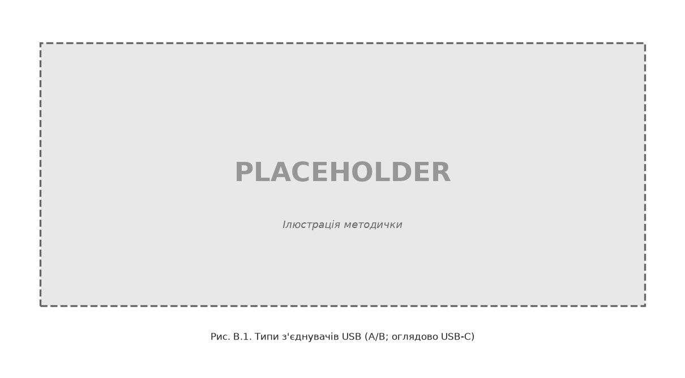

*Ілюстративний рисунок методички. Для звіту порівняйте з таблицею контактів USB-A / USB-C вище.*

### Сучасний контекст USB

Лабораторна 3 навчає **класичній моделі USB 2.0**. У сучасних ПК більшість пристроїв підключаються через **USB-C** і часто працюють на **USB 3.x / USB4**.

| Аспект | У лабораторній (модель) | У реальному ПК |
|--------|-------------------------|----------------|
| Роз’єм | USB-A/B (4 контакти даних/живлення) | USB-C (24 контакти, симетричний) |
| Швидкість | Задає викладач для розрахунків | USB 2.0 / 3.2 / USB4 |
| Кодування | NRZI (лаб. 2) | NRZI — USB 2.0; SuperSpeed — 8b/10b |
| Практична частина | Mock FS + JSON-пристрої | Mass Storage class; драйвер ядра ОС |
| Живлення | Не розглядається | USB PD через піни CC |

**У звіті (обов’язково):** порівняйте призначення контактів **USB-A** (з теорії вище) та **оглядово USB-C** (VBUS, GND, D+, D−, CC1/CC2).

---

## Лабораторна робота № 3

### Розроблення та дослідження елементів програмного драйвера інтерфейса УПШ (USB)

**Мета роботи:** опанування студентом технології створення програмного драйвера передавання повідомлення через послідовний інтерфейс УПШ (USB), сканування інтерфейсних портів та налаштування передачі даних.

**Завдання на роботу.** **Повідомлення** — прізвище (розділ 1.6). **Mock-пристрій** — стовпець «Mock USB» у розділі 1.11.

**Короткі теоретичні відомості.** Див. [теоретичний розділ блоку B](#теоретичні-відомості-для-виконання-лабораторної-роботи-3).

**Схема транзакції (mermaid):**

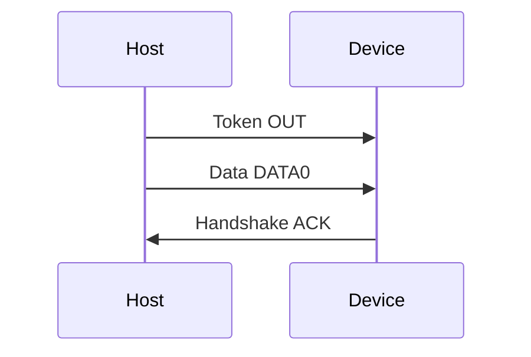


**Технологія виконання.**

**Теоретична частина (обов’язково в звіті):**

1. Визначити структуру транзакції USB: **маркерний пакет (Token)** → **пакет даних (Data)** → **пакет підтвердження (Handshake)**.
2. Розрахувати кількість байт у полі даних (≥ довжини повідомлення; надлишок — нульові байти).
3. Порівняти контакти USB-A та USB-C (див. [теоретичний розділ блоку B](#теоретичні-відомості-для-виконання-лабораторної-роботи-3)).

**Практична частина:**

1. Програма `host/usb_transaction.py` ([E.3](#appendix-e3)) — побудова байтових кадрів транзакції OUT для заданого повідомлення.
2. Програма `host/usb_scan.py` ([E.3](#appendix-e3)) — виведення mock-списку з таблиці в розділі 1.12; у звіті — відповідність реальному `lsusb`.
3. Програма `host/usb_gui.py` ([E.3](#appendix-e3)) — tkinter: кнопка «Сканувати», вибір mock-пристрою, панель властивостей (VID:PID, class, volume/format/size для Mass Storage), відкриття файлу, запис у `tempfile.TemporaryDirectory`.

**Кроки виконання:**

1. Побудувати транзакцію для повідомлення варіанту; навести hex-дамп пакетів.
2. Запустити сканер; зафіксувати mock-пристрій згідно з варіантом.
3. Записати повідомлення через GUI у temp-директорію; пояснити аналогію з Mass Storage.
4. Зробити скрін `usb_gui`: список пристроїв після «Сканувати», панель властивостей mock-пристрою, результат запису `.txt`. NRZI-графіки — у лаб. 2.
5. **(Для максимальної оцінки)** записати те саме прізвище на **реальну USB-флешку**: перелік removable → **мітка / формат / розмір** → `message.txt` → перевірка. Див. [examples/lab3/lab3.md](../examples/lab3/lab3.md) §6. Без флешки — здача за кроками 1–4 можлива, але **не на максимум**; mock/temp лишаються обов’язковими.

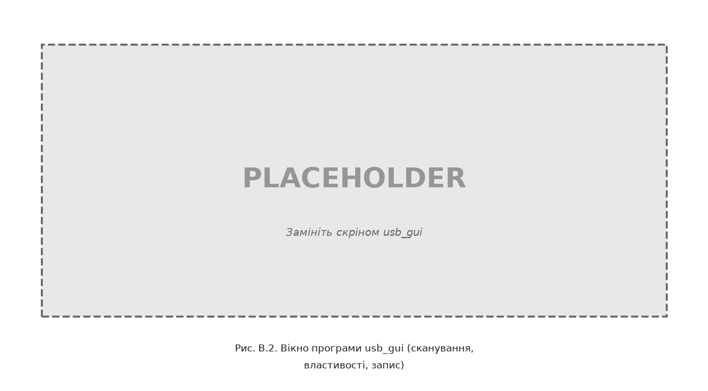

*Ілюстративний рисунок методички. У звіті студента — **скріншот** реального запуску `host/usb_gui.py`.*

**Приклад коду (фрагмент):**

```python
from pathlib import Path
import tempfile

def write_message_to_mock_storage(message: str, filename: str = "message.txt") -> Path:
    root = Path(tempfile.mkdtemp(prefix="ppid_usb_"))
    target = root / filename
    target.write_text(message, encoding="cp1251")
    return target

if __name__ == "__main__":
    path = write_message_to_mock_storage("IVANOV")  # ваше прізвище
    print(f"Записано: {path}")
```

**Питання для самоперевірки:**

1. Привести основні характеристики інтерфейсу USB.
2. Привести призначення контактів роз’ємів USB.
3. Привести особливості структур транзакцій інтерфейсу USB.
4. Привести основні етапи відлагодження програмного драйвера.
5. Пояснити роботу написаного програмного драйвера.
6. Пояснити структуру транзакцій інтерфейсу USB.
7. Пояснити основні принципи розроблення схеми алгоритму сканування інтерфейсних портів.
8. Пояснити основні принципи розроблення схеми алгоритму налаштування інтерфейсних портів для передачі даних.

**Додаткові питання:**

9. На якому рівні працює запис у temp-директорію порівняно з USB device driver?
10. Чим mock-список пристроїв відрізняється від `lsusb` або Диспетчера пристроїв?
11. Чим роз’єм USB-C відрізняється від USB-A за кількістю контактів і ролями (host/device)?
12. *(Для максимальної оцінки / флешка)* Чим запис на реальну флешку відрізняється від запису в `ppid_usb_*`? Чи це вже USB device driver?

**Зміст звіту:**

1. Мета роботи.
2. Короткі теоретичні відомості (включно з порівнянням контактів USB-A та оглядом USB-C).
3. Хід роботи: структура транзакції (Token → Data → Handshake); hex-дамп; скрін `usb_gui`; **для максимальної оцінки** — запис на флешку (§6 короткого гайду).
4. Висновки.
5. Текст програми ([E.3](#appendix-e3) у розділі «Приклад програмних драйверів» блоку B або додаток до звіту).
6. Демонстрація програми на комп’ютері.

---

## Приклад виконання основних етапів лабораторної роботи № 3

> Зразок звіту для **повної / максимальної оцінки** (включно з флешкою). Замініть `PETRENKO` на своє прізвище (латиницею A–Z).

```markdown
# Приклад звіту — лабораторна робота № 3

> Зразок для **повної / максимальної оцінки**: hex транзакції, mock-скан, скрін GUI + `cat` у temp, **запис на реальну флешку** ([lab3.md](lab3.md) §6), коротка таблиця USB-A / USB-C, пояснення рівня ФС.

---

**Титульний аркуш**

- Дисципліна: PPID  
- Лабораторна робота № 3  
- Студент: **PETRENKO**  
- Варіант: **1** (mock USB: SanDisk Cruzer Mass Storage)

---

## 1. Мета роботи

Опанувати транзакцію USB 2.0 (Token → Data → Handshake), mock-сканування пристроїв і передачу даних на рівні моделі та файлової системи.

## 2. Короткі теоретичні відомості

**Транзакція USB 2.0 (OUT):** Host → Token (OUT) → Data (DATA0) → Handshake (ACK).

**Порівняння роз’ємів:**

| Контакт / функція | USB-A (типовий) | USB-C (оглядово) |
|-------------------|-----------------|------------------|
| Живлення | VBUS, GND | VBUS, GND |
| Дані | D+, D− | TX/RX пари (симетрично) |
| Роль host/device | фіксована | CC1/CC2 (PD) |
| Кількість контактів | 4 (+ shield) | 24 |

**Рівень ПЗ:** запис через `usb_gui` у `tempfile` — **файлова система**, не kernel USB device driver.

## 3. Хід роботи

### 3.1. Параметри варіанту

| Параметр | Значення |
|----------|----------|
| Повідомлення | `PETRENKO` |
| Mock-пристрій | SanDisk Cruzer (Mass Storage) |
| VID:PID | 0781:5567 |

### 3.2. Побудова транзакції (hex)

```bash
python3 -m host.usb_transaction --message "PETRENKO"
```

Вивід:

```text
Фази: TOKEN → DATA → HANDSHAKE
Пакет 1: e1 81 00
Пакет 2: c3 50 45 54 52 45 4e 4b 4f e7 f4
Пакет 3: d2
```

Пояснення пакета 2 (Data DATA0):

- Payload: **8 байт** (довжина `PETRENKO`; мінімум у програмі — 8, коротші прізвища доповнюються `\x00`).
- ASCII у DATA: `50 45 54 52 45 4E 4B 4F`.
- Після payload — CRC (`e7 f4`); на початку пакета — PID DATA0 (`c3`).
- Ті самі ASCII-байти, що в `TX hex` лаб. 1 і на діаграмах лаб. 2.

### 3.3. Mock-сканування

```bash
python3 -m host.usb_scan
```

```text
Mock USB enumeration (fixtures/usb_devices.json):
...
0781:5567 Mass Storage @ 480 Mbps (High Speed) — SanDisk Cruzer (Mass Storage)
...
```

У реальній системі аналог: `lsusb` (Linux) або Диспетчер пристроїв (Windows).

### 3.4. GUI — скан, властивості, запис

```bash
python3 -m host.usb_gui
```

Дії: **Сканувати** → обрати **SanDisk Cruzer (Mass Storage)** → переглянути VID:PID, class, volume/format → у поле ввести `PETRENKO` → **Записати на mock-накопичувач**.

Список пристроїв у GUI — з `fixtures/usb_devices.json` (mock), не сканування USB-портів ПК.

Після «Готово» програма показала шлях, наприклад:

```text
Записано на SanDisk Cruzer (Mass Storage):
/var/folders/.../T/ppid_usb_g6ktqg22/message.txt
```

Перевірка вмісту (GUI ще відкритий):

```bash
cat /var/folders/.../T/ppid_usb_g6ktqg22/message.txt
```

```text
PETRENKO
```

Тобто записано **прізвище** у файл `message.txt` у temp-теці `ppid_usb_*` — рівень **ФС**, не передача по USB-шині.

**[СКРІНШОТ: вікно `usb_gui` — combobox з mock-пристроями, панель властивостей SanDisk (Mass Storage, FAT32, 16 GB), діалог «Готово» з повним шляхом до `message.txt`]**

### 3.5. Запис на реальну флешку (для максимальної оцінки)

Вставлено USB-накопичувач. Власний скрипт знайшов removable-томи, наприклад:

```text
/Volumes/NO NAME
```

Властивості обраного тома:

| Поле | Приклад |
|------|---------|
| Шлях / буква | `/Volumes/NO NAME` |
| Мітка | `NO NAME` або ваша мітка |
| Формат | `FAT32` / `exFAT` / … |
| Розмір / вільно | напр. 14.9 ГБ / 14.8 ГБ |

Записано прізвище і перевірено:

```bash
# шляхи — приклади; у звіті — ваші
cat "/Volumes/NO NAME/message.txt"
```

```text
PETRENKO
```

**[СКРІНШОТ: список removable-томів + властивості + Finder/Explorer з `message.txt`]**

Це той самий рівень **ФС**, що й `ppid_usb_*`: ОС уже має драйвер Mass Storage; студентський код лише пише файл на змонтований том.

### 3.6. Структура транзакції (схема)

```text
Host ──Token OUT──► Device
Host ──Data DATA0──► Device   (payload: PETRENKO)
Host ◄──Handshake ACK── Device
```

NRZI-кодування для цих даних наведено в лабораторній роботі № 2.

## 4. Висновки

Реалізовано модель USB-транзакції (hex) та mock-enumeration. Запис у temp і на **реальну флешку** — рівень файлової системи, не USB device driver у ядрі. USB-C додає CC-лінії; USB-A — схема контактів D+/D−.

## 5. Додаток — текст програм

Лістинги `host/usb_transaction.py`, `host/usb_scan.py`, `host/usb_gui.py` — з методички.

## 6. Демонстрація

На захисті: hex-дамп + `usb_gui` (скан → запис → `cat` у temp) + **запис на флешку** (removable → `message.txt` → `cat` на томі) + пояснити, чому і temp, і флешка — рівень **ФС**, не kernel USB driver. Див. [lab3.md](lab3.md) §6.

> Без флешки — здача можлива за кроками 1–4, але **не максимальна** оцінка.
```

---

## Приклад програмних драйверів для лабораторної роботи № 3

<a id="appendix-e3"></a>

### E.3. Лабораторна робота № 3

#### host/usb_transaction.py

```python
"""USB 2.0 transaction model for PPID lab 3."""

from __future__ import annotations

import argparse
import struct
from dataclasses import dataclass
from typing import Iterable, List

# USB 2.0 PID values (simplified educational subset)
PID_OUT = 0xE1
PID_IN = 0x69
PID_DATA0 = 0xC3
PID_DATA1 = 0x4B
PID_ACK = 0xD2
PID_NAK = 0x5A


@dataclass
class TokenPacket:
    pid: int
    addr: int
    endp: int

    def to_bytes(self) -> bytes:
        crc = ((self.addr & 0x7F) | ((self.endp & 0x0F) << 7)) & 0xFFFF
        return bytes([self.pid, crc & 0xFF, (crc >> 8) & 0xFF])


@dataclass
class DataPacket:
    pid: int
    payload: bytes

    def to_bytes(self) -> bytes:
        if len(self.payload) > 64:
            raise ValueError("Full-speed max data payload is 64 bytes")
        frame = bytes([self.pid]) + self.payload
        crc = _crc16(frame[1:])
        return frame + struct.pack("<H", crc)


@dataclass
class HandshakePacket:
    pid: int

    def to_bytes(self) -> bytes:
        return bytes([self.pid])


def _crc16(data: bytes) -> int:
    """USB CRC-16 (polynomial 0x8005), bit-reversed input."""
    crc = 0xFFFF
    for byte in data:
        crc ^= byte
        for _ in range(8):
            if crc & 1:
                crc = (crc >> 1) ^ 0xA001
            else:
                crc >>= 1
    return crc & 0xFFFF


def build_out_transaction(message: str, encoding: str = "cp1251") -> List[bytes]:
    payload = message.encode(encoding)
    if len(payload) < 8:
        payload = payload + b"\x00" * (8 - len(payload))
    return [
        TokenPacket(PID_OUT, addr=1, endp=1).to_bytes(),
        DataPacket(PID_DATA0, payload).to_bytes(),
        HandshakePacket(PID_ACK).to_bytes(),
    ]


def transaction_phases(packets: Iterable[bytes]) -> List[str]:
    phases = []
    for pkt in packets:
        pid = pkt[0]
        if pid in (PID_OUT, PID_IN):
            phases.append("TOKEN")
        elif pid in (PID_DATA0, PID_DATA1):
            phases.append("DATA")
        else:
            phases.append("HANDSHAKE")
    return phases


def main(argv: list[str] | None = None) -> int:
    parser = argparse.ArgumentParser(description="Build USB OUT transaction")
    parser.add_argument("--message", default="IVANOV")
    parser.add_argument("--encoding", default="cp1251")
    args = parser.parse_args(argv)

    packets = build_out_transaction(args.message, args.encoding)
    phases = transaction_phases(packets)
    print("Фази:", " → ".join(phases))
    for i, pkt in enumerate(packets, 1):
        print(f"Пакет {i}: {pkt.hex(' ')}")
    return 0


if __name__ == "__main__":
    raise SystemExit(main())
```

#### host/usb_scan.py

```python
"""Mock USB device enumeration for PPID lab 3."""

from __future__ import annotations

import argparse
import json
from pathlib import Path
from typing import Any, Optional

FIXTURES_DIR = Path(__file__).resolve().parent.parent / "fixtures"
DEFAULT_FIXTURE = FIXTURES_DIR / "usb_devices.json"


def load_devices(path: Path = DEFAULT_FIXTURE) -> list[dict[str, Any]]:
    with path.open(encoding="utf-8") as f:
        data = json.load(f)
    return data["devices"]


def get_device_by_name(name: str, path: Path = DEFAULT_FIXTURE) -> Optional[dict[str, Any]]:
    for dev in load_devices(path):
        if dev["name"] == name:
            return dev
    return None


def format_device(dev: dict[str, Any]) -> str:
    return (
        f"{dev['vid']}:{dev['pid']} "
        f"{dev['class']} @ {dev['speed']} — {dev['name']}"
    )


def _format_optional(value: Any, suffix: str = "") -> str:
    if value is None:
        return "—"
    if isinstance(value, float):
        return f"{value:g}{suffix}"
    return f"{value}{suffix}"


def format_device_details(dev: dict[str, Any]) -> str:
    lines = [
        f"VID:PID: {dev['vid']}:{dev['pid']}",
        f"Клас: {dev['class']}",
        f"Швидкість: {dev['speed']}",
        f"Назва: {dev['name']}",
        f"Мітка тому: {_format_optional(dev.get('volume_label'))}",
        f"Файлова система: {_format_optional(dev.get('drive_format'))}",
        f"Обсяг: {_format_optional(dev.get('total_gb'), ' ГБ')}",
        f"Вільно: {_format_optional(dev.get('free_gb'), ' ГБ')}",
    ]
    return "\n".join(lines)


def list_usb_devices(path: Path = DEFAULT_FIXTURE) -> list[str]:
    return [format_device(d) for d in load_devices(path)]


def main(argv: list[str] | None = None) -> int:
    parser = argparse.ArgumentParser(description="List mock USB devices")
    parser.add_argument(
        "--fixture",
        type=Path,
        default=DEFAULT_FIXTURE,
        help="Path to usb_devices.json",
    )
    args = parser.parse_args(argv)

    print("Mock USB enumeration (fixtures/usb_devices.json):")
    print("У продакшені: lsusb (Linux) або Get-PnpDevice (Windows)\n")
    for line in list_usb_devices(args.fixture):
        print(line)
    return 0


if __name__ == "__main__":
    raise SystemExit(main())
```

#### host/usb_gui.py

```python
"""Tkinter GUI for mock USB mass-storage transfer (PPID lab 3)."""

from __future__ import annotations

import tempfile
import tkinter as tk
from pathlib import Path
from tkinter import filedialog, messagebox, ttk
from typing import Any, Optional

from host.usb_scan import format_device_details, get_device_by_name, load_devices


class UsbGuiApp:
    def __init__(self, root: tk.Tk) -> None:
        self.root = root
        self.root.title("PPID Lab 3 — Mock USB transfer")
        self.devices: list[dict[str, Any]] = []
        self.storage_dir = Path(tempfile.mkdtemp(prefix="ppid_usb_"))
        self._build()
        self._scan_devices()

    def _build(self) -> None:
        frame = ttk.Frame(self.root, padding=10)
        frame.grid(row=0, column=0, sticky="nsew")
        self.root.columnconfigure(0, weight=1)
        self.root.rowconfigure(0, weight=1)

        top_row = ttk.Frame(frame)
        top_row.grid(row=0, column=0, columnspan=3, sticky="ew", pady=(0, 4))
        ttk.Button(top_row, text="Сканувати", command=self._scan_devices).pack(side="left")

        ttk.Label(frame, text="Mock USB-пристрій:").grid(row=1, column=0, sticky="w")
        self.device_var = tk.StringVar()
        self.device_combo = ttk.Combobox(
            frame, textvariable=self.device_var, values=[], width=40, state="readonly"
        )
        self.device_combo.grid(row=1, column=1, columnspan=2, sticky="ew", pady=4)
        self.device_combo.bind("<<ComboboxSelected>>", lambda _e: self._show_device_details())

        ttk.Label(frame, text="Властивості:").grid(row=2, column=0, sticky="nw")
        self.details = tk.Text(frame, width=50, height=8, state="disabled")
        self.details.grid(row=2, column=1, columnspan=2, sticky="ew", pady=4)

        ttk.Button(frame, text="Відкрити файл", command=self._open_file).grid(
            row=3, column=0, pady=4, sticky="w"
        )
        ttk.Label(
            frame,
            text="Повідомлення (прізвище латиницею, літери A–Z) — введіть або відкрити .txt",
            wraplength=420,
        ).grid(row=3, column=1, columnspan=2, sticky="w", padx=(8, 0))
        self.text = tk.Text(frame, width=50, height=10)
        self.text.grid(row=4, column=0, columnspan=3, pady=4, sticky="nsew")

        ttk.Button(frame, text="Записати на mock-накопичувач", command=self._save).grid(
            row=5, column=0, columnspan=3, pady=4
        )

        ttk.Label(
            frame,
            text=f"Каталог накопичувача: {self.storage_dir}",
            wraplength=420,
        ).grid(row=6, column=0, columnspan=3, sticky="w")

        frame.columnconfigure(1, weight=1)
        frame.rowconfigure(4, weight=1)

    def _selected_device(self) -> Optional[dict[str, Any]]:
        name = self.device_var.get()
        if not name:
            return None
        return get_device_by_name(name) or next(
            (d for d in self.devices if d["name"] == name), None
        )

    def _set_details(self, text: str) -> None:
        self.details.configure(state="normal")
        self.details.delete("1.0", tk.END)
        self.details.insert(tk.END, text)
        self.details.configure(state="disabled")

    def _scan_devices(self) -> None:
        self.devices = load_devices()
        names = [d["name"] for d in self.devices]
        self.device_combo["values"] = names
        if names:
            current = self.device_var.get()
            self.device_var.set(current if current in names else names[0])
            self._show_device_details()
        else:
            self.device_var.set("")
            self._set_details("Пристрої не знайдено")

    def _show_device_details(self) -> None:
        dev = self._selected_device()
        if dev is None:
            self._set_details("")
            return
        self._set_details(format_device_details(dev))

    def _open_file(self) -> None:
        path = filedialog.askopenfilename(
            title="Відкрити текстовий файл",
            filetypes=[
                ("Текстові файли", "*.txt"),
                ("Markdown", "*.md"),
                ("Усі файли", "*.*"),
            ],
        )
        if not path:
            return
        raw = Path(path).read_bytes()
        if b"\x00" in raw[:8192]:
            messagebox.showerror(
                "Помилка",
                "Обрано бінарний файл (зображення, PDF тощо).\n"
                "Для лаб. 3 — текстовий .txt із прізвищем латиницею (напр. IVANOV).",
            )
            return
        content: str | None = None
        for encoding in ("utf-8", "cp1251"):
            try:
                content = raw.decode(encoding)
                break
            except UnicodeDecodeError:
                continue
        if content is None:
            messagebox.showerror(
                "Помилка",
                "Не вдалося прочитати файл як текст (UTF-8 або cp1251).",
            )
            return
        self.text.delete("1.0", tk.END)
        self.text.insert(tk.END, content)

    def _save(self) -> None:
        content = self.text.get("1.0", tk.END).strip()
        if not content:
            messagebox.showwarning("Увага", "Немає даних для запису")
            return
        dev = self._selected_device()
        label = dev["name"] if dev else "unknown"
        target = self.storage_dir / "message.txt"
        try:
            target.write_text(content, encoding="cp1251")
        except UnicodeEncodeError:
            messagebox.showerror(
                "Помилка",
                "Текст містить символи, яких немає в cp1251.\n"
                "Записуйте прізвище латиницею (літери A–Z), не PDF чи зображення.",
            )
            return
        messagebox.showinfo("Готово", f"Записано на {label}:\n{target}")


def main() -> None:
    root = tk.Tk()
    UsbGuiApp(root)
    root.mainloop()


if __name__ == "__main__":
    main()
```

#### fixtures/usb_devices.json

```json
{
  "devices": [
    {
      "vid": "046d",
      "pid": "c52b",
      "name": "Logitech USB Receiver",
      "class": "HID",
      "speed": "12 Mbps (Full Speed)",
      "volume_label": null,
      "drive_format": null,
      "total_gb": null,
      "free_gb": null
    },
    {
      "vid": "0781",
      "pid": "5567",
      "name": "SanDisk Cruzer (Mass Storage)",
      "class": "Mass Storage",
      "speed": "480 Mbps (High Speed)",
      "volume_label": "PPID_USB",
      "drive_format": "FAT32",
      "total_gb": 16.0,
      "free_gb": 15.2
    },
    {
      "vid": "303a",
      "pid": "1001",
      "name": "Espressif USB JTAG/serial (CDC)",
      "class": "CDC",
      "speed": "12 Mbps (Full Speed)",
      "volume_label": null,
      "drive_format": null,
      "total_gb": null,
      "free_gb": null
    },
    {
      "vid": "1d6b",
      "pid": "0002",
      "name": "Linux Foundation 2.0 root hub",
      "class": "Hub",
      "speed": "480 Mbps (High Speed)",
      "volume_label": null,
      "drive_format": null,
      "total_gb": null,
      "free_gb": null
    },
    {
      "vid": "8087",
      "pid": "0026",
      "name": "Intel Bluetooth (USB)",
      "class": "Wireless",
      "speed": "12 Mbps (Full Speed)",
      "volume_label": null,
      "drive_format": null,
      "total_gb": null,
      "free_gb": null
    }
  ]
}
```

---

# БЛОК C. Лабораторні 4–5 (I²C та інтеграція КСМ)

## Теоретичні відомості для виконання лабораторних робіт № 4–5

**I²C (EN):** *synchronous, multi-master/multi-slave, single-ended, serial communication bus* (open-drain SDA/SCL).

**I²C** (*Inter-Integrated Circuit*): лінії **SDA** (дані), **SCL** (такт); **master** ініціює; **7-бітна адреса** (BME280: 0x76/0x77; OLED часто 0x27); транзакція START → адреса + R/W → ACK → дані → STOP; **open-drain** + **pull-up**. У Wokwi підтягування вбудоване.

**SPI** (*Serial Peripheral Interface*): *synchronous, full-duplex, serial* — окремі **MOSI**, **MISO**, **SCK**, **CS**; вища швидкість; немає адресації на шині — окремий **CS** (chip select) на пристрій.

**Платформи embedded:**

| Платформа | UART | I²C | USB |
|-----------|------|-----|-----|
| ESP32 | GPIO, `machine.UART` | `machine.I2C`, GPIO 21/22 | USB-CDC (S2/S3) |
| Raspberry Pi | `/dev/ttyAMA0` | `/dev/i2c-*`, `i2cdetect` | USB host |
| STM32 | USART HAL | I²C HAL | USB device |

**Capstone (лаб. 5):** вузол моніторингу — датчик (I²C) → MCU (ESP32) → UART → host → CSV/графік; аналогія з Raspberry Pi / Jetson — драйвери у просторі ядра Linux (`/dev/i2c-*`, `/dev/tty*`).


*Ілюстративний рисунок методички. Доповнює mermaid-схему нижче в лаб. 4.*

---

## Лабораторна робота № 4

### Дослідження шини I²C та програмного доступу до периферійного датчика

**Мета роботи:** опанування студентом принципів роботи синхронної двопровідної шини I²C (інтерфейс «інтегральної схеми»), адресації пристроїв master–slave та читання даних з периферійного датчика на прикладі платформи ESP32 у симуляторі Wokwi.

**Завдання на роботу.** Тип датчика — з розділу 1.11. Для OLED виведіть **прізвище** на дисплей (розділ 1.6).

**Короткі теоретичні відомості.** Див. [теоретичний розділ блоку C](#теоретичні-відомості-для-виконання-лабораторних-робіт-4–5).

**Технологія виконання.** Використовуйте **Logic Analyzer** у Wokwi для фіксації timing на лініях SDA/SCL.

**Схема шини (mermaid):**

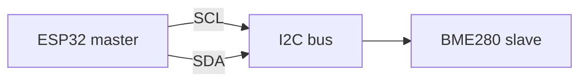


**Кроки виконання:**

1. Вставити **`main.py`**, **`bmp180.py`** та **`diagram.json`** з **[E.4](#appendix-e4)** у Wokwi MicroPython ESP32.
2. Виконати `i2c.scan()` — зафіксувати адресу пристрою у звіті (Wokwi BMP180: **0x77**).
3. Прочитати температуру (BMP180 у Wokwi; BME280 на реальному залізі) — вивід у Serial Monitor.
4. Записати шину **Logic Analyzer** (Stop → `wokwi-logic.vcd`); відкрити у **PulseView**, декодер **I²C**; скрін SDA/SCL під час `scan()` або читання (§1.4).

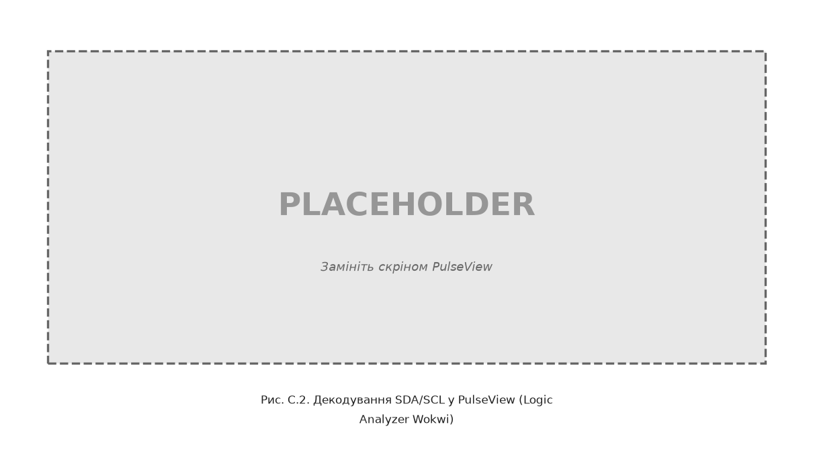

*Ілюстративний рисунок методички. У звіті студента — **скріншот** PulseView/Surfer з декодером I²C (адреса 0x77, ACK, STOP).*

5. Порівняти I²C та SPI (коротко) у розділі теорії звіту.

**Питання для самоперевірки:**

1. Що таке master і slave на шині I²C?
2. Навіщо потрібні лінії SDA та SCL?
3. Як визначити адресу пристрою на шині?
4. Чим транзакція читання регістра відрізняється від `i2c.scan()`?
5. Чому для сенсорів часто обирають I²C, а не SPI?
6. Де в таблиці embedded-платформ ([теоретичний розділ блоку C](#теоретичні-відомості-для-виконання-лабораторних-робіт-4–5)) згадується I²C на ESP32?

**Додаткові питання:**

7. Що показує Logic Analyzer на лініях SDA/SCL під час адресації?
8. Який шар ПЗ відповідає за формування START/STOP на шині?

**Зміст звіту:**

1. Мета роботи.
2. Короткі теоретичні відомості (I²C; порівняння з SPI).
3. Хід роботи: адреса, регістри, скрін Logic Analyzer.
4. Висновки.
5. Текст програми ([E.4](#appendix-e4) у розділі «Приклад програмних драйверів» блоку C або додаток до звіту).
6. Демонстрація в Wokwi.

---

## Лабораторна робота № 5

### Розроблення та дослідження інтегрованого вузла моніторингу комп’ютерної системи (capstone)

**Мета роботи:** опанування студентом технології інтеграції послідовного інтерфейсу UART, шини I²C та рівня зберігання даних (аналог периферійного накопичувача) у міні-системі моніторингу, характерній для вузлів IoT на базі ESP32 або одноплатних комп’ютерів (спеціалізація КСМ).

**Завдання на роботу.** Інтервал опитування датчика та формат телеметричного рядка визначає викладач згідно з **розділом 1.11** (типово: `TEMP=<значення>\r\n` кожні 200–1000 мс). Повідомлення та параметри UART — як у лабораторній № 1.

**Короткі теоретичні відомості.** Див. [теоретичний розділ блоку C](#теоретичні-відомості-для-виконання-лабораторних-робіт-4–5) (I²C, capstone, шари ПЗ).

**Схема компонентів (mermaid, скопіюйте у звіт):**

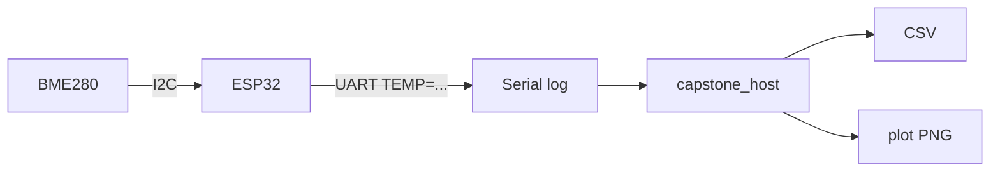


**Технологія виконання.**

**Кроки виконання:**

1. **Embedded (Wokwi):** **`main.py`**, **`bmp180.py`** та **`diagram.json`** з **[E.5](#appendix-e5)**.
2. Зберегти вивід Serial Monitor у текстовий файл (лог симуляції).
3. **Host (Python):** програма `host/capstone_host.py` ([E.5](#appendix-e5)) — парсинг рядків `TEMP=...`, запис CSV, побудова графіка matplotlib.
4. Опційно: експорт CSV у mock USB-директорію (як у лаб. 3).
5. У звіті: **діаграма компонентів** з методички (mermaid вище) та пояснення шарів драйверів — без ручного малювання.

**Запуск:**

```bash
python -m host.capstone_host --input sample_log.txt --plot out.png
```

**Питання для самоперевірки:**

1. Перелічіть шари програмного забезпечення від датчика BME280 до CSV-файлу на ПК.
2. Чим цей вузол схожий на типовий IoT-застосунок на ESP32?
3. Де в системі «драйвер пристрою», а де — застосунок?
4. Які інтерфейси лекцій 1, 2 та 6 використані в capstone?
5. Навіщо узгоджувати формат рядка між прошивкою та host-програмою?

**Додаткові питання:**

6. Як зміниться архітектура, якщо замість UART використати USB-CDC на ESP32-S3?
7. Яку роль виконує mock USB-накопичувач у ланцюжку зберігання даних?

**Зміст звіту:**

1. Мета роботи.
2. Короткі теоретичні відомості; діаграма компонентів з методички + пояснення шарів ПЗ.
3. Хід роботи: Serial log, CSV, графік телеметрії (`out.png`).
4. Висновки про шари драйверів.
5. Текст програм ([E.5](#appendix-e5) у розділі «Приклад програмних драйверів» блоку C або додаток до звіту).
6. Демонстрація на комп’ютері.

---

## Приклад виконання основних етапів лабораторних робіт № 4–5

> Зразки звітів для **повної оцінки**. Замініть `PETRENKO` на своє прізвище (латиницею A–Z).

### Лабораторна робота № 4

```markdown
# Приклад звіту — лабораторна робота № 4

> Зразок для **повної оцінки**: адреса I²C, Serial Monitor, скрін Logic Analyzer, порівняння I²C/SPI.

---

**Титульний аркуш**

- Дисципліна: PPID  
- Лабораторна робота № 4  
- Студент: **PETRENKO**  
- Варіант: **1** (датчик BME280, 9600 8N1 для UART — контекст capstone)

---

## 1. Мета роботи

Опанувати master–slave I²C: адресація, читання температури з I²C-датчика (BMP180 у Wokwi; BME280 на реальному залізі), аналіз SDA/SCL у Logic Analyzer.

## 2. Короткі теоретичні відомості

**I²C:** синхронна шина, лінії **SDA** (дані) та **SCL** (такт). Один master (ESP32), один або кілька slaves (BMP180/BME280).

**Транзакція:** START → адреса 7 біт + R/W → ACK → дані/регістри → STOP.

**Порівняння з SPI:**

| Критерій | I²C | SPI |
|----------|-----|-----|
| Дроти | 2 (+ GND) | 4+ (MOSI, MISO, SCK, CS) |
| Адресація | на шині (7 біт) | окремий CS на пристрій |
| Швидкість | нижча (100–400 kHz типово) | вища, потокові дані |

## 3. Хід роботи

### 3.1. Параметри варіанту

| Параметр | Значення |
|----------|----------|
| Датчик (Wokwi) | BMP180 (`board-bmp180`) |
| Датчик (варіант курсу) | BME280 |
| Адреса I²C (Wokwi) | **0x77** |
| Шина | SDA=GPIO21, SCL=GPIO22, 100 kHz |

### 3.2. Wokwi — scan та читання

Після запуску симуляції (`main.py` + `bmp180.py` + `diagram.json`):

```text
PPID Lab 4 — I2C sensor
I2C scan: ['0x77']
TEMP=24.0 PRESS=1013.2
TEMP=24.0 PRESS=1013.2
...
```

**[СКРІНШОТ: Wokwi — Serial Monitor з `I2C scan: ['0x77']` та TEMP/PRESS, board-bmp180 на схемі]**

### 3.3. Logic Analyzer

Під час симуляції Wokwi записав сигнали на **D0 (SDA)** та **D1 (SCL)**. Після Stop завантажено `wokwi-logic.vcd`. Файл відкрито в **PulseView** з декодером **I²C** (див. §1.4 методички, [Wokwi Logic Analyzer Guide](https://docs.wokwi.com/guides/logic-analyzer)). Альтернатива без встановлення — **[Surfer](https://surfer-project.org/)** у браузері ([app.surfer-project.org](https://app.surfer-project.org/)): сирий перегляд SDA/SCL, опис протоколу в тексті звіту. Під час `i2c.scan()` видно START, адресу `0x77`, ACK, STOP.

**[СКРІНШОТ: PulseView або Surfer — SDA/SCL (або рядок декодера I²C) під час адресації 0x77]**

### 3.4. Драйвер BMP180 (`bmp180.py`)

Окремий модуль — **драйвер пристрою** (I²C-протокол BMP180). У `main.py` лише `from bmp180 import BMP180` та цикл опитування. Це не Arduino Library Manager — у MicroPython бібліотека = файл `.py` у проєкті Wokwi.

## 4. Висновки

На шині виявлено BMP180 за адресою **0x77**. ESP32 — master; датчик — slave. Logic Analyzer підтверджує коректну адресацію. I²C зручніший за SPI за кількістю дротів.

## 5. Додаток — текст програми

Лістинги `main.py`, `bmp180.py`, `diagram.json` — з методички (блок C).

## 6. Демонстрація

На захисті: Wokwi live — `scan`, читання TEMP, показ Logic Analyzer.
```

### Лабораторна робота № 5

```markdown
# Приклад звіту — лабораторна робота № 5

> Зразок для **повної оцінки**: діаграма компонентів з методички, Serial log, CSV, графік PNG, пояснення шарів ПЗ.

---

**Титульний аркуш**

- Дисципліна: PPID  
- Лабораторна робота № 5 (capstone)  
- Студент: **PETRENKO**  
- Варіант: **1** (BME280, poll 500 ms, 9600 8N1)

---

## 1. Мета роботи

Інтегрувати I²C (датчик), UART (телеметрія) та host-обробку (CSV, графік) у вузол моніторингу — аналог IoT-ланцюжка на embedded + ПК.

## 2. Короткі теоретичні відомості та діаграма компонентів

**Шари ПЗ (від датчика до CSV):**

```text
BME280 (периферія)
  → HAL I²C (machine.I2C, прошивка)
  → застосунок ESP32 (формування TEMP=...)
  → UART / Serial
  → pyserial або log-файл
  → capstone_host (парсинг, CSV, matplotlib)
  → (опційно) mock USB FS
```

**Діаграма компонентів (з методички):**


## 3. Хід роботи

### 3.1. Параметри варіанту

| Параметр | Значення |
|----------|----------|
| Датчик | BME280 (0x76) |
| Інтервал опитування | 500 ms |
| Формат телеметрії | `TEMP=<value>\r\n` |
| UART | 9600 8N1 |

### 3.2. Embedded (Wokwi)

Запущено `wokwi/lab05-capstone/`. Збережено Serial Monitor у `my_log.txt`:

```text
PPID Lab 5 — Capstone node
I2C: ['0x76']
TEMP=22.1
TEMP=22.3
TEMP=22.5
TEMP=22.4
TEMP=22.8
...
```

**[СКРІНШОТ: Wokwi capstone — Serial Monitor з рядками TEMP=..., BME280 на схемі]**

### 3.3. Host — парсинг, CSV, графік

```bash
python3 -m host.capstone_host --input sample_log.txt --plot capstone_plot.png
```

Вивід:

```text
Знайдено зчитувань: 10
Графік: capstone_plot.png
```

**[СКРІНШОТ: графік matplotlib — вісь X: номер зчитування, вісь Y: температура °C; файл `capstone_plot.png`]**

Фрагмент CSV (генерується поруч із графіком):

```text
index,temperature_c
1,22.1
2,22.3
3,22.5
...
```

**[СКРІНШОТ або фрагмент: відкритий CSV у редакторі / таблиця в звіті]**

### 3.4. Опційно — export mock USB

```bash
python3 -m host.capstone_host --input sample_log.txt --plot capstone_plot.png --export-usb
```

CSV копіюється у temp-директорію mock Mass Storage (аналог лаб. 3).

## 4. Висновки

Capstone об’єднує інтерфейси лекцій 1 (UART), 2 (модель обміну) та 6 (I²C). «Драйвер пристрою» для BME280 — у прошивці (`machine.I2C`); на ПК — лише парсинг текстового протоколу та візуалізація. Узгоджений формат `TEMP=...` між ESP32 і `capstone_host` критичний для коректного CSV.

## 5. Додаток — текст програм

Лістинги `wokwi/lab05-capstone/main.py`, `host/capstone_host.py` — з методички.

## 6. Демонстрація

На захисті: Wokwi (live TEMP) → `capstone_host` → показати `capstone_plot.png` і пояснити шари ПЗ.
```

---

## Приклад програмних драйверів для лабораторних робіт № 4–5

<a id="appendix-e4"></a>

### E.4. Лабораторна робота № 4

#### wokwi/lab04-i2c-sensor/main.py (MicroPython, Wokwi)

```python
# PPID lab 4 — I2C environmental sensor (Wokwi)
# Wokwi files: this main.py + diagram.json (here) + bmp180.py (wokwi/lib/)
# Sensor: board-bmp180 (I2C 0x77). Course variants on real hardware: BME280.

from machine import I2C, Pin
import time

from bmp180 import BMP180

i2c = I2C(0, scl=Pin(22), sda=Pin(21), freq=100000)

print("PPID Lab 4 — I2C sensor")
addrs = i2c.scan()
print("I2C scan:", [hex(a) for a in addrs])

sensor = BMP180(i2c)

while True:
    try:
        sensor.blocking_read()
        print("TEMP={:.1f} PRESS={:.1f}".format(sensor.temperature, sensor.pressure))
    except OSError as e:
        print("I2C error:", e)
    time.sleep(1)
```

#### wokwi/lib/bmp180.py (драйвер MicroPython, Wokwi — лаб. 4 і 5)

```python
# BMP180 driver for MicroPython (based on robert-hh/BMP085_BMP180, MIT)
# Wokwi: board-bmp180 (I2C 0x77). Real hardware course variants: BME280.

from ustruct import unpack as unp
import time


class BMP180:
    def __init__(self, i2c):
        self._i2c = i2c
        self._addr = 0x77
        self._delays = (7, 8, 14, 28)
        self._sign = time.ticks_diff(1, 0)
        cal = unp(
            ">hhhHHHhhhhh",
            self._i2c.readfrom_mem(self._addr, 0xAA, 22),
        )
        (self._AC1, self._AC2, self._AC3, self._AC4, self._AC5, self._AC6,
         self._B1, self._B2, self._MB, self._MC, self._MD) = cal
        self._oversample = 2
        self._ut = bytearray(2)
        self._mlx = bytearray(3)
        self._cmd = bytearray(1)
        self._B5 = 0
        self._gauge = self._make_gauge()
        for _ in range(128):
            next(self._gauge)
            time.sleep_ms(1)

    def _make_gauge(self):
        while True:
            self._cmd[0] = 0x2E
            self._i2c.writeto_mem(self._addr, 0xF4, self._cmd)
            t0 = time.ticks_ms()
            while time.ticks_diff(time.ticks_ms(), t0) * self._sign <= 5:
                yield None
            self._i2c.readfrom_mem_into(self._addr, 0xF6, self._ut)

            self._cmd[0] = 0x34 | (self._oversample << 6)
            self._i2c.writeto_mem(self._addr, 0xF4, self._cmd)
            t0 = time.ticks_ms()
            while time.ticks_diff(time.ticks_ms(), t0) * self._sign <= self._delays[self._oversample]:
                yield None
            self._i2c.readfrom_mem_into(self._addr, 0xF6, self._mlx)
            yield True

    def blocking_read(self):
        while next(self._gauge) is None:
            pass

    @property
    def temperature(self):
        next(self._gauge)
        x1 = ((unp(">H", self._ut)[0] - self._AC6) * self._AC5) >> 15
        x2 = (self._MC << 11) // (x1 + self._MD)
        self._B5 = x1 + x2
        return ((self._B5 + 8) >> 4) / 10.0

    @property
    def pressure(self):
        self.temperature
        up = (((self._mlx[0] << 16) + (self._mlx[1] << 8) + self._mlx[2])
              >> (8 - self._oversample))
        b6 = self._B5 - 4000
        x1 = (self._B2 * ((b6 * b6) >> 12)) >> 11
        x2 = (self._AC2 * b6) >> 11
        b3 = (((self._AC1 * 4 + x1 + x2) << self._oversample) + 2) >> 2
        x1 = (self._AC3 * b6) >> 13
        x2 = (self._B1 * ((b6 * b6) >> 12)) >> 16
        x3 = ((x1 + x2) + 2) >> 2
        b4 = (self._AC4 * (x3 + 32768)) >> 15
        b7 = (up - b3) * (50000 >> self._oversample)
        p = (b7 * 2) // b4
        x1 = (((p >> 8) * (p >> 8)) * 3038) >> 16
        x2 = (-7357 * p) // 65536
        return (p + (x1 + x2 + 3791) // 16) / 100
```

#### wokwi/lab04-i2c-sensor/diagram.json (Wokwi)

```json
{
  "version": 1,
  "author": "PPID LPNU",
  "editor": "wokwi",
  "parts": [
    { "type": "board-esp32-devkit-c-v4", "id": "esp", "top": 0, "left": 0, "attrs": {} },
    {
      "type": "board-bmp180",
      "id": "bmp1",
      "top": 96,
      "left": 220,
      "attrs": { "temperature": "24", "pressure": "101325" }
    },
    {
      "type": "wokwi-logic-analyzer",
      "id": "logic1",
      "top": -120,
      "left": 80,
      "attrs": { "channelNames": "SDA,SCL" }
    }
  ],
  "connections": [
    [ "esp:TX", "$serialMonitor:RX", "", [] ],
    [ "esp:RX", "$serialMonitor:TX", "", [] ],
    [ "bmp1:VCC", "esp:3V3", "red", [ "v0" ] ],
    [ "bmp1:GND", "esp:GND.1", "black", [ "v0" ] ],
    [ "bmp1:SDA", "esp:21", "green", [ "v0" ] ],
    [ "bmp1:SCL", "esp:22", "yellow", [ "v0" ] ],
    [ "logic1:D0", "esp:21", "green", [ "v0" ] ],
    [ "logic1:D1", "esp:22", "yellow", [ "v0" ] ]
  ],
  "serialMonitor": { "display": "auto", "newline": "lf" }
}
```

<a id="appendix-e5"></a>

### E.5. Лабораторна робота № 5

#### host/capstone_host.py

```python
"""Capstone host: parse sensor log and plot (PPID lab 5)."""

from __future__ import annotations

import argparse
import csv
import re
import tempfile
from pathlib import Path

import matplotlib.pyplot as plt

TEMP_RE = re.compile(r"TEMP=([\d.]+)")


def parse_log_lines(lines: list[str]) -> list[tuple[int, float]]:
    readings: list[tuple[int, float]] = []
    for i, line in enumerate(lines):
        match = TEMP_RE.search(line)
        if match:
            readings.append((i, float(match.group(1))))
    return readings


def parse_log_file(path: Path) -> list[tuple[int, float]]:
    if not path.is_file():
        repo_sample = Path(__file__).resolve().parent.parent / "sample_log.txt"
        hint = (
            f"Файл не знайдено: {path}\n"
            f"Для швидкого тесту: python3 -m host.capstone_host\n"
            f"(за замовчуванням — {repo_sample})\n"
            f"Або з Wokwi збережіть Serial Monitor у my_log.txt і передайте --input my_log.txt"
        )
        raise FileNotFoundError(hint)
    text = path.read_text(encoding="utf-8", errors="replace")
    return parse_log_lines(text.splitlines())


def write_csv(readings: list[tuple[int, float]], path: Path) -> None:
    with path.open("w", newline="", encoding="utf-8") as f:
        writer = csv.writer(f)
        writer.writerow(["sample", "temp_c"])
        writer.writerows(readings)


def plot_readings(readings: list[tuple[int, float]], out_path: Path) -> None:
    if not readings:
        raise ValueError("No TEMP= readings found in log")
    xs = [r[0] for r in readings]
    ys = [r[1] for r in readings]
    plt.figure(figsize=(8, 4))
    plt.plot(xs, ys, marker="o")
    plt.xlabel("Зразок")
    plt.ylabel("Температура, °C")
    plt.title("PPID Capstone — моніторинг")
    plt.grid(True)
    plt.tight_layout()
    plt.savefig(out_path)
    plt.close()


def export_to_mock_usb(csv_path: Path, usb_dir: Path) -> Path:
    usb_dir.mkdir(parents=True, exist_ok=True)
    target = usb_dir / csv_path.name
    target.write_bytes(csv_path.read_bytes())
    return target


def main(argv: list[str] | None = None) -> int:
    parser = argparse.ArgumentParser(description="Capstone host log processor")
    parser.add_argument(
        "--input",
        type=Path,
        default=Path(__file__).resolve().parent.parent / "sample_log.txt",
    )
    parser.add_argument("--plot", type=Path, default=Path("capstone_plot.png"))
    parser.add_argument("--export-usb", action="store_true")
    args = parser.parse_args(argv)

    readings = parse_log_file(args.input)
    print(f"Знайдено зчитувань: {len(readings)}")

    with tempfile.TemporaryDirectory(prefix="ppid_capstone_") as tmp:
        csv_path = Path(tmp) / "readings.csv"
        write_csv(readings, csv_path)
        plot_readings(readings, args.plot)
        print(f"Графік: {args.plot}")
        if args.export_usb:
            usb = Path(tmp) / "mock_usb"
            exported = export_to_mock_usb(csv_path, usb)
            print(f"Експорт на mock USB: {exported}")

    return 0


if __name__ == "__main__":
    raise SystemExit(main())
```

#### wokwi/lab05-capstone/main.py (MicroPython, Wokwi)

```python
# PPID lab 5 — Capstone: I2C sensor + UART telemetry (Wokwi)
# Wokwi files: this main.py + diagram.json (here) + bmp180.py (wokwi/lib/)

from machine import I2C, Pin, UART
import time

from bmp180 import BMP180

i2c = I2C(0, scl=Pin(22), sda=Pin(21), freq=100000)
uart = UART(1, baudrate=9600, tx=17, rx=16)
INTERVAL_MS = 500

sensor = BMP180(i2c)

print("PPID Lab 5 — Capstone node")
print("I2C:", [hex(a) for a in i2c.scan()])

while True:
    try:
        sensor.blocking_read()
        line = "TEMP={:.1f}\r\n".format(sensor.temperature)
        uart.write(line.encode("utf-8"))
        print(line.strip())
    except OSError as e:
        print("ERR:", e)
    time.sleep_ms(INTERVAL_MS)
```

#### wokwi/lab05-capstone/diagram.json (Wokwi)

> **`bmp180.py`** для лаб. 5 — той самий, що в [E.4](#appendix-e4) (`wokwi/lib/bmp180.py`).

```json
{
  "version": 1,
  "author": "PPID LPNU",
  "editor": "wokwi",
  "parts": [
    { "type": "board-esp32-devkit-c-v4", "id": "esp", "top": 0, "left": 0, "attrs": {} },
    {
      "type": "board-bmp180",
      "id": "bmp1",
      "top": 96,
      "left": 220,
      "attrs": { "temperature": "24", "pressure": "101325" }
    },
    {
      "type": "wokwi-logic-analyzer",
      "id": "logic1",
      "top": -120,
      "left": 80,
      "attrs": { "channelNames": "SDA,SCL" }
    }
  ],
  "connections": [
    [ "esp:TX", "$serialMonitor:RX", "", [] ],
    [ "esp:RX", "$serialMonitor:TX", "", [] ],
    [ "bmp1:VCC", "esp:3V3", "red", [ "v0" ] ],
    [ "bmp1:GND", "esp:GND.1", "black", [ "v0" ] ],
    [ "bmp1:SDA", "esp:21", "green", [ "v0" ] ],
    [ "bmp1:SCL", "esp:22", "yellow", [ "v0" ] ],
    [ "logic1:D0", "esp:21", "green", [ "v0" ] ],
    [ "logic1:D1", "esp:22", "yellow", [ "v0" ] ],
    [ "logic1:D2", "esp:17", "blue", [ "v0" ] ]
  ],
  "serialMonitor": { "display": "auto", "newline": "lf" }
}
```

<a id="appendix-e5-sample-log"></a>

#### sample_log.txt (приклад логу Serial Monitor)

```text
PPID Lab 5 — Capstone node
I2C: ['0x76']
TEMP=22.1
TEMP=22.3
TEMP=22.5
TEMP=22.4
TEMP=22.8
TEMP=23.0
TEMP=23.1
TEMP=23.5
TEMP=23.4
TEMP=23.2
```

---

# ЧАСТИНА III. Додатки

<a id="appendix-a"></a>

## Додаток A. Огляд лабораторних робіт

| № | Тема | Основні артефакти |
|---|------|-------------------|
| 1 | UART: передавач, приймач, модель обміну | `uart_host` + `uart_device_emu` (віртуальна пара) |
| 2 | Діаграми UART + NRZI | PNG UART (`uart_plot` / `signal_gui`), PNG NRZI |
| 3 | USB: транзакція, сканування, GUI | `usb_gui`, `usb_transaction`, hex |
| 4 | Шина I²C, датчик | Wokwi + Logic Analyzer |
| 5 | Capstone: I²C → UART → CSV/графік | Serial log, CSV, `out.png` |

## Додаток B. Чеклист перед захистом

- [ ] На титульному аркуші: номер варіанту та прізвище.
- [ ] Python 3.11+ та пакети встановлені.
- [ ] Wokwi-проєкти для лаб. 4, 5 симулюються.
- [ ] У звіті: скріни, програмні PNG/логи, відповіді на питання (див. розділ 1.3).
- [ ] Лаб. 1: `uart_device_emu` + `uart_host --wait-ack` (`TX hex`, `Verify: OK` на `ACK:…`).
- [ ] Лаб. 2: 2 PNG (UART + NRZI).
- [ ] Лаб. 3: USB-транзакція, USB-A vs USB-C, рівень ФС.
- [ ] Лаб. 4: скрін Logic Analyzer.

<a id="appendix-c"></a>

## Додаток C. Стек технологій та індекс програм

| Компонент | Технологія |
|-----------|------------|
| Мова / середовище | Python 3.11+; MicroPython (Wokwi) |
| Послідовний порт | pyserial; `machine.UART` |
| Діаграми | matplotlib, `signal_gui` (PNG); draw.io опційно |
| Mock USB / файли | tkinter, tempfile |
| Порти / симуляція | Wokwi, com0com, socat, `loop://` |

**Індекс програм (розділи «Приклад програмних драйверів»):**

| Лаб | Якір | Блок | Зміст |
|-----|------|------|-------|
| 1 | [E.1](#appendix-e1) | A | `host/uart_host.py`, `uart_device_emu.py`, `uart_pty_pair.py` |
| 2 | [E.2](#appendix-e2) | A | `encoding/uart_plot.py`, `usb_nrzi.py`, `signal_gui.py` |
| 3 | [E.3](#appendix-e3) | B | `usb_transaction.py`, `usb_scan.py`, `usb_gui.py`, `usb_devices.json` |
| 4 | [E.4](#appendix-e4) | C | Wokwi lab04 I²C |
| 5 | [E.5](#appendix-e5) | C | `capstone_host.py`, Wokwi lab05, `sample_log.txt` |

## Додаток D. Приклад логу телеметрії (лаб. 5)

Див. [`sample_log.txt`](#appendix-e5-sample-log) у [E.5](#appendix-e5) (блок C, «Приклад програмних драйверів»).

