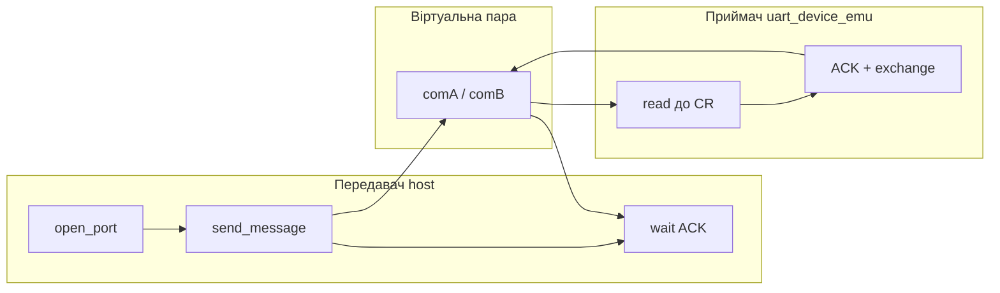
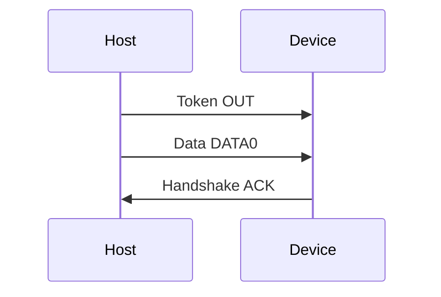

# Лабораторний практикум PPID (2026)

**Навчальний заклад:** Національний університет «Львівська політехніка»  
**Кафедра:** Електроніка та комп’ютерні технології (ЕОМ)  
**Дисципліна:** Периферійні пристрої, інтерфейси та драйвери (PPID)  
**Спеціалізація:** Інтерфейси та драйвери периферійних пристроїв  
**Видання:** 2026 (**5 лабораторних робіт**)

> **Про цей документ.** Методичний посібник: **Вступ → загальні положення → тематичні блоки** (теорія → лабораторні → приклад виконання → приклад програм). Усі інструкції, таблиці варіантів, зразки звітів, **повні лістинги програм** у розділах «Приклад програмних драйверів» кожного блоку, схеми Wokwi та питання для самоперевірки зібрані **в одному файлі**. Окремі markdown-файли чи посилання на репозиторій **не потрібні**. Для практичної частини потрібні: **Python 3.11+**, пакети з розділу 1.2 та браузер з доступом до **https://wokwi.com** (лабораторні 4, 5).

---

# ВСТУП

**Мета practicum** — опанування студентами технологій розроблення та дослідження програмних драйверів периферійних інтерфейсів: послідовного асинхронного **RS-232C / UART**, **USB (УПШ)**, синхронної шини **I²C**, а також інтеграції вузла моніторингу (capstone). Посібник призначений для студентів дисципліни **«Інтерфейси та драйвери периферійних пристроїв»** (PPID).

**Умови виконання (2026).** Лабораторні працюють на **Python 3.11+**; лаб. **4–5** — симулятор **Wokwi** (ESP32 MicroPython). Лаб. **1** — host + `uart_device_emu` на віртуальній парі (без Wokwi). Фізичне залізо (USB-UART, зовнішній датчик I²C) **не обов’язкове**; за замовчуванням — `loop://` (лише TX) та mock USB-пристрої.

Практикум містить **5 лабораторних** у **трьох блоках**:

| Блок | Тема | Лабораторні |
|------|------|-------------|
| A | RS-232C / UART | № 1 (TX+RX+модель), № 2 (діаграми UART + NRZI) |
| B | USB / УПШ | № 3 (транзакція, scan, GUI) |
| C | I²C та інтеграція | № 4 (шина I²C), № 5 (capstone) |

**Як користуватися документом:**

1. **Частина I** — встановлення ПЗ, оформлення звіту, варіанти, загальна класифікація інтерфейсів.
2. **Блоки A–C** — для кожної теми: спільна теорія → робота → зразок звіту → лістинги програм.
3. **Додатки A–D** — огляд лабораторних, чеклист, стек технологій, приклад логу.

Додатковий контекст курсу: [course-overview-2026.md](course-overview-2026.md), [lectures-supplement-2026.md](lectures-supplement-2026.md).

---

# ЗМІСТ

- [Вступ](#вступ)
- [ЧАСТИНА I. Загальні положення](#частина-i-загальні-положення)
  - [1.1. Необхідне програмне забезпечення](#11-необхідне-програмне-забезпечення)
  - [1.2. Встановлення Python та пакетів](#12-встановлення-python-та-пакетів)
  - [1.3. Оформлення звіту (2026)](#13-оформлення-звіту-2026)
  - [1.4. Симулятор Wokwi](#14-симулятор-wokwi-лаб-4-5)
  - [1.5. Послідовний порт host](#15-послідовний-порт-host---port-лаб-1)
  - [1.6. Повідомлення (прізвище)](#16-повідомлення-прізвище-та-кодування)
  - [1.7. Рівні програмного забезпечення](#17-рівні-програмного-забезпечення)
  - [1.8. Класифікація інтерфейсів (загальний орієнтир)](#18-класифікація-периферійних-інтерфейсів-орієнтир)
  - [1.11. Таблиця варіантів](#111-таблиця-варіантів-завдань)
  - [1.12. Mock USB-пристрої](#112-mock-usb-пристрої-для-лаб-3)
- [ЧАСТИНА II. Лабораторні роботи](#частина-ii-лабораторні-роботи)
- [БЛОК A. RS-232C / UART (лаб. 1–2)](#блок-a-лабораторні-12-rs-232c--uart)
  - [Теоретичні відомості для лаб. 1–2](#теоретичні-відомості-для-виконання-лабораторних-робіт-1–2)
  - [Лабораторна робота № 1](#лабораторна-робота--1)
  - [Лабораторна робота № 2](#лабораторна-робота--2)
  - [Приклад виконання лаб. 1–2](#приклад-виконання-основних-етапів-лабораторних-робіт-1–2)
  - [Приклад програмних драйверів лаб. 1–2](#приклад-програмних-драйверів-для-лабораторних-робіт-1–2)
- [БЛОК B. USB / УПШ (лаб. 3)](#блок-b-лабораторна-3-usb--упш)
  - [Теоретичні відомості для лаб. 3](#теоретичні-відомості-для-виконання-лабораторної-роботи-3)
  - [Лабораторна робота № 3](#лабораторна-робота--3)
  - [Приклад виконання лаб. 3](#приклад-виконання-основних-етапів-лабораторної-роботи-3)
  - [Приклад програмних драйверів лаб. 3](#приклад-програмних-драйверів-для-лабораторної-роботи-3)
- [БЛОК C. I²C та інтеграція (лаб. 4–5)](#блок-c-лабораторні-45-i²c-та-інтеграція-ксм)
  - [Теоретичні відомості для лаб. 4–5](#теоретичні-відомості-для-виконання-лабораторних-робіт-4–5)
  - [Лабораторна робота № 4](#лабораторна-робота--4)
  - [Лабораторна робота № 5](#лабораторна-робота--5)
  - [Приклад виконання лаб. 4–5](#приклад-виконання-основних-етапів-лабораторних-робіт-4–5)
  - [Приклад програмних драйверів лаб. 4–5](#приклад-програмних-драйверів-для-лабораторних-робіт-4–5)
- [ЧАСТИНА III. Додатки A–D](#частина-iii-додатки)

---

# ЧАСТИНА I. Загальні положення

## 1.1. Необхідне програмне забезпечення

| Компонент | Призначення |
|-----------|-------------|
| **Python 3.11+** | Лабораторні 1–3, 5 (host) |
| **pyserial** ≥ 3.5 | Послідовний порт (лаб. 1) |
| **matplotlib** ≥ 3.11 | Діаграми UART/NRZI (лаб. 2), графік capstone (лаб. 5) |
| **pytest** ≥ 9.1 | Перевірка модулів (лаб. 2–3), опційно |
| **Wokwi** (браузер) | Симуляція ESP32 MicroPython (лаб. 4, 5) |
| **com0com** / **VSPD** (Windows) | Віртуальна пара COM (лаб. 1) |
| **socat** (Linux/macOS) | Альтернатива `uart_pty_pair` (лаб. 1) |
| **draw.io** / diagrams.net | Опційно: пояснення на захисті (не обов’язково у звіті) |

**Залежності Python (requirements.txt):**

```text
pyserial>=3.5
matplotlib>=3.11
pytest>=9.1
```

## 1.2. Встановлення Python та пакетів

1. Встановіть Python 3.11 або новіший з https://www.python.org/downloads/ (Windows: увімкніть «Add to PATH»).
2. Створіть робочу теку, наприклад `ppid-labs-work`.
3. Скопіюйте програми з розділу **«Приклад програмних драйверів»** відповідного блоку (A, B або C) у файли `host/`, `encoding/` та `wokwi/` у робочій теці (структура каталогів — як у назвах файлів у лістингах). Індекс програм — [Додаток C](#appendix-c).
4. У терміналі:

```bash
cd ppid-labs-work
python3 -m venv .venv
source .venv/bin/activate          # Windows: .venv\Scripts\activate
pip install pyserial matplotlib pytest
python3 -m pytest tests/ -v        # опційно, якщо скопійовано каталог tests/ з репозиторію
```

Лабораторні **1, 2, 3** працюють **повністю офлайн** (лаб. 1 — host + `uart_device_emu`). Лабораторні **4, 5** потребують інтернету для Wokwi.

## 1.3. Оформлення звіту (2026)

Звіт базується на **доказах виконання** (скріни програм, програмно згенеровані діаграми, логи, лістинги коду). Ручні flowchart **не обов’язкові**.

**Обов’язково у звіті:**

1. Титульний аркуш з **номером варіанту** та **прізвищем** (латиницею A–Z).
2. Мета, короткі теоретичні відомості, хід роботи, висновки.
3. **Докази виконання:** скріни роботи програм (Wokwi, GUI), **програмно згенеровані** діаграми (PNG з matplotlib або `signal_gui`), hex-дампи та логи (`Verify: OK`, `TX hex` тощо).
4. Таблиця параметрів варіанту (baud, format, mock USB — розділ 1.11).
5. Текст програм (розділ «Приклад програмних драйверів» відповідного блоку або додаток до звіту).
6. Відповіді на питання для самоперевірки (на захисті або у звіті).
7. Демонстрація на комп’ютері / у Wokwi.

**Не обов’язково:** ручні схеми алгоритмів (draw.io, Visio). Mermaid-діаграми в методичці — **довідково** для розуміння, не для здачі.

**По лабораторних (мінімальний набір артефактів):**

| Лаб | Артефакти звіту |
|-----|-----------------|
| 1 | TX+RX через віртуальну пару: логи `uart_host` + `uart_device_emu`; TXD/RXD/GND; ASCII першої літери; опційно `loop://` |
| 2 | 2 PNG UART+NRZI; розрахунок часу; **посимвольний розбір** (start/data/parity?/stop + NRZI); місток ASCII → лаб. 3 |
| 3 | Hex транзакції; скрін `usb_gui` + `cat` у temp; USB-A/C; **для макс. оцінки** — флешка (мітка/формат/розмір + `cat`) |
| 4 | Адреса `i2c.scan()`; Serial Monitor; скрін Logic Analyzer SDA/SCL |
| 5 | Serial log, CSV, графік `out.png`; діаграма компонентів з методички |

## 1.4. Симулятор Wokwi (лаб. 4, 5)

1. Відкрийте https://wokwi.com/projects/new/micropython-esp32
2. У редакторі: **File → New file** — створіть `main.py`, вставте код з розділу **«Приклад програмних драйверів»** відповідного блоку.
3. **File → New file** — створіть `diagram.json`, вставте `diagram.json` з того ж розділу.
4. **Лаб. 4 і 5:** **`main.py`** та **`diagram.json`** — з папки лабораторії в репозиторії; **`bmp180.py`** — з [`wokwi/lib/bmp180.py`](../wokwi/lib/bmp180.py) (спільний драйвер; не Arduino Library Manager).
5. Натисніть **▶ Start Simulation**.
6. Відкрийте **Serial Monitor** (нижня панель) для обміну з ESP32.
7. Для **лаб. 4** (і 5): на схемі є **Logic Analyzer** (`diagram.json`). Під час симуляції зростає лічильник samples; після **Stop** браузер завантажить **`wokwi-logic.vcd`**. Хвилі SDA/SCL у Wokwi **не** показуються — їх переглядають у зовнішній програмі (див. нижче).

**Файли Wokwi (лаб. 4, 5):** `main.py` + `diagram.json` (з папки lab04 або lab05) + `bmp180.py` (з `wokwi/lib/`).

### Logic Analyzer: перегляд SDA/SCL (лаб. 4)

Wokwi **записує** цифрові сигнали, але **не малює** осцилограму в браузері. Офіційна інструкція: [Wokwi Logic Analyzer Guide](https://docs.wokwi.com/guides/logic-analyzer).

1. Запустіть симуляцію; переконайтесь, що на Logic Analyzer блимають LED і зростає число samples.
2. Натисніть **Stop** — завантажиться **`wokwi-logic.vcd`** (формат VCD).
3. Відкрийте файл у **[PulseView](https://sigrok.org/)** (рекомендовано) або **GTKWave**:
   - PulseView: **Open** → ▼ → **Import Value Change Dump data…** → обрати `wokwi-logic.vcd`.
   - У діалозі імпорту встановіть **Downsampling factor = 50** (див. [таблицю Wokwi](https://docs.wokwi.com/guides/logic-analyzer)).
4. Додайте декодер **I²C** (кнопка *Add protocol decoder*). Канали з `diagram.json`: **SDA = D0** (GPIO21), **SCL = D1** (GPIO22). Зробіть скрін START, адреса **0x77**, ACK, STOP — у звіт.

**Встановлення PulseView** (одноразово; безкоштовно). Деталі та оновлення: [sigrok Downloads](https://sigrok.org/wiki/Downloads). Використання VCD: [Wokwi Logic Analyzer Guide](https://docs.wokwi.com/guides/logic-analyzer).

| ОС | Як встановити |
|----|----------------|
| **Windows** | З [sigrok Downloads](https://sigrok.org/wiki/Downloads) — **PulseView (64bit)** installer (`.exe`); запустити інсталятор. |
| **Linux** | AppImage **PulseView (64bit)** з [sigrok Downloads](https://sigrok.org/wiki/Downloads): `chmod +x pulseview-*.AppImage` → `./pulseview-*.AppImage`. Альтернатива: пакет дистрибутива (`pulseview`), якщо є у репозиторії. |
| **macOS** | З [sigrok Downloads](https://sigrok.org/wiki/Downloads) — **PulseView (64bit)** DMG → встановити в Applications. Офіційний DMG — **x86_64** (на Apple Silicon зазвичай працює через Rosetta). Деталі: [sigrok — Mac OS X](https://sigrok.org/wiki/Mac_OS_X). Якщо macOS блокує запуск: `xattr -cr /Applications/PulseView.app` |

**GTKWave** — запасний переглядач без декодера I²C: Linux `sudo apt install gtkwave`; macOS `brew install gtkwave`; Windows — [gtkwave.sourceforge.net](https://gtkwave.sourceforge.net/).

**Surfer (веб, без встановлення)** — альтернатива, якщо PulseView не встановлюється (зокрема macOS): [app.surfer-project.org](https://app.surfer-project.org/) ([проєкт Surfer](https://surfer-project.org/)). Перетягніть `wokwi-logic.vcd` у вікно браузера, додайте сигнали **D0 (SDA)** та **D1 (SCL)**, зробіть скрін. **Немає декодера I²C** — лише цифрові хвилі; у звіті коротко опишіть START, адресу **0x77**, ACK, STOP (або посилайтесь на `i2c.scan()` з Serial Monitor).

**Що шукати у VCD (PulseView / Surfer / GTKWave):** канали **SDA** і **SCL** (часто **D0**/**D1**); у спокої обидві ≈ **1** (*idle*); **пачки** переходів — транзакції I²C (`scan`, читання датчика). Це рівні на дротах, не текст `TEMP=...`. У PulseView з декодером — підпис адреси **0x77** і ACK; у Surfer — лише хвилі + адреса з Serial.
**Датчик I²C у Wokwi (лаб. 4, 5):** на схемі — **`board-bmp180`**, адреса **0x77**. У таблиці варіантів поле `sensor` часто = `BME280` (тип завдання); у симуляторі завжди працюєте з файлами lab04/lab05 + `bmp180.py`.

## 1.5. Послідовний порт host, `--port` (лаб. 1)

| Сценарій | Значення `--port` | ОС |
|----------|-------------------|-----|
| Самоперевірка TX | `loop://` | усі (Windows, Linux, macOS) |
| USB-UART адаптер | `COM3`, `COM5`, … | Windows |
| USB-UART адаптер | `/dev/ttyUSB0`, `/dev/ttyACM0` | Linux |
| USB-UART адаптер | `/dev/cu.usbserial-*`, `/dev/cu.usbmodem*` | macOS |
| Віртуальна пара (**обов’язковий** обмін TX↔RX) | `COM5` / `COM6` | Windows — com0com |
| Віртуальна пара (**обов’язковий** обмін TX↔RX) | `/tmp/comA`, `/tmp/comB` | Linux/macOS — `uart_pty_pair` (або socat) |

`loop://` однаковий на всіх ОС (pyserial `serial_for_url`); додаткових драйверів не потрібно — це лише **самоперевірка TX**, не роль приймача.

**Linux/macOS** — віртуальна пара (**обов’язково** для обміну; без окремого `socat`):

```bash
python3 -m host.uart_pty_pair
# або: socat -d -d pty,raw,echo=0,link=/tmp/comA pty,raw,echo=0,link=/tmp/comB
```

**Windows:** встановіть com0com (https://com0com.sourceforge.net/) і створіть пару з’єднаних портів (наприклад COM5 ↔ COM6).

**Обов’язковий обмін Host↔Device:**

```bash
python3 -m host.uart_pty_pair                                 # термінал 0
python3 -m host.uart_device_emu --port /tmp/comB              # термінал 1 (RX)
python3 -m host.uart_host --message "IVANOV" --port /tmp/comA --wait-ack   # термінал 2 (TX)
```

Windows: `--port COM6` / `--port COM5`. Див. [SETUP § Virtual COM](SETUP.md#virtual-com-ports-lab-1).

**Лише TX:** `python3 -m host.uart_host` (за замовч. `--port loop://`).
## 1.6. Повідомлення (прізвище) та кодування

**Повідомлення** для лаб. **1–3** і запису в mock USB (лаб. 3) — **прізвище студента великими латинськими літерами A–Z** (без пробілів; транслітерація, напр. `IVANOV`):

| Ситуація | Приклад |
|----------|---------|
| Звичайне прізвище | `IVANOV`, `PETRENKO` |
| Подвійне прізвище | `SHEVCHENKO-PETRENKO` |
| Прізвище < 4 символів | додати ім’я без пробілу — узгодити з викладачем |

**Лаб. 4 (OLED, варіанти 4, 6, 9):** замість датчика — дисплей **SSD1306** (I²C **0x3C**). Проєкт `lab04-i2c-oled/` (`main.py` + `diagram.json`) + драйвер `ssd1306.py`; вивести **те саме прізвище** на дисплей (`SURNAME` у `main.py`).

Кодування: **ASCII / UTF-8** (латиниця); `cp1251` також підходить для A–Z. Завершення пакета UART — символ `\r`. **Не використовуйте кирилицю** у повідомленні лаб. 1–3.

**Номер варіанту (1–10)** задає лише **технічні параметри** (розділ 1.11), не текст повідомлення.

## 1.7. Рівні програмного забезпечення

```text
Периферійний пристрій
    → firmware (вбудоване ПЗ пристрою)
    → драйвер ядра ОС (kernel driver)
    → API операційної системи
    → прикладні бібліотеки (pyserial, tkinter)
    → програма користувача
```

| Рівень | Приклад | Лабораторні |
|--------|---------|-------------|
| Модель протоколу | NRZI, Token/Data/Handshake | 2, 3 |
| HAL / бібліотека | pyserial; `machine.UART` / `machine.I2C` (Wokwi) | 1; 4–5 |
| API ОС | pathlib, tempfile, tkinter | 3, 5 |
| Фізична шина (симуляція) | Wokwi Logic Analyzer | 4 |

**Лаб. 1:** `Python host (pyserial) ↔ віртуальна пара COM ↔ uart_device_emu`

**Лаб. 3:** модель байтів USB → mock enumeration → GUI + tempfile (аналог Mass Storage API, **не** kernel driver).

**Лаб. 5:** `BMP180 → I²C → ESP32 → UART → host → CSV + графік`

## 1.8. Класифікація периферійних інтерфейсів (орієнтир)

> Нижче — українські терміни з **англомовними відповідниками (EN)**, як у datasheet і підручниках: *simplex*, *half-duplex*, *full-duplex*, *serial*, *parallel*, *asynchronous*, *synchronous*, *bus*, *point-to-point*, *master–slave*.

### За напрямком передачі (duplex)

| Режим (UK / EN) | Приклади в курсі |
|-----------------|------------------|
| Симплекс / *simplex* | Датчик → MCU (дані в один бік) |
| Напівдуплекс / *half-duplex* | CAN, I²C, RS-485 (обидва боки, але не одночасно) |
| Повний дуплекс / *full-duplex* | RS-232 (окремі TX/RX), SPI (MOSI/MISO), USB endpoints |

### За способом передачі (serial vs parallel)

| Тип (UK / EN) | Приклади |
|---------------|----------|
| Послідовний / *serial* | RS-232, USB, CAN, SPI, I²C, MIL-1553B |
| Паралельний / *parallel* | Centronics, IEEE-488 (GPIB) |
| Магістраль / *bus* | PCI, PCIe, CAN, I²C |

### За синхронізацією

| Тип (UK / EN) | Приклади |
|---------------|----------|
| Асинхронний / *asynchronous* | UART, RS-232C (baud, start/stop bit) |
| Синхронний / *synchronous* | SPI, I²C, USB (SOF), PCIe (shared / embedded clock) |

### За топологією

| Топологія (UK / EN) | Приклади |
|---------------------|----------|
| Point-to-point / *вузол–вузол* | RS-232, USB (host–device) |
| Шина / *bus* (багато вузлів) | CAN, I²C |
| Зірка / *star* | USB hub, PCIe root complex |
| Master–slave / *ведучий–ведений* | SPI, I²C |

Детальна теорія за інтерфейсами — у **теоретичних розділах блоків A, B, C** (Частина II).

## 1.11. Таблиця варіантів завдань

Номер варіанта призначає викладач. **Прізвище** — за розділом 1.6 (однакове правило для всіх).

{{variants_table:fixtures/variants.json}}

**Примітки:** `7E1` = 7 біт + парність Even + 1 стоп; `8N2` = 8 біт, без парності, 2 стоп-біти. Mock USB — з таблиці в розділі 1.12. **Повідомлення** — прізвище; завершення пакета — `\r`.

## 1.12. Mock USB-пристрої (для лаб. 3)

| VID:PID | Назва | Клас | Швидкість |
|---------|-------|------|-----------|
| 046d:c52b | Logitech USB Receiver | HID | 12 Mbps (Full Speed) |
| 0781:5567 | SanDisk Cruzer (Mass Storage) | Mass Storage | 480 Mbps (High Speed) |
| 303a:1001 | Espressif USB JTAG/serial (CDC) | CDC | 12 Mbps (Full Speed) |
| 1d6b:0002 | Linux Foundation 2.0 root hub | Hub | 480 Mbps (High Speed) |
| 8087:0026 | Intel Bluetooth (USB) | Wireless | 12 Mbps (Full Speed) |

У реальній ОС: `lsusb` (Linux), Диспетчер пристроїв (Windows).

---

# ЧАСТИНА II. Лабораторні роботи

# БЛОК A. Лабораторні 1–2 (RS-232C / UART)

## Теоретичні відомості для виконання лабораторних робіт № 1–2

> Загальна класифікація інтерфейсів — розділ 1.8. Нижче — теорія блоку RS-232C / UART для лаб. 1–2.

**UART / RS-232C (EN):** *asynchronous, serial, point-to-point* (зазвичай *full-duplex* за окремими лініями TX/RX).

1. **RS-232C** — інтерфейс між DTE (термінал, ПК) та DCE (модем, перетворювач). На сучасних платах (ESP32, Raspberry Pi) той самий **UART**-протокол реалізується на рівні мікроконтролера або `/dev/tty*`.
2. **Формат слова** — стартовий біт, біти даних (зазвичай 8), біт парності (опційно), один або кілька стопових бітів. Позначення **8N1**: 8 біт даних, без парності, 1 стоп-біт.
3. **Передавальний порт** — режими **налаштування** (baudrate, bytesize, parity, stopbits) та **передавання** (запис байтів у буфер TX).
4. **Приймальний порт** — налаштування → циклічне читання з буфера RX до завершення пакета (символ `\r`).
5. **Драйвер** на ПК (pyserial) інкапсулює доступ до послідовного порту; у прошивці MCU — `machine.UART` (лаб. 4–5).

Інтерфейс RS-232C широко використовують у персональних та промислових комп’ютерах для обміну з периферією у **послідовному дуплексному** режимі. У багатьох ПК інтерфейс реалізований як **COM-порт**; для підключення застосовують стандартизований **25-** або **9-контактний** з’єднувач.


*Ілюстративний рисунок методички (не обов’язковий у звіті).*

Початок асинхронного символу відмічається **стартовим бітом** (логічний 0), далі — поле даних (5–8 біт), біт паритету (опційно), один або кілька **стопових бітів** (логічна 1). Символи ASCII передаються у 7- або 8-бітовому полі даних.


*Ілюстративний рисунок методички (а — рівні ТТЛ, б — рівні RS-232C).*

Комп’ютер має **DB25P** або **DB9P** з’єднувач. Контакти DB25P використовуються неповно, тому на практиці частіше застосовують **DB9P**.


*Ілюстративний рисунок методички.*

**Призначення основних сигналів** (шина даних і управління):

| Сигнал | DB25 | DB9 | Напрям | Опис |
|--------|------|-----|--------|------|
| RXD | 3 | 2 | IN | Дані, що приймаються |
| TXD | 2 | 3 | OUT | Дані, що передаються |
| DTR | 20 | 4 | OUT | Готовність терміналу |
| GND | 7 | 5 | — | Сигнальна земля |
| DSR | 6 | 6 | IN | Готовність даних |
| RTS | 4 | 7 | OUT | Запит на відправку |
| CTS | 5 | 8 | IN | Готовність прийому |

При **програмному** протоколі управління потоком (XON/XOFF) використовують лише лінії TXD/RXD — **три- або чотирипровідний** зв’язок.


*Ілюстративний рисунок методички.*

Формат слова програмується завчасно і має бути **однаковим** для передавача та приймача; тривалість такту **T_такт = 1 / baudrate**.


*Ілюстративний рисунок методички.*

На лінії RS-232C дані передаються в **інверсному коді** (логічній одиниці відповідає негативна напруга, логічному нулю — позитивна). Типові діапазони:

| Рівень | Передавач | Приймач |
|--------|-----------|---------|
| Логічний 0 | +5 В … +15 В | +3 В … +15 В |
| Логічна 1 | −5 В … −15 В | −3 В … −15 В |


*Ілюстративний рисунок методички.*

Швидкості обміну (біт/с): 50, 75, 100, 150, 300, 600, 1200, 2400, 4800, 9600, 19200, 38400, 57600, 115200. Апаратний драйвер часто реалізують мікросхемою **UART** (i8250, 16550A тощо); рівні ТТЛ узгоджують з RS-232 перетворювачами рівнів.

**Амплітудно-часова діаграма UART** — послідовність рівнів на лінії TX протягом передачі старт-стопного кадру кожного символу. Між символами в завданні передбачена **пауза тривалістю один такт**.

**NRZI** (Non-Return to Zero Inverted) у USB 2.0: при передачі логічного **0** рівень сигналу **змінюється**; при логічній **1** — **не змінюється**. **Bit stuffing** — вставка біта 0 після шести послідовних одиниць. Для **USB 3.x SuperSpeed** — кодування **8b/10b** (детальніше — блок B).

---

## Лабораторна робота № 1

### Розроблення та дослідження програм передавача, приймача та моделі обміну даними інтерфейса RS-232C

**Мета роботи:** опанування студентом технології та процесу налаштування передавального та приймального портів, створення програм передавача і приймача пакетних даних та реалізації моделі обміну заданим повідомленням через послідовний асинхронний інтерфейс RS-232C (COM-порт / UART).

**Завдання на роботу.** Конкретний пакет даних та відповідне повідомлення студенту визначає викладач згідно з **розділом 1.11** (прізвище **латиницею A–Z**, напр. `IVANOV`). Задається швидкість обміну даними, тип контролю, кількість стопових біт.

**Короткі теоретичні відомості.** Див. [теоретичний розділ блоку A](#теоретичні-відомості-для-виконання-лабораторних-робіт-1–2).

**Технологія виконання.** Реалізуйте **дві ролі** на **одному живому шляху байтів** (віртуальна пара COM):

| Роль | Програма | Функції |
|------|----------|---------|
| **Передавач (TX), host** | `host/uart_host.py` | `open_port`, `configure_port`, `send_message`, `--wait-ack` |
| **Приймач (RX), device** | `host/uart_device_emu.py` — **обов’язково** | читання до `\r`, `--- exchange ---`, відповідь `ACK:…\n` |
| Міст | `host/uart_pty_pair.py` (або socat / com0com) | `/tmp/comA` ↔ `/tmp/comB` (Linux/macOS); `COM5`↔`COM6` (Windows) |

**Одне прізвище** у `--message` host і в прийнятому кадрі RX. На `loop://` host лише **самоперевіряє запис** (echo) — це **не** роль приймача. Wokwi у лаб. 1 **не використовується** (перший Wokwi — лаб. 4).

> **Формат кадру в лаб. 1.** У шаблоні `host/uart_host.py` формат лінії **захардкоджено як 8N1** (8 біт даних, без парності, 1 стоп-біт): `bytesize` / `parity` / `stopbits` не вибираються з GUI. У звіті достатньо зазначити **8N1** (або формат з варіанту як теоретичний параметр). **Старт-біт, парність (Even/Odd), стоп-біти та амплітудно-часова діаграма** — у **лабораторній № 2** (`uart_plot`, `signal_gui`, формати `8N1` / `7E1` / `8N2`).

**Довідкова схема обміну (mermaid, не обов’язкова у звіті):**




**Кроки виконання:**

1. Визначити параметри лінії згідно з варіантом (розділ 1.11); **повідомлення** — прізвище (розділ 1.6).
2. **(Опційно)** самоперевірка TX: `python3 -m host.uart_host --message "IVANOV" --baud 9600 --port loop://` → `TX hex`, `Verify: OK`.
3. **Приймач + передавач — обов’язково** (живий шлях байтів):
   ```bash
   python3 -m host.uart_pty_pair                                 # термінал 0 (тримати запущеним)
   python3 -m host.uart_device_emu --port /tmp/comB              # термінал 1 (RX)
   python3 -m host.uart_host --message "IVANOV" --port /tmp/comA --wait-ack   # термінал 2 (TX)
   ```
   Альтернатива: `socat` (див. розділ 1.5). Windows: com0com (`COM5`↔`COM6`). Див. [SETUP § Virtual COM](SETUP.md#virtual-com-ports-lab-1).
4. У звіті: лог emu (`--- exchange ---`) + host `TX hex` і `Verify: OK` на `ACK:…`.
5. Коротко: ASCII першої літери прізвища (hex); idle = 1, start = 0; повний кадр — у лаб. 2.

**Приклад коду (фрагмент, host):**

```python
import serial

PORT = "/tmp/comA"  # або COM5; loop:// — лише самоперевірка TX
BAUD = 9600

def open_port(name: str) -> serial.Serial:
    return serial.Serial(
        port=name,
        baudrate=BAUD,
        bytesize=serial.EIGHTBITS,
        parity=serial.PARITY_NONE,
        stopbits=serial.STOPBITS_ONE,
        timeout=1,
    )

def send_message(ser: serial.Serial, text: str) -> int:
    payload = (text + "\r").encode("cp1251")
    return ser.write(payload)

if __name__ == "__main__":
    message = "IVANOV"  # ваше прізвище латиницею (A–Z)
    with open_port(PORT) as ser:
        nbytes = send_message(ser, message)
        print(f"Надіслано байт: {nbytes}")
```

**Питання для самоперевірки:**

1. Привести основні характеристики інтерфейсу RS-232C.
2. Привести призначення сигналів інтерфейсу RS-232C.
3. Привести формат даних інтерфейсу RS-232C.
4. Привести формат слова передавального та приймального порту.
5. Привести особливості основних режимів функціонування передавального та приймального портів.
6. Пояснити, яким способом порт переводиться з режиму налаштування в режим основної роботи.
7. Пояснити основні принципи розроблення схем алгоритмів первинного налаштування передавача та приймача.
8. Привести основні етапи відлагодження програм передавача та приймача.
9. Пояснити роботу написаних програм.
10. Навести особливості передачі-приймання заданого повідомлення в моделі обміну.

**Додаткові питання:**

11. Чим pyserial відрізняється від `machine.UART` на ESP32 (лаб. 4–5)?
12. Як перевірити передачу без фізичного COM-порту та USB-UART адаптера?
13. Навіщо `uart_pty_pair` / com0com, якщо є `loop://`?
14. Хто в цій лабораторній є **передавачем (TX)**, хто **приймачем (RX)**? Чому baud і format мають збігатися на обох сторонах?
15. Які три контакти DB9 достатні для обміну даними? Що таке idle і start-біт?

**Зміст звіту:**

1. Мета роботи.
2. Короткі теоретичні відомості (ролі TX/RX; **TXD/RXD/GND**; idle/start; формат кадру UART).
3. Хід роботи:
   - **3.1** Параметри варіанту;
   - **3.2** Передавач (host): `TX hex`; опційно `loop://`; з `--wait-ack` — `Verify: OK`;
   - **3.3** Приймач (`uart_device_emu`, **обов’язково**): `--- exchange ---`, ACK;
   - **3.4** Порівняння: ті самі байти на TX і RX; host прийняв `ACK:…`;
   - **3.5** ASCII першої літери (підготовка до лаб. 2).
4. Висновки.
5. Текст програм ([E.1](#appendix-e1) у розділі «Приклад програмних драйверів» блоку A або додаток до звіту).
6. Демонстрація на комп’ютері (на захисті — **показати live** Host↔Device на віртуальній парі).

---

## Лабораторна робота № 2

### Дослідження графічного представлення сигналів лінії зв’язку та кодування NRZI інтерфейса УПШ (USB)

**Мета роботи:** опанування студентом особливостей передачі пакету даних через лінію зв’язку у графічному представленні сигналів для послідовного асинхронного інтерфейса RS-232C (COM-порта) та особливостей формування посимвольних даних у схемі кодування NRZI через інтерфейс УПШ (USB).

**Завдання на роботу.** **Повідомлення** — прізвище (розділ 1.6). **Baudrate і формат** — з розділу 1.11.

**Короткі теоретичні відомості.** Див. [теоретичний розділ блоку A](#теоретичні-відомості-для-виконання-лабораторних-робіт-1–2) (UART-діаграми та NRZI).

**Технологія виконання.** Побудуйте амплітудно-часові діаграми передачі **усього заданого повідомлення** (UART та NRZI). Тут же досліджуються **старт-біт, біти даних, парність (за форматом варіанту), стоп-біти** — на відміну від лаб. 1, де host захардкоджено як 8N1. **Основний спосіб** — CLI або **довідковий GUI** `host/signal_gui.py`: збереження **PNG** для звіту. Альтернатива: `encoding/uart_plot.py`, `encoding/usb_nrzi.py` (matplotlib). draw.io — лише запасний варіант; GUI надає курс — не замінює код студента у звіті.

**Розрахунок часу передачі (UART):**

```text
T_символ = (1 старт + N_даних + парність? + N_стоп) × T_такт
T_такт = 1 / baudrate
T_повідомлення ≈ (кількість_символів × біт_на_символ × T_такт) + (паузи між символами)
```

**Кроки виконання:**

1. За варіантом визначити повідомлення, baudrate і **format**.
2. Побудувати діаграму UART для всього повідомлення з паузою 1 такт між символами; підписати start/data/parity?/stop.
3. Перетворити повідомлення в бітовий рядок; застосувати bit stuffing; закодувати NRZI.
4. Побудувати діаграму NRZI для всього повідомлення.
5. Розрахувати загальний час передавання повідомлення для UART (за заданим baudrate).
6. **Посимвольно:** для однієї літери прізвища — таблиця ролей бітів UART + розбір NRZI (див. [examples/lab2/lab2.md](../examples/lab2/lab2.md) §4).
7. У висновку: ті самі ASCII-байти з’являться в лаб. 3 (Data / `message.txt`).


*Ілюстративний рисунок методички. У звіті студента — **програмно згенерований** PNG з `uart_plot` або `signal_gui` для всього повідомлення варіанту.*


*Ілюстративний рисунок методички. У звіті — PNG з `usb_nrzi` або `signal_gui`.*

**Приклад коду (фрагмент, NRZI):**

```python
def nrzi_encode(bits: str) -> list[int]:
    levels = [1]
    for b in bits:
        if b == "0":
            levels.append(1 - levels[-1])
        else:
            levels.append(levels[-1])
    return levels

message = "IVANOV"  # ваше прізвище великими літерами
raw = "".join(format(ord(c), "08b") for c in message)
encoded = nrzi_encode(raw)
```

**Запуск шаблонів:**

```bash
cd ppid-labs-work   # робоча тека; програми — блок A, розділ «Приклад програмних драйверів»
python -m encoding.uart_plot --message "IVANOV" --baud 9600
python -m encoding.usb_nrzi --message "IVANOV"
python -m host.signal_gui
pytest tests/test_usb_nrzi.py -v
```

**Питання для самоперевірки:**

1. Привести співвідношення швидкості обміну інформацією та тривалості одного такту для інтерфейсу RS-232C.
2. Привести сигнальні рівні кодування логічної одиниці та логічного нуля для передавача та приймача.
3. Пояснити, яким способом можна розрахувати загальний час передавання заданого повідомлення.
4. Привести основні характеристики інтерфейсу USB.
5. Привести особливості системи кодування NRZI.
6. Пояснити структуру транзакцій інтерфейсу USB (зв’язок з лаб. 3).

**Додаткові питання:**

7. Чим відрізняється логічний рівень у програмі від електричного рівня на лінії RS-232?
8. Чому довга послідовність одиниць у NRZI може бути проблемою для синхронізації?
9. Для якої версії USB застосовується NRZI, а яке кодування використовує SuperSpeed (USB 3.x)?
10. Як руками зібрати кадр UART для першої літери прізвища за форматом варіанту (`8N1` / `7E1` / `8N2`)?

**Зміст звіту:**

1. Мета роботи.
2. Короткі теоретичні відомості.
3. Хід роботи: **2 PNG** — UART і NRZI для всього повідомлення; підписи start/data/parity?/stop; **посимвольний розбір** одного символу.
4. Розрахунок загального часу передавання заданого повідомлення (UART).
5. Висновки (включно з містком ASCII → лаб. 3).
6. Текст програми ([E.2](#appendix-e2) у розділі «Приклад програмних драйверів» блоку A або додаток до звіту).
7. Демонстрація на комп’ютері програми для заданого пакету даних.

---

## Приклад виконання основних етапів лабораторних робіт № 1–2

> Зразки звітів для **повної оцінки**. Замініть `PETRENKO` на своє прізвище (латиницею A–Z).

### Лабораторна робота № 1

{{include:examples/lab1/report-example.md}}

### Лабораторна робота № 2

{{include:examples/lab2/report-example.md}}

---

<a id="appendix-e"></a>

## Приклад програмних драйверів для лабораторних робіт № 1–2

Повні лістинги програм для лабораторних 1–2. Скопіюйте файли у робочу теку зі структурою каталогів як у репозиторії ppid-labs.

<a id="appendix-e1"></a>

### E.1. Лабораторна робота № 1

#### host/uart_host.py

{{include:host/uart_host.py}}

#### host/uart_device_emu.py (обов’язковий PC RX на віртуальній парі)

{{include:host/uart_device_emu.py}}

#### host/uart_pty_pair.py (міст /tmp/comA ↔ /tmp/comB)

{{include:host/uart_pty_pair.py}}

<a id="appendix-e2"></a>

### E.2. Лабораторна робота № 2

#### encoding/uart_plot.py

{{include:encoding/uart_plot.py}}

#### encoding/usb_nrzi.py

{{include:encoding/usb_nrzi.py}}

#### host/signal_gui.py (довідковий GUI)

{{include:host/signal_gui.py}}

---

# БЛОК B. Лабораторна 3 (USB / УПШ)

## Теоретичні відомості для виконання лабораторної роботи № 3

**USB 2.0 (EN):** *serial bus, star topology, host–device*; host ініціює транзакції; фази **Token → Data → Handshake**; кодування лінії **NRZI** + **bit stuffing** (NRZI — лаб. 2).

1. **USB** — host ініціює всі транзакції; пристрої — endpoints.
2. **Транзакція** — **Token** (маркерний пакет) → **Data** (дані) → **Handshake** (ACK/NAK/STALL).
3. **PID** (Packet ID) ідентифікує тип пакета (OUT, IN, DATA0, DATA1, ACK тощо).
4. Програма запису на диск `E:\` працює на **рівні файлової системи** — це **не** розробка USB device driver.
5. **Сканування пристроїв** — `lsusb` (Linux), Диспетчер пристроїв (Windows). У лабораторній — **mock-перелік** (розділ 1.12).

**USB-C (огляд для звіту):**

- Реверсивний роз’єм; **CC1/CC2** — орієнтація кабеля, роль host/device, **USB Power Delivery**.
- **Alternate modes:** DisplayPort, Thunderbolt по тих самих контактах.

**Кодування на фізичному рівні:**

| Версія USB | Кодування |
|------------|-----------|
| USB 2.0 Full/Low Speed | **NRZI** (лаб. 2) |
| USB 3.x SuperSpeed | **8b/10b** |
| USB4 | **128b/132b** |

**Порівняння контактів (для звіту):**

| USB-A (типово) | USB-C (огляд) |
|----------------|---------------|
| VBUS, GND | VBUS, GND |
| D+, D− | D+, D− (USB 2.0) |
| — | CC1, CC2 (PD, орієнтація) |
| — | Додаткові пари для SuperSpeed |

**Класи пристроїв:** HID, Mass Storage, CDC-ACM (віртуальний COM), UAC (аудіо).


*Ілюстративний рисунок методички. Для звіту порівняйте з таблицею контактів USB-A / USB-C вище.*

### Сучасний контекст USB

Лабораторна 3 навчає **класичній моделі USB 2.0**. У сучасних ПК більшість пристроїв підключаються через **USB-C** і часто працюють на **USB 3.x / USB4**.

| Аспект | У лабораторній (модель) | У реальному ПК |
|--------|-------------------------|----------------|
| Роз’єм | USB-A/B (4 контакти даних/живлення) | USB-C (24 контакти, симетричний) |
| Швидкість | Задає викладач для розрахунків | USB 2.0 / 3.2 / USB4 |
| Кодування | NRZI (лаб. 2) | NRZI — USB 2.0; SuperSpeed — 8b/10b |
| Практична частина | Mock FS + JSON-пристрої | Mass Storage class; драйвер ядра ОС |
| Живлення | Не розглядається | USB PD через піни CC |

**У звіті (обов’язково):** порівняйте призначення контактів **USB-A** (з теорії вище) та **оглядово USB-C** (VBUS, GND, D+, D−, CC1/CC2).

---

## Лабораторна робота № 3

### Розроблення та дослідження елементів програмного драйвера інтерфейса УПШ (USB)

**Мета роботи:** опанування студентом технології створення програмного драйвера передавання повідомлення через послідовний інтерфейс УПШ (USB), сканування інтерфейсних портів та налаштування передачі даних.

**Завдання на роботу.** **Повідомлення** — прізвище (розділ 1.6). **Mock-пристрій** — стовпець «Mock USB» у розділі 1.11.

**Короткі теоретичні відомості.** Див. [теоретичний розділ блоку B](#теоретичні-відомості-для-виконання-лабораторної-роботи-3).

**Схема транзакції (mermaid):**




**Технологія виконання.**

**Теоретична частина (обов’язково в звіті):**

1. Визначити структуру транзакції USB: **маркерний пакет (Token)** → **пакет даних (Data)** → **пакет підтвердження (Handshake)**.
2. Розрахувати кількість байт у полі даних (≥ довжини повідомлення; надлишок — нульові байти).
3. Порівняти контакти USB-A та USB-C (див. [теоретичний розділ блоку B](#теоретичні-відомості-для-виконання-лабораторної-роботи-3)).

**Практична частина:**

1. Програма `host/usb_transaction.py` ([E.3](#appendix-e3)) — побудова байтових кадрів транзакції OUT для заданого повідомлення.
2. Програма `host/usb_scan.py` ([E.3](#appendix-e3)) — виведення mock-списку з таблиці в розділі 1.12; у звіті — відповідність реальному `lsusb`.
3. Програма `host/usb_gui.py` ([E.3](#appendix-e3)) — tkinter: кнопка «Сканувати», вибір mock-пристрою, панель властивостей (VID:PID, class, volume/format/size для Mass Storage), відкриття файлу, запис у `tempfile.TemporaryDirectory`.

**Кроки виконання:**

1. Побудувати транзакцію для повідомлення варіанту; навести hex-дамп пакетів.
2. Запустити сканер; зафіксувати mock-пристрій згідно з варіантом.
3. Записати повідомлення через GUI у temp-директорію; пояснити аналогію з Mass Storage.
4. Зробити скрін `usb_gui`: список пристроїв після «Сканувати», панель властивостей mock-пристрою, результат запису `.txt`. NRZI-графіки — у лаб. 2.
5. **(Для максимальної оцінки)** записати те саме прізвище на **реальну USB-флешку**: перелік removable → **мітка / формат / розмір** → `message.txt` → перевірка. Див. [examples/lab3/lab3.md](../examples/lab3/lab3.md) §6. Без флешки — здача за кроками 1–4 можлива, але **не на максимум**; mock/temp лишаються обов’язковими.


*Ілюстративний рисунок методички. У звіті студента — **скріншот** реального запуску `host/usb_gui.py`.*

**Приклад коду (фрагмент):**

```python
from pathlib import Path
import tempfile

def write_message_to_mock_storage(message: str, filename: str = "message.txt") -> Path:
    root = Path(tempfile.mkdtemp(prefix="ppid_usb_"))
    target = root / filename
    target.write_text(message, encoding="cp1251")
    return target

if __name__ == "__main__":
    path = write_message_to_mock_storage("IVANOV")  # ваше прізвище
    print(f"Записано: {path}")
```

**Питання для самоперевірки:**

1. Привести основні характеристики інтерфейсу USB.
2. Привести призначення контактів роз’ємів USB.
3. Привести особливості структур транзакцій інтерфейсу USB.
4. Привести основні етапи відлагодження програмного драйвера.
5. Пояснити роботу написаного програмного драйвера.
6. Пояснити структуру транзакцій інтерфейсу USB.
7. Пояснити основні принципи розроблення схеми алгоритму сканування інтерфейсних портів.
8. Пояснити основні принципи розроблення схеми алгоритму налаштування інтерфейсних портів для передачі даних.

**Додаткові питання:**

9. На якому рівні працює запис у temp-директорію порівняно з USB device driver?
10. Чим mock-список пристроїв відрізняється від `lsusb` або Диспетчера пристроїв?
11. Чим роз’єм USB-C відрізняється від USB-A за кількістю контактів і ролями (host/device)?
12. *(Для максимальної оцінки / флешка)* Чим запис на реальну флешку відрізняється від запису в `ppid_usb_*`? Чи це вже USB device driver?

**Зміст звіту:**

1. Мета роботи.
2. Короткі теоретичні відомості (включно з порівнянням контактів USB-A та оглядом USB-C).
3. Хід роботи: структура транзакції (Token → Data → Handshake); hex-дамп; скрін `usb_gui`; **для максимальної оцінки** — запис на флешку (§6 короткого гайду).
4. Висновки.
5. Текст програми ([E.3](#appendix-e3) у розділі «Приклад програмних драйверів» блоку B або додаток до звіту).
6. Демонстрація програми на комп’ютері.

---

## Приклад виконання основних етапів лабораторної роботи № 3

> Зразок звіту для **повної / максимальної оцінки** (включно з флешкою). Замініть `PETRENKO` на своє прізвище (латиницею A–Z).

{{include:examples/lab3/report-example.md}}

---

## Приклад програмних драйверів для лабораторної роботи № 3

<a id="appendix-e3"></a>

### E.3. Лабораторна робота № 3

#### host/usb_transaction.py

{{include:host/usb_transaction.py}}

#### host/usb_scan.py

{{include:host/usb_scan.py}}

#### host/usb_gui.py

{{include:host/usb_gui.py}}

#### fixtures/usb_devices.json

{{include:fixtures/usb_devices.json}}

---

# БЛОК C. Лабораторні 4–5 (I²C та вузол моніторингу)

## Теоретичні відомості для виконання лабораторних робіт № 4–5

**I²C (EN):** *synchronous, multi-master/multi-slave, single-ended, serial communication bus* (open-drain SDA/SCL).

**I²C** (*Inter-Integrated Circuit*): лінії **SDA** (дані), **SCL** (такт); **master** ініціює; **7-бітна адреса** (у лаб. 4 Wokwi BMP180: **0x77**; SSD1306 OLED зазвичай 0x3C); транзакція START → адреса + R/W → ACK → дані → STOP; **open-drain** + **pull-up**. У Wokwi підтягування вбудоване.

**SPI** (*Serial Peripheral Interface*): *synchronous, full-duplex, serial* — окремі **MOSI**, **MISO**, **SCK**, **CS**; вища швидкість; немає адресації на шині — окремий **CS** (chip select) на пристрій.

**Платформи embedded:**

| Платформа | UART | I²C | USB |
|-----------|------|-----|-----|
| ESP32 | GPIO, `machine.UART` | `machine.I2C`, GPIO 21/22 | USB-CDC (S2/S3) |
| Raspberry Pi | `/dev/ttyAMA0` | `/dev/i2c-*`, `i2cdetect` | USB host |
| STM32 | USART HAL | I²C HAL | USB device |

**Capstone (лаб. 5):** вузол моніторингу — датчик (I²C) → MCU (ESP32) → UART → host → CSV/графік; аналогія з Raspberry Pi / Jetson — драйвери у просторі ядра Linux (`/dev/i2c-*`, `/dev/tty*`).


*Ілюстративний рисунок методички. Доповнює mermaid-схему нижче в лаб. 4.*

---

## Лабораторна робота № 4

### Дослідження шини I²C та програмного доступу до периферійного датчика

**Мета роботи:** опанування студентом принципів роботи синхронної двопровідної шини I²C (інтерфейс «інтегральної схеми»), адресації пристроїв master–slave та читання даних з периферійного датчика на прикладі платформи ESP32 у симуляторі Wokwi.

**Завдання на роботу.** Тип датчика — з розділу 1.11. Для варіантів OLED (4, 6, 9) — проєкт `lab04-i2c-oled/` (SSD1306, 0x3C): виведіть **прізвище** на дисплей (розділ 1.6).

**Короткі теоретичні відомості.** Див. [теоретичний розділ блоку C](#теоретичні-відомості-для-виконання-лабораторних-робіт-4–5).

**Технологія виконання.** Використовуйте **Logic Analyzer** у Wokwi для фіксації timing на лініях SDA/SCL.

**Схема шини (mermaid):**


**Кроки виконання:**

1. Вставити **`main.py`**, **`bmp180.py`** та **`diagram.json`** з **[E.4](#appendix-e4)** у Wokwi MicroPython ESP32 (датчик на схемі — BMP180).
2. Виконати `i2c.scan()` — у звіті адреса **0x77**.
3. Прочитати TEMP/PRESS — вивід у Serial Monitor; скрін.
4. **Опційно:** під час симуляції клікнути на BMP180 у Wokwi і змінити temperature/pressure слайдерами — у Serial мають оновитись значення (без змін у коді).
5. **Logic Analyzer:** Stop → `wokwi-logic.vcd` → PulseView (декодер I²C) або Surfer; скрін SDA/SCL (§1.4).


*Ілюстративний рисунок методички. У звіті студента — **скріншот** PulseView/Surfer з декодером I²C (адреса 0x77, ACK, STOP).*

6. Порівняти I²C та SPI (коротко) у теорії звіту. Див. також короткий гайд [examples/lab4/lab4.md](../examples/lab4/lab4.md).

**Питання для самоперевірки:**

1. Що таке master і slave на шині I²C?
2. Навіщо потрібні лінії SDA та SCL?
3. Як визначити адресу пристрою на шині?
4. Чим транзакція читання регістра відрізняється від `i2c.scan()`?
5. Чому для сенсорів часто обирають I²C, а не SPI?
6. Де в таблиці embedded-платформ ([теоретичний розділ блоку C](#теоретичні-відомості-для-виконання-лабораторних-робіт-4–5)) згадується I²C на ESP32?

**Додаткові питання:**

7. Що показує Logic Analyzer на лініях SDA/SCL під час адресації?
8. Який шар ПЗ відповідає за формування START/STOP на шині?

**Зміст звіту:**

1. Мета роботи.
2. Короткі теоретичні відомості (I²C; порівняння з SPI).
3. Хід роботи: адреса **0x77**, Serial TEMP/PRESS, скрін Logic Analyzer.
4. Висновки.
5. Текст програми ([E.4](#appendix-e4) у розділі «Приклад програмних драйверів» блоку C або додаток до звіту).
6. Демонстрація в Wokwi.

---

## Лабораторна робота № 5

### Розроблення та дослідження інтегрованого вузла моніторингу комп’ютерної системи (capstone)

**Мета роботи:** опанування студентом технології інтеграції послідовного інтерфейсу UART, шини I²C та рівня зберігання даних (аналог периферійного накопичувача) у міні-системі моніторингу, характерній для вузлів IoT на базі ESP32 або одноплатних комп’ютерів.

**Завдання на роботу.** Інтервал опитування датчика та формат телеметричного рядка визначає викладач згідно з **розділом 1.11** (типово: `TEMP=<значення>\r\n` кожні 200–1000 мс). Повідомлення та параметри UART — як у лабораторній № 1.

**Короткі теоретичні відомості.** Див. [теоретичний розділ блоку C](#теоретичні-відомості-для-виконання-лабораторних-робіт-4–5) (I²C, capstone, шари ПЗ).

**Схема компонентів (mermaid, скопіюйте у звіт):**


**Технологія виконання.**

**Кроки виконання:**

1. **Embedded (Wokwi):** **`main.py`**, **`bmp180.py`** та **`diagram.json`** з **[E.5](#appendix-e5)** (датчик на схемі — BMP180, адреса **0x77**). Виставити `INTERVAL_MS` згідно з `poll_ms` варіанту.
2. Зберегти вивід Serial Monitor у `my_log.txt` (рядки `TEMP=...`). **Опційно:** під час симуляції клікнути на BMP180 і змінити temperature слайдером кілька разів — у логу будуть різні `TEMP=` (зручніше для графіка).
3. **Host** на своєму логу: `python -m host.capstone_host --input my_log.txt --plot out.png --csv readings.csv` ([E.5](#appendix-e5)).
4. Опційно: експорт CSV у mock USB-директорію (`--export-usb`, як у лаб. 3).
5. У звіті: **діаграма компонентів** з методички, `my_log.txt`, `readings.csv`, графік, пояснення шарів ПЗ. Див. також [examples/lab5/lab5.md](../examples/lab5/lab5.md).

**Запуск:**

```bash
python -m host.capstone_host --input my_log.txt --plot out.png --csv readings.csv
```

**Питання для самоперевірки:**

1. Перелічіть шари програмного забезпечення від датчика BMP180 до CSV-файлу на ПК.
2. Чим цей вузол схожий на типовий IoT-застосунок на ESP32?
3. Де в системі «драйвер пристрою», а де — застосунок?
4. Які інтерфейси лекцій 1, 2 та 6 використані в capstone?
5. Навіщо узгоджувати формат рядка між прошивкою та host-програмою?

**Додаткові питання:**

6. Як зміниться архітектура, якщо замість UART використати USB-CDC на ESP32-S3?
7. Яку роль виконує mock USB-накопичувач у ланцюжку зберігання даних?

**Зміст звіту:**

1. Мета роботи.
2. Короткі теоретичні відомості; діаграма компонентів з методички + пояснення шарів ПЗ.
3. Хід роботи: Serial log (`I2C: ['0x77']`, `TEMP=...`), CSV (`readings.csv`), графік телеметрії.
4. Висновки про шари драйверів.
5. Текст програм ([E.5](#appendix-e5) у розділі «Приклад програмних драйверів» блоку C або додаток до звіту).
6. Демонстрація на комп’ютері.

---

## Приклад виконання основних етапів лабораторних робіт № 4–5

> Зразки звітів для **повної оцінки**. Замініть `PETRENKO` на своє прізвище (латиницею A–Z).

### Лабораторна робота № 4

{{include:examples/lab4/report-example.md}}

### Лабораторна робота № 5

{{include:examples/lab5/report-example.md}}

---

## Приклад програмних драйверів для лабораторних робіт № 4–5

<a id="appendix-e4"></a>

### E.4. Лабораторна робота № 4

#### wokwi/lab04-i2c-sensor/main.py (MicroPython, Wokwi)

{{include:wokwi/lab04-i2c-sensor/main.py}}

#### wokwi/lib/bmp180.py (драйвер MicroPython, Wokwi — лаб. 4 і 5)

{{include:wokwi/lib/bmp180.py}}

#### wokwi/lab04-i2c-sensor/diagram.json (Wokwi)

{{include:wokwi/lab04-i2c-sensor/diagram.json}}

<a id="appendix-e5"></a>

### E.5. Лабораторна робота № 5

#### host/capstone_host.py

{{include:host/capstone_host.py}}

#### wokwi/lab05-capstone/main.py (MicroPython, Wokwi)

{{include:wokwi/lab05-capstone/main.py}}

#### wokwi/lab05-capstone/diagram.json (Wokwi)

> **`bmp180.py`** для лаб. 5 — той самий, що в [E.4](#appendix-e4) (`wokwi/lib/bmp180.py`).

{{include:wokwi/lab05-capstone/diagram.json}}

<a id="appendix-e5-sample-log"></a>

#### sample_log.txt (приклад логу Serial Monitor)

{{include:sample_log.txt}}

---

# ЧАСТИНА III. Додатки

<a id="appendix-a"></a>

## Додаток A. Огляд лабораторних робіт

| № | Тема | Основні артефакти |
|---|------|-------------------|
| 1 | UART: передавач, приймач, модель обміну | `uart_host` + `uart_device_emu` (віртуальна пара) |
| 2 | Діаграми UART + NRZI | PNG UART (`uart_plot` / `signal_gui`), PNG NRZI |
| 3 | USB: транзакція, сканування, GUI | `usb_gui`, `usb_transaction`, hex |
| 4 | Шина I²C, датчик | Wokwi + Logic Analyzer |
| 5 | Capstone: I²C → UART → CSV/графік | Serial log, CSV, `out.png` |

## Додаток B. Чеклист перед захистом

- [ ] На титульному аркуші: номер варіанту та прізвище.
- [ ] Python 3.11+ та пакети встановлені.
- [ ] Wokwi-проєкти для лаб. 4, 5 симулюються.
- [ ] У звіті: скріни, програмні PNG/логи, відповіді на питання (див. розділ 1.3).
- [ ] Лаб. 1: `uart_device_emu` + `uart_host --wait-ack` (`TX hex`, `Verify: OK` на `ACK:…`).
- [ ] Лаб. 2: 2 PNG (UART + NRZI).
- [ ] Лаб. 3: USB-транзакція, USB-A vs USB-C, рівень ФС.
- [ ] Лаб. 4: скрін Logic Analyzer.

<a id="appendix-c"></a>

## Додаток C. Стек технологій та індекс програм

| Компонент | Технологія |
|-----------|------------|
| Мова / середовище | Python 3.11+; MicroPython (Wokwi) |
| Послідовний порт | pyserial; `machine.UART` |
| Діаграми | matplotlib, `signal_gui` (PNG); draw.io опційно |
| Mock USB / файли | tkinter, tempfile |
| Порти / симуляція | Wokwi, com0com, socat, `loop://` |

**Індекс програм (розділи «Приклад програмних драйверів»):**

| Лаб | Якір | Блок | Зміст |
|-----|------|------|-------|
| 1 | [E.1](#appendix-e1) | A | `host/uart_host.py`, `uart_device_emu.py`, `uart_pty_pair.py` |
| 2 | [E.2](#appendix-e2) | A | `encoding/uart_plot.py`, `usb_nrzi.py`, `signal_gui.py` |
| 3 | [E.3](#appendix-e3) | B | `usb_transaction.py`, `usb_scan.py`, `usb_gui.py`, `usb_devices.json` |
| 4 | [E.4](#appendix-e4) | C | Wokwi lab04 I²C |
| 5 | [E.5](#appendix-e5) | C | `capstone_host.py`, Wokwi lab05, `sample_log.txt` |

## Додаток D. Приклад логу телеметрії (лаб. 5)

Див. [`sample_log.txt`](#appendix-e5-sample-log) у [E.5](#appendix-e5) (блок C, «Приклад програмних драйверів»).

