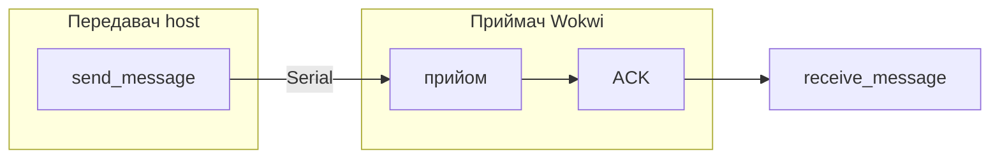

# Лабораторна робота № 1: UART — передавач, приймач, модель обміну

## Мета

Опанувати налаштування послідовного порту, ролі **передавача (TX)** і **приймача (RX)** та модель обміну через RS-232C / UART (host + embedded).

> **Повна методичка:** [lab-praktikum-2026.md](../../docs/lab-praktikum-2026.md)  
> **Повідомлення:** ваше **прізвище латиницею** (літери A–Z, напр. `IVANOV`; розділ 1.6 методички).  
> **Параметри лінії:** [fixtures/variants.json](../../fixtures/variants.json) — поля `baud`, `format` за номером варіанту

## Передавач і приймач (дві ролі, одна лаба)

| Роль | Де | Що робить |
|------|-----|-----------|
| **TX, передавач** | `host/uart_host.py` | `send_message()` — запис у буфер TX |
| **RX, приймач** | Wokwi `main.py` (ESP32) | прийом рядка, `ACK:...`, verify, LED |

Параметри порту **однакові** на обох сторонах. Окремі два Python-застосунки на ПК не потрібні — приймач це **MCU у Wokwi**, передавач — **host на ПК**.

## Теоретичні відомості (стисло)

1. UART — асинхронна передача: старт-біт, дані, парність (опційно), стоп-біт(и).
2. Параметри TX і RX повинні збігатися (baud, bytesize, parity, stopbits).
3. **pyserial** на ПК — host driver; **machine.UART** на ESP32 — device HAL.

## Порт host (`--port`)

| Сценарій | Значення `--port` | ОС |
|----------|-------------------|-----|
| Без заліза (за замовч.) | `loop://` | усі (Windows, Linux, macOS) |
| USB-UART адаптер | `COM3`, `COM5`, … | Windows |
| USB-UART адаптер | `/dev/ttyUSB0`, `/dev/ttyACM0` | Linux |
| USB-UART адаптер | `/dev/cu.usbserial-*`, `/dev/cu.usbmodem*` | macOS |
| Віртуальна пара (опційно) | `COM5` / `COM6` | Windows — [com0com](https://com0com.sourceforge.net/) |
| Віртуальна пара (опційно) | `/tmp/comA`, `/tmp/comB` | Linux/macOS — `socat` ([SETUP § Virtual COM](../../docs/SETUP.md#virtual-com-ports-lab-1-optional)) |
| ESP32 у Wokwi | Serial Monitor Wokwi | браузер |

```bash
python3 -m host.uart_host --message "IVANOV" --port loop://
python3 -m host.uart_host --message "IVANOV" --port COM5          # Windows
python3 -m host.uart_host --message "IVANOV" --port /dev/ttyUSB0 # Linux
python3 -m host.uart_host --message "IVANOV" --port /tmp/comA    # Linux/macOS (socat)
```

## Що в репозиторії

| Шлях | Роль | Призначення |
|------|------|-------------|
| [host/uart_host.py](../../host/uart_host.py) | TX (+ RX відповіді) | `send_message`, `receive_message`, verify |
| [wokwi/lab01-uart/](../../wokwi/lab01-uart/) | RX (device) | ESP32 MicroPython + `diagram.json` |
| [host/uart_loopback_demo.py](../../host/uart_loopback_demo.py) | опційно | TX+RX на `loop://` в одному процесі |
| [host/signal_gui.py](../../host/signal_gui.py) | — | **Довідковий** GUI (лаб. 2) |

## Довідкова схема обміну (не обов’язкова у звіті)

[docs/diagrams/uart-algorithms.md](../../docs/diagrams/uart-algorithms.md)



## Кроки

1. Визначити варіант (повідомлення, baud, format) — **однакові для TX і RX**.
2. **Передавач (host):** запустити `uart_host`, зафіксувати `TX hex` і `Verify: OK`.
   ```bash
   python3 -m host.uart_host --message "IVANOV" --baud 9600
   ```
3. **Приймач (device):** Wokwi — ввести прізвище на `Enter your message:`; перевірити `--- verify ---`, LED, Logic Analyzer D0.
4. **Опційно:** `uart_loopback_demo` або віртуальна пара COM (два термінали — класична схема з двома портами).

> **Приклад звіту:** [report-example.md](report-example.md)

## Зміст звіту

Мета, теорія (TX/RX), **3.2 передавач** + **3.3 приймач** + verify, висновки, код, демонстрація (на захисті — хто TX, хто RX).
