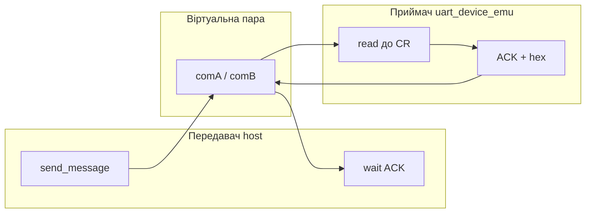

# Лабораторна робота № 1: UART — передавач, приймач, модель обміну

## Мета

Опанувати налаштування послідовного порту, ролі **передавача (TX)** і **приймача (RX)** та **живий** обмін байтами через UART (host ↔ device на ПК).

> **Повна методичка:** [lab-praktikum-2026.md](../../docs/lab-praktikum-2026.md)  
> **Повідомлення:** ваше **прізвище латиницею** (літери A–Z, напр. `IVANOV`; розділ 1.6 методички).  
> **Параметри лінії:** [fixtures/variants.json](../../fixtures/variants.json) — поля `baud`, `format` за номером варіанту

## Передавач і приймач

| Роль | Де | Що робить |
|------|-----|-----------|
| **TX, передавач** | [host/uart_host.py](../../host/uart_host.py) | `send_message()`; з `--wait-ack` чекає `ACK:…` |
| **RX, приймач** | [host/uart_device_emu.py](../../host/uart_device_emu.py) | читає рядок з `\r`, друкує hex / ACK, відповідає `ACK:…\n` |

Зв’язок: віртуальна пара COM — [uart_pty_pair](../../host/uart_pty_pair.py) (Linux/macOS) або com0com (Windows). Wokwi у лаб. 1 **немає** (перший Wokwi — лаб. 4).

> **Формат у лаб. 1:** `uart_host.py` **захардкоджено як 8N1**. Старт/стоп/парність і діаграми — у **лаб. 2**.

## Теоретичні відомості

1. UART — асинхронна передача: старт-біт, дані, парність (опційно), стоп-біт(и).
2. Параметри TX і RX повинні збігатися (baud, bytesize, parity, stopbits).
3. **pyserial** на ПК — host і емулятор device.
4. **Контакти (мінімум для звіту):** на роз’ємі **DB9** (RS-232 / USB-UART) для обміну даними достатньо трьох ліній:

| Сигнал | DB9 (DTE) | Напрям (ПК) | Призначення |
|--------|-----------|-------------|-------------|
| **TXD** | 3 | OUT | передача даних |
| **RXD** | 2 | IN | прийом даних |
| **GND** | 5 | — | спільна «земля» |

Решта ліній (RTS/CTS, DTR/DSR…) — для апаратного handshake / модему; у лаб. 1 **не обов’язкові**.

5. **Idle / start:** у спокої лінія UART у логічній **1** (idle); початок символу — **старт-біт = 0**. Детальний кадр і діаграми — у **лаб. 2**.

## Порт host (`--port`)

| Сценарій | Значення `--port` | ОС |
|----------|-------------------|-----|
| Самоперевірка TX | `loop://` | усі |
| Віртуальна пара (**обов’язковий** обмін) | `/tmp/comA` ↔ `/tmp/comB` | Linux/macOS — `python3 -m host.uart_pty_pair` |
| Віртуальна пара (**обов’язковий** обмін) | `COM5` ↔ `COM6` | Windows — [com0com](https://com0com.sourceforge.net/) |
| USB-UART адаптер | `COM3`, `/dev/ttyUSB0`, … | за наявності заліза |

```bash
# TX self-check (не замінює RX)
python3 -m host.uart_host --message "IVANOV" --port loop://

# Обов’язковий обмін (три термінали) — див. кроки нижче
```

Деталі: [SETUP § Virtual COM](../../docs/SETUP.md#virtual-com-ports-lab-1).

## Що в репозиторії

| Шлях | Роль | Призначення |
|------|------|-------------|
| [host/uart_host.py](../../host/uart_host.py) | TX | `send_message`, `--wait-ack` |
| [host/uart_device_emu.py](../../host/uart_device_emu.py) | RX | емулятор приймача на віртуальній парі |
| [host/uart_pty_pair.py](../../host/uart_pty_pair.py) | міст | `/tmp/comA` ↔ `/tmp/comB` без socat |
| [host/signal_gui.py](../../host/signal_gui.py) | — | **Довідковий** GUI (лаб. 2) |

## Довідкова схема обміну (не обов’язкова у звіті)



## Кроки

1. Визначити варіант (повідомлення, baud) — **те саме прізвище** на TX і RX.
2. **(Опційно)** самоперевірка TX: `python3 -m host.uart_host --message "IVANOV" --baud 9600` → `TX hex`, `Verify: OK` на `loop://`.
3. **Приймач + передавач** — живий шлях байтів:
   ```bash
   # термінал 0 — тримайте запущеним
   python3 -m host.uart_pty_pair
   # термінал 1 — RX
   python3 -m host.uart_device_emu --port /tmp/comB
   # термінал 2 — TX
   python3 -m host.uart_host --message "IVANOV" --port /tmp/comA --wait-ack
   ```
   Windows: com0com `COM5`↔`COM6`, ті самі команди з `--port COM6` / `--port COM5`.  
   У звіті: лог emu (`--- exchange ---`) + host `TX hex` і `Verify: OK` на `ACK:…`.
4. **Підготовка до лаб. 2 (коротко в звіті):** для **першої літери** прізвища записати ASCII (hex) і нагадати: idle = 1, старт = 0; повний кадр бітів — у лаб. 2.

> **Приклад звіту:** [report-example.md](report-example.md)

## Зміст звіту

1. Мета.
2. Теорія: TX/RX; таблиця **TXD / RXD / GND**; idle / start; формат host = 8N1 (діаграми — лаб. 2).
3. Хід роботи: **3.2 передавач** + **3.3 приймач** + `Verify: OK`; ASCII першої літери (hex).
4. Висновки, код, демонстрація (live Host↔Device).
