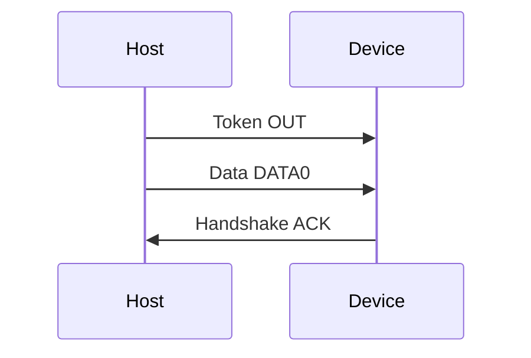

# Лабораторна робота № 3: Модель USB 2.0

## Мета

Опанувати транзакцію USB (Token → Data → Handshake), mock-сканування пристроїв і передачу даних на рівні моделі та ФС.

> **Повна методичка:** [lab-praktikum-2026.md](../../docs/lab-praktikum-2026.md)  
> **Повідомлення:** ваше **прізвище латиницею** (лаб. 1–3).  
> **Mock-пристрій:** поле `mock_usb_name` у [variants.json](../../fixtures/variants.json)

## Теоретичні відомості (стисло)

1. Host ініціює транзакції; фази: **Token → Data → Handshake**.
2. Запис у temp-директорію — рівень **файлової системи**, не USB device driver.
3. У звіті: порівняння **USB-A** vs **USB-C** (supplement).

## Транзакція (mermaid)

Детальніше: [docs/diagrams/usb-transaction.md](../../docs/diagrams/usb-transaction.md).



## Що в репозиторії

| Шлях | Призначення |
|------|-------------|
| [host/usb_transaction.py](../../host/usb_transaction.py) | Побудова OUT-транзакції |
| [host/usb_scan.py](../../host/usb_scan.py) | Mock enumeration |
| [host/usb_gui.py](../../host/usb_gui.py) | tkinter: сканування, властивості mock-пристрою, запис у temp |
| [fixtures/usb_devices.json](../../fixtures/usb_devices.json) | Список mock USB |

## Кроки

```bash
python3 -m host.usb_transaction --message "IVANOV"
python3 -m host.usb_scan
python3 -m host.usb_gui
python3 -m pytest tests/test_usb_transaction.py -v
```

1. Навести hex-дамп пакетів для повідомлення варіанту.
2. Обрати mock-пристрій згідно з варіантом; переглянути панель властивостей (VID:PID, class, volume для Mass Storage).
3. Записати **текстове повідомлення** (прізвище латиницею) через GUI; пояснити аналогію з Mass Storage. Не завантажуйте PDF чи зображення — лише `.txt` або введення вручну.
4. Зробити скрін `usb_gui` (скан + властивості + запис). NRZI-графіки — у лаб. 2.

## Зміст звіту

Мета, теорія (USB-A/C), hex транзакції, скрін GUI, код, демонстрація.

> **Приклад звіту:** [report-example.md](report-example.md)

## Рівні ПЗ

Див. [docs/ARCHITECTURE.md](../../docs/ARCHITECTURE.md).
