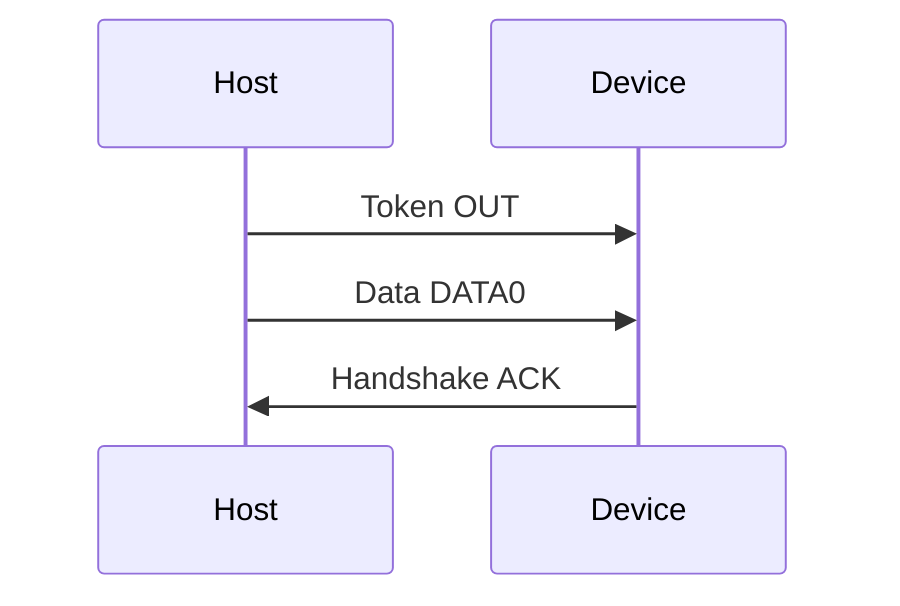

# Лабораторна робота № 3: Модель USB 2.0

## Мета

Опанувати транзакцію USB (Token → Data → Handshake), mock-сканування пристроїв і передачу даних на рівні **моделі байтів** та **файлової системи** (не kernel driver).

> **Повна методичка:** [lab-praktikum-2026.md](../../docs/lab-praktikum-2026.md) (блок B)  
> **Повідомлення:** ваше **прізвище латиницею** (лаб. 1–3).  
> **Mock-пристрій:** поле `mock_usb_name` у [variants.json](../../fixtures/variants.json)  
> **Список mock-пристроїв:** [fixtures/usb_devices.json](../../fixtures/usb_devices.json) або методичка §1.12

## Параметри варіанту (перед запуском)

| Параметр | Звідки взяти | Приклад |
|----------|--------------|---------|
| Повідомлення | прізвище A–Z | `PETRENKO` |
| Mock-пристрій | `variants.json` → `mock_usb_name` | `SanDisk Cruzer (Mass Storage)` |
| VID:PID | [usb_devices.json](../../fixtures/usb_devices.json) за назвою | `0781:5567` |

> **Не Mass Storage** (CDC, HID, Hub): у GUI все одно оберіть **свій** `mock_usb_name` з варіанту. Панель властивостей покаже клас і швидкість (без FAT32/ГБ). Запис у temp — той самий навчальний сценарій: рівень **ФС**, не USB-драйвер ядра.

## Теоретичні відомості

1. Host ініціює транзакції; фази: **Token → Data → Handshake**.
2. **OUT-транзакція (лаб.):** Token OUT → Data DATA0 → Handshake ACK.
3. `usb_scan` / GUI читають **mock**-список з JSON — не реальні USB-пристрої ПК.
4. Запис через `usb_gui` → `message.txt` у **temp** (`ppid_usb_*`) — рівень **файлової системи**, не USB device driver і не передача по шині.
5. NRZI для payload — у **лаб. 2**; тут — структура **пакетів** (hex) + шар ФС.
6. **Місток з лаб. 1–2:** ті самі ASCII-байти прізвища, що в `TX hex` / на UART-діаграмі, лежать у полі **Data** транзакції і в `message.txt`.

## Транзакція (mermaid)

Детальніше: [docs/diagrams/usb-transaction.md](../../docs/diagrams/usb-transaction.md).



## Що в репозиторії

| Шлях | Призначення |
|------|-------------|
| [host/usb_transaction.py](../../host/usb_transaction.py) | Побудова OUT-транзакції (hex) |
| [host/usb_scan.py](../../host/usb_scan.py) | Mock enumeration |
| [host/usb_gui.py](../../host/usb_gui.py) | tkinter: сканування, властивості, запис у temp |
| [fixtures/usb_devices.json](../../fixtures/usb_devices.json) | Список mock USB |

## Кроки

### 1. Транзакція — hex-дамп (підставте **своє** прізвище)

```bash
python3 -m host.usb_transaction --message "PETRENKO"
```

Очікуваний вивід (приклад):

```text
Фази: TOKEN → DATA → HANDSHAKE
Пакет 1: e1 81 00
Пакет 2: c3 50 45 54 52 45 4e 4b 4f e7 f4
Пакет 3: d2
```

У звіті: три рядки hex + коротке пояснення пакета 2 (ASCII-байти прізвища в DATA) + речення: *ті самі байти, що в лаб. 2 / TX hex лаб. 1*.

### 2. Байти в полі Data (обов’язково в звіті)

**Що порахувати:** довжину **payload** у пакеті Data (без PID і CRC).

| Ситуація | Payload |
|----------|---------|
| Прізвище ≥ 8 символів | рівно `len(прізвище)` байт (напр. `PETRENKO` → **8** байт) |
| Прізвище &lt; 8 символів | доповнення **нулями** `\x00` до **8** байт (мінімум у `usb_transaction.py`) |

Приклад для `PETRENKO`: у пакеті 2 між `c3` (DATA0) і `e7 f4` (CRC) — `50 45 54 52 45 4e 4b 4f` (8 байт).

Детальний зразок: [report-example.md](report-example.md) §3.2.

### 3. Mock-сканування

```bash
python3 -m host.usb_scan
```

У звіті: рядок **вашого** mock-пристрою з варіанту + один рядок «у реальній ОС: `lsusb` / Диспетчер пристроїв».

### 4. GUI — скан, властивості, запис (і перевірка)

```bash
python3 -m host.usb_gui
```

> **Важливо:** список у GUI — **завжди з** `fixtures/usb_devices.json`, **не** з реальних USB-портів ПК. Назви схожі на `lsusb`, але це **mock**. Реального USB-емулятора PHY тут немає.

#### Навіщо GUI в лаб. 3

| Частина лаби | Рівень | Що показує |
|--------------|--------|------------|
| `usb_transaction` | модель **пакетів** | Token → Data → Handshake (hex) |
| `usb_scan` / GUI «Сканувати» | mock **enumeration** | список VID:PID «як `lsusb`» |
| GUI «Записати…» | **файлова система** | запис `.txt` у папку — аналог копіювання на флешку |

GUI **не** шле байти по USB-шині. Він потрібен, щоб у звіті чітко сказати: *це рівень ФС / Mass Storage API, а не kernel USB device driver*.

#### Кроки в GUI

| Крок | Що зробити |
|------|------------|
| **Сканувати** | перечитати mock-список з JSON |
| Вибір пристрою | **точна назва** з `mock_usb_name` варіанту |
| Властивості | VID:PID, клас, швидкість; для Mass Storage — FAT32 / ГБ |
| Текст | ввести **своє прізвище латиницею** (не довільний текст) |
| **Записати на mock-накопичувач** | створити `message.txt` у temp; зробити **скрін** |

Не завантажуйте PDF чи зображення — лише `.txt` або ручний ввід прізвища.

#### Що саме записується і куди

| | Значення |
|---|----------|
| **Що** | текст з поля GUI → файл `message.txt` (кодування **cp1251**) |
| **Куди** | тимчасова тека ОС з префіксом `ppid_usb_` (не флешка) |
| **Шлях** | у діалозі **«Готово»** і знизу вікна: «Каталог накопичувача: …» |

Приклади шляхів:

```text
macOS / Linux:  /var/folders/.../T/ppid_usb_XXXX/message.txt
                або /tmp/ppid_usb_XXXX/message.txt
Windows:        %TEMP%\ppid_usb_XXXX\message.txt
```

#### Як перевірити запис (обов’язково для себе / на захисті)

1. Скопіюй повний шлях з повідомлення «Готово».
2. У терміналі (GUI **ще не закривай** — тека жива):

```bash
cat "/шлях/з_діалогу/message.txt"
# має вивести ваше прізвище, напр. PETRENKO
```

3. У звіті: скрін GUI + рядок `cat` з вмістом.

Якщо в файлі довільний текст — перезапишіть **прізвищем** (те саме, що в `usb_transaction --message`). Після закриття GUI temp-тека може зникнути — для здачі достатньо скріна + виводу `cat`.

### 5. Опційно (pytest)

```bash
python3 -m pytest tests/test_usb_transaction.py -v
```

### 6. Запис на **реальну** флешку (для **максимальної** оцінки)

> **Обов’язково для повної / максимальної оцінки.** Mock + temp (кроки 1–4) — база; без флешки лаба здається, але **не на максимум**. Потрібен **реальний** знімний том ОС (USB-флешка).

**Мета:** показати той самий рівень **ФС**, але на живому USB Mass Storage (флешка), а не лише в `/tmp`.

**Що зробити самостійно** (код курсу **не треба змінювати** — окремий скрипт або свій форк GUI):

1. Вставити USB-флешку (бажано з вільною текою для лаби).
2. **Знайти removable-томи** у Python:
   - Windows: перебір букв дисків / API «removable»;
   - macOS: вміст `/Volumes/` (крім системного диска);
   - Linux: `/media/$USER` або `/run/media/$USER`.
3. Вивести список томів (буква / шлях) і **властивості** обраного: мітка тома, файлова система (напр. FAT32 / exFAT), обсяг / вільне місце (ГБ), якщо ОС віддає.
4. Записати файл **`message.txt`** (прізвище) **на обраний том**.
5. Перевірити: Finder / Explorer / `cat /шлях/на/флешці/message.txt`.

**У звіті:** скрін списку томів + **мітка / формат / розмір** + шлях на флешці + `cat` + 1–2 речення: *це API файлової системи ОС; ядро USB Mass Storage уже в ОС — ви не писали USB device driver*.

**На захисті:** чим це відрізняється від `ppid_usb_*` temp? (місце зберігання інше; **шар ПЗ той самий** — ФС.)

**Без флешки:** кроки 1–4 + mock GUI достатні для **здачі з неповною оцінкою**; для **максимуму** — виконати §6.

## Зміст звіту (чеклист)

1. Мета.
2. Теорія (коротко): Token → Data → Handshake; mock vs реальний USB; GUI = ФС, не kernel driver.  
   **USB-A / USB-C** — коротка таблиця (зразок у [report-example.md](report-example.md) §2 або блок B методички).
3. Хід роботи:
   - таблиця параметрів варіанту (повідомлення, mock-пристрій, VID:PID);
   - **hex** трьох пакетів + **кількість байт** у Data;
   - вивід `usb_scan` (ваш пристрій);
   - **скрін** `usb_gui` (скан + властивості + «Готово» з шляхом);
   - коротко: **що** / **куди** / **як перевірили** (`cat`);
   - **для максимальної оцінки:** запис на реальну флешку — §6 (томи + мітка/формат/розмір + `cat`);
   - одне речення: ASCII прізвища = дані лаб. 2 = payload / `message.txt`.
4. Висновки.
5. Додаток — лістинги з методички (+ опційний скрипт, якщо є).
6. Демонстрація: hex + live GUI (скан → запис → `cat message.txt`).

> **Приклад звіту:** [report-example.md](report-example.md)

## Рівні ПЗ

Див. [docs/ARCHITECTURE.md](../../docs/ARCHITECTURE.md).
