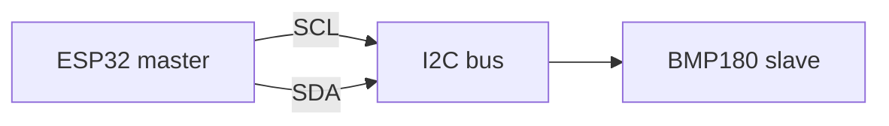

# Лабораторна робота № 4: Шина I²C

## Мета

Опанувати I²C (master–slave): знайти адресу датчика, прочитати температуру/тиск, зафіксувати SDA/SCL у Logic Analyzer.

> **Повна методичка:** [lab-praktikum-2026.md](../../docs/lab-praktikum-2026.md)

## Що використовуємо в цій лабі

| | |
|---|---|
| Середовище | [Wokwi MicroPython ESP32](https://wokwi.com/projects/new/micropython-esp32) |
| Датчик на схемі | **BMP180** (`board-bmp180`) |
| Адреса I²C | **0x77** |
| Файли | `main.py` + `diagram.json` з [lab04-i2c-sensor/](../../wokwi/lab04-i2c-sensor/) + `bmp180.py` з [wokwi/lib/](../../wokwi/lib/bmp180.py) |

> Поле `sensor` у [variants.json](../../fixtures/variants.json) для більшості варіантів — `BME280`: це тип завдання (температура по I²C). **У Wokwi завжди працюєте з BMP180** з папки вище. Якщо у варіанті **OLED** — виведіть **прізвище латиницею** на дисплей (узгодьте з викладачем / методичкою).

## Теоретичні відомості

1. **SDA** — дані, **SCL** — такт; master (ESP32) звертається до slave (датчик) за 7-бітною адресою.
2. **`i2c.scan()`** повертає список адрес на шині (очікуємо **`0x77`**).
3. I²C vs SPI: I²C — 2 дроти + адресація; SPI — швидше, окремий CS на кожен пристрій.



## Кроки

### 1. Зібрати проєкт у Wokwi

1. Відкрити [Wokwi MicroPython ESP32](https://wokwi.com/projects/new/micropython-esp32).
2. Створити **три файли** і вставити вміст з репозиторію:
   - `main.py` ← [wokwi/lab04-i2c-sensor/main.py](../../wokwi/lab04-i2c-sensor/main.py)
   - `diagram.json` ← [wokwi/lab04-i2c-sensor/diagram.json](../../wokwi/lab04-i2c-sensor/diagram.json)
   - `bmp180.py` ← [wokwi/lib/bmp180.py](../../wokwi/lib/bmp180.py)

### 2. Scan і читання (обов’язково в звіті)

1. **▶ Start Simulation**.
2. У Serial Monitor має з’явитись:

```text
PPID Lab 4 — I2C sensor
I2C scan: ['0x77']
TEMP=... PRESS=...
```

3. У звіті: рядок `I2C scan` + кілька рядків `TEMP` / `PRESS` + **скрін** Serial Monitor.
4. **Опційно (рекомендовано на захисті):** під час симуляції клацніть на **BMP180** на схемі — з’являться слайдери **temperature** / **pressure**. Змініть значення: у Serial мають оновитись `TEMP=` / `PRESS=` (код не чіпаєте).

### 3. Logic Analyzer (обов’язково в звіті)

1. Під час симуляції переконайтесь, що Logic Analyzer на схемі рахує samples.
2. **Stop** → завантажиться `wokwi-logic.vcd` (запис рівнів на дротах, **не** текст `TEMP=...`).
3. Відкрити у **PulseView** (декодер I²C) — [SETUP § PulseView](../../docs/SETUP.md#pulseview-lab-4--logic-analyzer)  
   або в браузері **Surfer**: [app.surfer-project.org](https://app.surfer-project.org/) — [SETUP § Surfer](../../docs/SETUP.md#surfer--web-fallback-lab-4).
4. У звіті: **скрін** SDA/SCL; коротко: START → адреса **0x77** → ACK → STOP.

**Що шукати у файлі / на скріні (ознака, що все ок):**

| Що бачите | Що це означає |
|-----------|----------------|
| Канали **SDA** і **SCL** (у VCD часто **D0** / **D1**) | Лінії даних і такту I²C |
| Більшість часу обидві лінії **= 1** (високий рівень) | Шина вільна (*idle*) — нормально для I²C |
| Окремі **пачки** швидких переходів | Транзакції master↔датчик (`scan`, читання TEMP/PRESS) |
| У PulseView — підпис адреси **0x77**, ACK | Декодер підтвердив адресацію (у Surfer цього немає — адреса з Serial) |

Файл **правильний**, якщо є SDA/SCL і видно пачки активності, а не лише рівну лінію.

### 4. Порівняння I²C і SPI

У теорії звіту — коротка таблиця (2–4 рядки): дроти, адресація, швидкість. Зразок: [report-example.md](report-example.md) §2.

## Зміст звіту (чеклист)

1. Мета.
2. Теорія: SDA/SCL, master/slave; таблиця I²C vs SPI.
3. Хід роботи:
   - адреса **0x77** (`i2c.scan`);
   - скрін Serial (`TEMP` / `PRESS`);
   - скрін Logic Analyzer (SDA/SCL + 0x77).
4. Висновки.
5. Додаток — `main.py` (з методички).
6. Демонстрація: live Wokwi (scan + TEMP + LA).

> **Приклад звіту:** [report-example.md](report-example.md)
