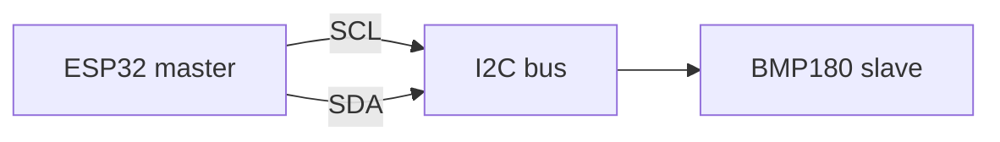

# Лабораторна робота № 4: Шина I²C

## Мета

Опанувати master–slave I²C: адресація, читання датчика, аналіз SDA/SCL у Logic Analyzer.

> **Повна методичка:** [lab-praktikum-2026.md](../../docs/lab-praktikum-2026.md)  
> **Датчик:** поле `sensor` у [variants.json](../../fixtures/variants.json). Для **OLED** — вивести **прізвище латиницею** на дисплей.

> **Примітка:** фіксуйте timing на SDA/SCL через **Logic Analyzer** у Wokwi (експорт VCD → PulseView).

## Wokwi: BMP180 замість BME280

У Wokwi **немає вбудованого BME280**. У проєкті використовується офіційний **`board-bmp180`** (I²C **0x77**) — той самий навчальний сценарій (scan, read, Logic Analyzer). На реальному залізі варіанти курсу — **BME280** (0x76/0x77).

## Теоретичні відомості (стисло)

1. **SDA** — дані, **SCL** — такт; кілька пристроїв на одній шині.
2. **i2c.scan()** повертає 7-бітні адреси (BMP180 у Wokwi: **0x77**; BME280: 0x76/0x77; OLED: часто 0x27).
3. I²C vs SPI: менше дротів, адресація на шині; SPI — швидше, окремий CS.

## Що в репозиторії

| Шлях | Призначення |
|------|-------------|
| [wokwi/lab04-i2c-sensor/](../../wokwi/lab04-i2c-sensor/) | `main.py`, `diagram.json` |
| [wokwi/lib/bmp180.py](../../wokwi/lib/bmp180.py) | драйвер BMP180 (лаб. 4 і 5) |

## Кроки

1. Відкрити [Wokwi MicroPython ESP32](https://wokwi.com/projects/new/micropython-esp32).
2. Створити **три файли у Wokwi:** **`main.py`**, **`diagram.json`** — з [lab04-i2c-sensor/](../../wokwi/lab04-i2c-sensor/); **`bmp180.py`** — з [wokwi/lib/](../../wokwi/lib/bmp180.py).
3. Запустити симуляцію; перевірити `I2C scan: ['0x77']`.
4. У Serial Monitor — рядки `TEMP=... PRESS=...`.
5. **Logic Analyzer:** sim → **Stop** → `wokwi-logic.vcd`. **PulseView** (рекомендовано, декодер I²C) — [SETUP § PulseView](../../docs/SETUP.md#pulseview-lab-4--logic-analyzer), [Wokwi guide](https://docs.wokwi.com/guides/logic-analyzer). **Або Surfer у браузері** (без встановлення): [app.surfer-project.org](https://app.surfer-project.org/) — [SETUP § Surfer](../../docs/SETUP.md#surfer--web-fallback-lab-4). Скрін SDA/SCL; для Surfer — коротко опишіть START / **0x77** / ACK / STOP у тексті звіту.
6. Коротко порівняти I²C і SPI у звіті.

## Зміст звіту

Мета, теорія, адреса, Serial Monitor, скрін Logic Analyzer, `main.py` у додатку, демонстрація в Wokwi.

> **Приклад звіту:** [report-example.md](report-example.md)
