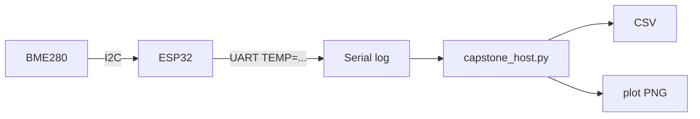

# Лабораторна робота № 5: Capstone — вузол моніторингу КСМ

## Мета

Інтегрувати I²C, UART і host-обробку (CSV, графік) у міні-систему моніторингу.

> **Повна методичка:** [lab-praktikum-2026.md](../../docs/lab-praktikum-2026.md)  
> **Інтервал:** поле `poll_ms` у [variants.json](../../fixtures/variants.json)

## Архітектура

Скопіюйте діаграму з методички (не малюйте від руки). Детальніше: [docs/diagrams/capstone-components.md](../../docs/diagrams/capstone-components.md).



## Що в репозиторії

| Шлях | Призначення |
|------|-------------|
| [wokwi/lab05-capstone/](../../wokwi/lab05-capstone/) | I²C read + UART telemetry |
| [host/capstone_host.py](../../host/capstone_host.py) | Parse log, CSV, matplotlib |
| [sample_log.txt](../../sample_log.txt) | Приклад логу для тесту host |

## Кроки

**Wokwi:** `main.py` та `diagram.json` — з [lab05-capstone/](../../wokwi/lab05-capstone/); `bmp180.py` — з [wokwi/lib/](../../wokwi/lib/bmp180.py). Зберегти вивід Serial Monitor у `my_log.txt`.

**Host (спочатку без Wokwi — готовий приклад):**

```bash
python3 -m host.capstone_host
python3 -m host.capstone_host --input sample_log.txt --plot capstone_plot.png --export-usb
python3 -m host.capstone_host --input my_log.txt --plot capstone_plot.png
```

1. У звіті: діаграма компонентів з методички + пояснення шарів ПЗ ([ARCHITECTURE.md](../../docs/ARCHITECTURE.md)).
2. Додати Serial log, CSV та графік `capstone_plot.png`.

## Зміст звіту

Мета, діаграма компонентів (з методички), хід роботи (log, CSV, PNG), висновки про драйвери, код, демонстрація.

> **Приклад звіту:** [report-example.md](report-example.md)
