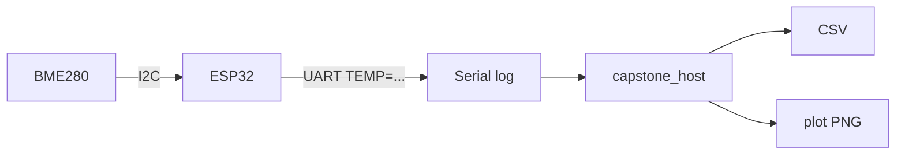

# Приклад звіту — лабораторна робота № 5

> Зразок для **повної оцінки**: діаграма компонентів з методички, Serial log, CSV, графік PNG, пояснення шарів ПЗ.

---

**Титульний аркуш**

- Дисципліна: PPID  
- Лабораторна робота № 5 (capstone)  
- Студент: **PETRENKO**  
- Варіант: **1** (BME280, poll 500 ms, 9600 8N1)

---

## 1. Мета роботи

Інтегрувати I²C (датчик), UART (телеметрія) та host-обробку (CSV, графік) у вузол моніторингу — аналог IoT-ланцюжка на embedded + ПК.

## 2. Короткі теоретичні відомості та діаграма компонентів

**Шари ПЗ (від датчика до CSV):**

```text
BME280 (периферія)
  → HAL I²C (machine.I2C, прошивка)
  → застосунок ESP32 (формування TEMP=...)
  → UART / Serial
  → pyserial або log-файл
  → capstone_host (парсинг, CSV, matplotlib)
  → (опційно) mock USB FS
```

**Діаграма компонентів (з методички):**



## 3. Хід роботи

### 3.1. Параметри варіанту

| Параметр | Значення |
|----------|----------|
| Датчик | BME280 (0x76) |
| Інтервал опитування | 500 ms |
| Формат телеметрії | `TEMP=<value>\r\n` |
| UART | 9600 8N1 |

### 3.2. Embedded (Wokwi)

Запущено `wokwi/lab05-capstone/`. Збережено Serial Monitor у `my_log.txt`:

```text
PPID Lab 5 — Capstone node
I2C: ['0x76']
TEMP=22.1
TEMP=22.3
TEMP=22.5
TEMP=22.4
TEMP=22.8
...
```

**[СКРІНШОТ: Wokwi capstone — Serial Monitor з рядками TEMP=..., BME280 на схемі]**

### 3.3. Host — парсинг, CSV, графік

```bash
python3 -m host.capstone_host --input sample_log.txt --plot capstone_plot.png
```

Вивід:

```text
Знайдено зчитувань: 10
Графік: capstone_plot.png
```

**[СКРІНШОТ: графік matplotlib — вісь X: номер зчитування, вісь Y: температура °C; файл `capstone_plot.png`]**

Фрагмент CSV (генерується поруч із графіком):

```text
index,temperature_c
1,22.1
2,22.3
3,22.5
...
```

**[СКРІНШОТ або фрагмент: відкритий CSV у редакторі / таблиця в звіті]**

### 3.4. Опційно — export mock USB

```bash
python3 -m host.capstone_host --input sample_log.txt --plot capstone_plot.png --export-usb
```

CSV копіюється у temp-директорію mock Mass Storage (аналог лаб. 3).

## 4. Висновки

Capstone об’єднує інтерфейси лекцій 1 (UART), 2 (модель обміну) та 6 (I²C). «Драйвер пристрою» для BME280 — у прошивці (`machine.I2C`); на ПК — лише парсинг текстового протоколу та візуалізація. Узгоджений формат `TEMP=...` між ESP32 і `capstone_host` критичний для коректного CSV.

## 5. Додаток — текст програм

Лістинги `wokwi/lab05-capstone/main.py`, `host/capstone_host.py` — з методички.

## 6. Демонстрація

На захисті: Wokwi (live TEMP) → `capstone_host` → показати `capstone_plot.png` і пояснити шари ПЗ.
